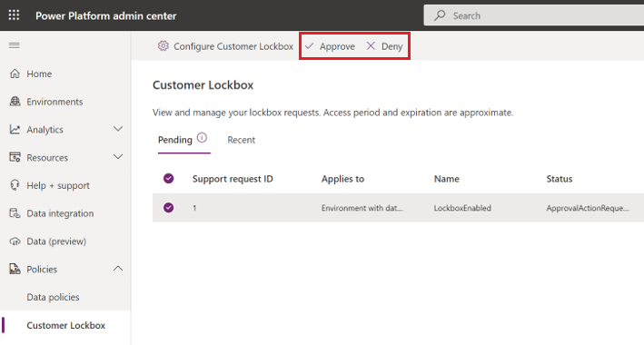
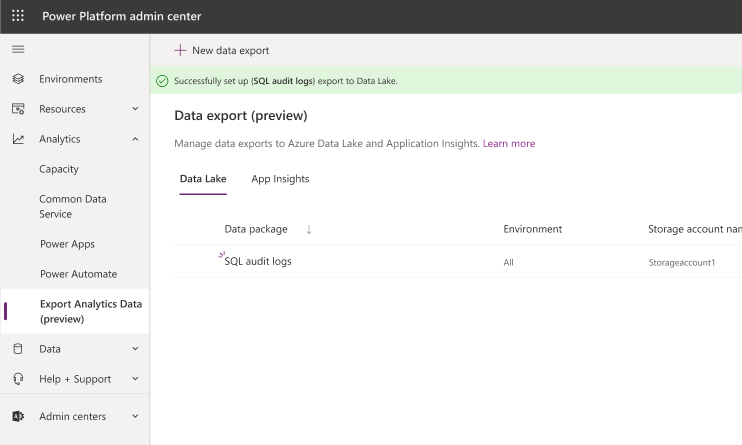

# Power Platform Lockbox 

Lockbox for Power Platform provides an interface for customers to review and approve or reject customer data access requests. It is usually used in cases where a Microsoft engineer needs to access customer data to resolve a support request. 

## Summary

Lockbox for Power Platform allows an organization to define which [Common Data Service databases](https://docs.microsoft.com/powerapps/maker/common-data-service/data-platform-intro) need to be protected with lockbox by creating a lockbox policy. Global administrators can configure the lockbox policy. See Configure lockbox policy. 

Whenever Microsoft attempts to access data that is stored in a database that is protected by lockbox, a lockbox request will be sent to the global administrators. See Review lockbox requests. 

Once access is granted to Microsoft, any action taking place in the database during the elevated access period is recorded and made available to the organization as SQL audit logs. These can be exported to the customer’s own data lake. See Auditing data access.

> [!NOTE]
> Lockbox only protects Common Data Service databases. Customer data stored in other data stores is currently out of scope.

## Workflow

1. Your organization has an issue with Power Platform requiring opening a support request with Microsoft Support.

2. A Microsoft support engineer reviews the support request and attempts to troubleshoot the issue by using standard tools and telemetry. If the troubleshooting fails, the support engineer can request elevated permissions by using a Just-In-Time (JIT) access service. 

3. After the access request is submitted by the Microsoft support engineer, the Just-In-Time access service evaluates the request by considering factors such as: 

   - The scope of the resource 
   - Whether the requester is an isolated identity or using multi-factor authentication 
   - Permissions levels 

   Based on the JIT rule, this request may include an approval from Internal Microsoft Approvers. For example, the approver might be the Customer support lead or the DevOps Manager. 

4. When the request requires direct access to customer data, a lockbox request is generated if the database is protected according to the organization’s lockbox policy. An email notification is sent to the designated approvers about the pending data access request from Microsoft. 

   :::image type="content" source="media/lockbox-sample-approval.png" alt-text="Sample lockbox approval ":::

5. The approver signs in to the Power Platform admin center and approves the request. If the request is rejected or if it is not approved within 12h, it expires, and no access is granted to the Microsoft engineer. 

6. After the approver from your organization approves the request, the Microsoft engineer receives the approval message, logs into the tenant, and fixes the customer's issue. Microsoft engineers have a set amount of time to fix the issue after which the access is automatically revoked. 

   > [!NOTE]
   > All actions performed by a Microsoft engineer are recorded and made available in SQL audit logs.

## Configure the lockbox policy

Global administrators can create or update the lockbox policy in the Power Platform admin center. The lockbox policy can protect all environments, some environments, or no environments. 

> [!NOTE]
> If your organization has a lockbox policy in place, every data access by Microsoft will be regulated and will require an explicit approval from the designated approvers in your organization.

1. Sign in to the [Power Platform admin center](https://admin.powerplatform.microsoft.com). 

2. Select **Governance** > **Lockbox policy**.

3. Configure the lockbox policy.
   
   |Setting  |Description  |
   |---------|---------|
   |Environments with a database     | Select this to protect your organization’s environments that are associated with a Common Data Service database.      |

   > [!div class="mx-imgBorder"] 
   > 

## Review a lockbox request

1. Sign in to the Power Platform admin center. 

2. Select **Governance** > **Lockbox requests**.

3. Review the request details.

   |Field  |Description  |
   |---------|---------|
   |Support request ID     | The ID of the support ticket associated with the lockbox request.         |
   |Environment     | The display name of the environment in which data access is being requested.         |
   |Status     | The status of the lockbox request.   <ul><li>Action needed: Pending approval from the customer </li><li>**Expired**: No approval received from the customer </li><li>**Approved**: Approved by the customer </li><li>**Denied**: Denied by the customer.</li></ul>        |
   |Requested     | The time at which the Microsoft engineer has requested access to your organization’s data.         |
   |Request expiration     | The time by which the customer needs to approve the lockbox request. The status of the request will change to “expired” if no approval is received.         |
   |Access period     | The approximate length of time requested to access your data. It is an estimate and could slightly change.         |
   |Access expiration     | If access is granted, this is the time until which the Microsoft engineer has access to your data. It is an estimate and could slightly change.         |
   

4. Select a Lockbox request, and then choose **Approve** or **Deny**.
   
   > [!div class="mx-imgBorder"] 
   > 

> [!NOTE]
> The lockbox requests that have occurred in the past 28 days will be displayed in the **Recent** table.

## Audit lockbox requests

All actions taken by the Microsoft engineer during the data access period are recorded in the form of SQL audit logs. These logs can be exported to your organization’s data lake for subsequent analysis. You can configure that data export by using the new Data Export functionality.

> [!NOTE]
> Actions related to accepting or denying a lockbox request are not recorded in the SQL audit logs and are only made available in the lockbox requests page.

Below is an example of the SQL logs that are generated. On row #248, observe that a **SELECT** action has been executed on the TimeZoneDefinitionBase table.

> [!div class="mx-imgBorder"] 
> 

To export SQL audit logs to your organization's [Azure data lake](https://docs.microsoft.com/azure/architecture/data-guide/scenarios/data-lake):

1. Sign in to the [Power Platform admin center](https://admin.powerplatform.microsoft.com). 

2. Select **Data export (preview)** from the left-side menu, and then select **New data export**.

   > [!div class="mx-imgBorder"] 
   > 

3. Select **Select analytics data** > **SQL audit logs**.

   > [!div class="mx-imgBorder"] 
   > 

4. Enter Data Lake details, and then select **Create**.

   |Field  |Description  |
   |---------|---------|
   |Subscription     | Azure subscription used by the customer for this data export.        |
   |Resource group     | The resource group under the Azure subscription that will be used for this data export.        |
   |Storage account     | The account under the resource group that will be used for the data export.        |

   > [!div class="mx-imgBorder"] 
   > 

Your export will appear in the list under the **Data Lake** tab of the Export Analytics Data page.

> [!div class="mx-imgBorder"] 
> 

|Field  |Description  |
|---------|---------|
|Data package     | The type of data export – will contain “SQL audit logs”.         |
|Environment     | The environments for which SQL audit logs are being exported to the customer data lake. If the lockbox policy protects all environments, then “All” will be displayed. If it protects some environments, then the names of each environment will be displayed.        |
|Status   | The status is “Connected” when a connection has been setup. The status becomes “Disabled” if lockbox is not enabled for any environment.        |

## Exclusions

Lockbox requests aren't triggered in the following engineering support scenarios:

- A Microsoft engineer needs to do an activity that falls outside of standard operating procedures. For example, to recover or restore services in unexpected or unpredictable scenarios. 

- A Microsoft engineer executes scripts on a single or multiple databases to maintain a healthy data infrastructure. These scripts are peer reviewed and require elevated permissions to execute. All operations executed on a database by such scripts are recorded and made available in the SQL audit logs. 

Additionally, please note that environment lifecycle operations (create, delete, backup, recover, copy, reset, etc.) have no impact on the lockbox policy. For example, if the data from a lockbox protected environment (environment A) is copied to another environment that is not lockbox-protected (environment B), then the copied data in environment B is not protected by lockbox. 
