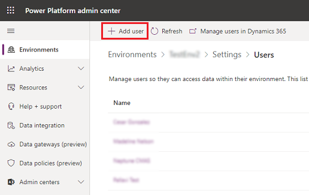

# Add users to an environment 

Environments can have zero or one Common Data Service database. The process for adding users to environments with no Common Data Service database differs from the process for environments with one Common Data Service database. For an overview of environments, see [Environments overview](environments-overview.md). 

## Add users to an environment with no Common Data Service database 

There is no add user process for environments with no Common Data Service environments since all users in the organization are present in these environments by default. However, for a user to have access to an environment’s resources, a security role needs to be assigned to them. For assigning a security role to users in an environment, see [Configure user security to resources in an environment](database-security.md). 

## Add users to an environment with a Common Data Service database 

When an environment is created with a Common Data Service database, or when a Common Data Service database is added to an existing environment, unless a security group is selected as an access filter, all users in the organization will be added automatically to the environment. Review the following on automatic user addition to environments. 

- There are some criteria to meet for a user to be successfully added to an environment that has a Common Data Service database. This same set of criteria applies to [enabling a user who is already present in an environment](create-users-assign-online-security-roles.md#enable-or-disable-users).

- Automatic user addition to an environment takes time to complete, especially if your organization is large and the environment’s access is not restricted to any security group. As best practice, it is recommended to gate your environment’s access to a set of users by [associating your environment to a security group](control-user-access.md). 

- In most cases, adding users to an environment only gives users access to the environment itself, and no access to any resources (apps and data) in the environment. Resource access needs to be configured through [assigning security role to users](database-security.md). Users with certain Dynamics app licenses will be assigned some security roles by default that only give them read access to the environment’s resources. Users who have been assigned service admin roles or the Global admin role, assigned through Microsoft 365 admin center, will get the [System Administrator role](database-security.md#predefined-security-roles) by default. They will have admin privileges to the environment’s resources when they get added to the environment. 

- Since automatic user addition to an environment may take some time, if you'd like to add specific users to the environment sooner, you can follow these steps. 

## Add users to an environment that has a Common Data Service database 

1. From the [Power Platform admin center](https://admin.powerplatform.microsoft.com) select the environment to which you want to add users. 

2. Select **Settings** > **Users + permissions** > **Users**. 

3. You'll see the list of users that have already been added to the environment. This user list includes users with enabled and disabled status. More information: [Enable or disable users](create-users-assign-online-security-roles.md#enable-or-disable-users) 

4. Check to see if the user you want to add may already be present in the environment by doing a search since automatic user addition may have added the user already. If you don’t find the user in the environment yet, select **Add user**. 

   > [!div class="mx-imgBorder"] 
   > 

6. In the side-panel that opens up, enter a user’s name or email address, select them and add them to the environment. Note the requirements for successfully adding a user. Refer to [enable a user in an environment](create-users-assign-online-security-roles.md#enable-or-disable-users) for details on how to ensure the requirements are met. 

   > [!div class="mx-imgBorder"] 
   > 

7. After a user is added to the environment, [assign a security role to the user](database-security.md) to configure their access to resources in the environment. 