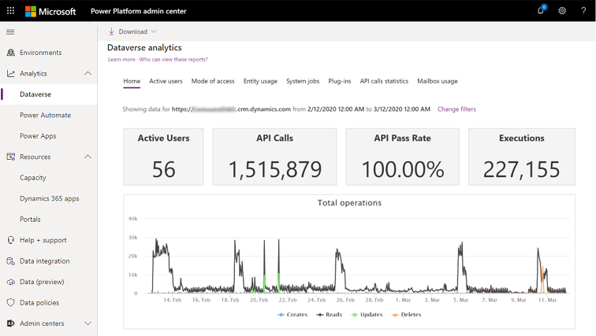
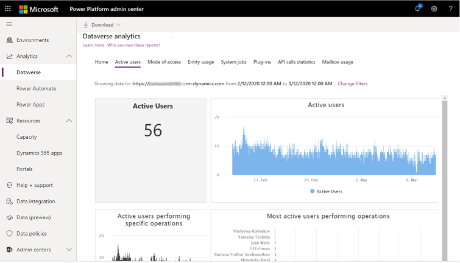
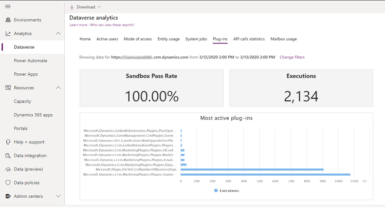
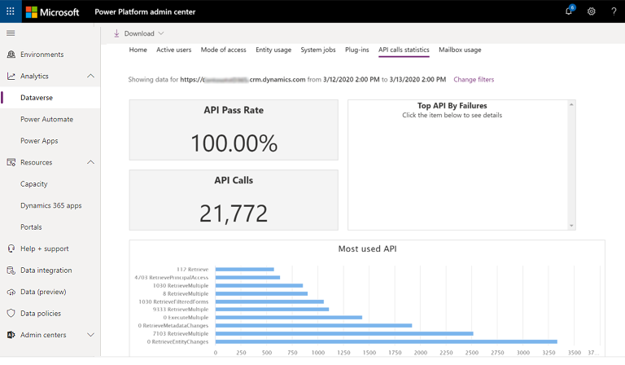
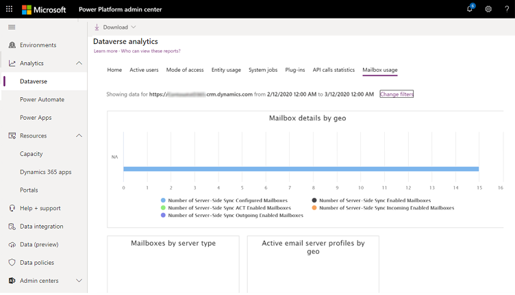
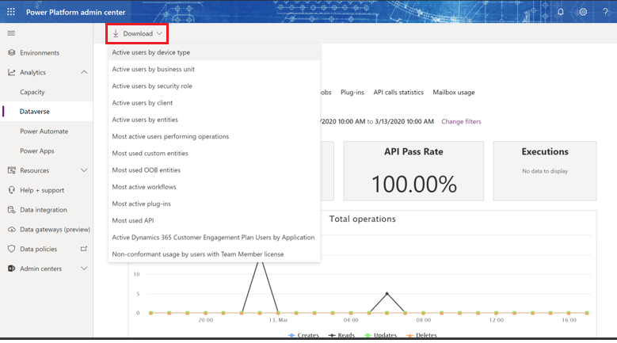
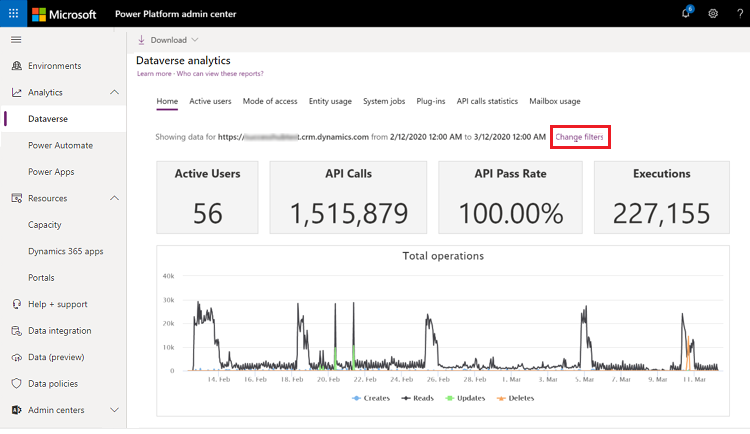

# Microsoft Dataverse analytics

We've improved how you view metrics for your organization. You no longer need to install or update a solution. Instead, you can view Dataverse analytics right from the Microsoft Power Platform admin center to quickly view adoption and user metrics for your organization. 

To access these reports:

1. Go to the navigation bar on the left side.
2. Select **Analytics**.
3. Select **Dataverse**.
4. View the reports on the right side.

## Who can view these reports?

Admins with the following roles and a [license](pricing-billing-skus.md) can view the reports in Dataverse analytics: 
- Environment Admin - can view reports for the environments that the admin has access to.
- Power Platform admin – can view reports for all environments.
- Dynamics 365 admin - can view reports for all environments.
- Microsoft 365 Global admin – can view reports for all environments.

For more information on the different roles for managing your tenant across the platform, see [Use service admin roles to manage your tenant](use-service-admin-role-manage-tenant.md).

 **Key highlights**  

- **Deprecating the solution**: Organization Insights, available as a preferred solution from AppSource, will no longer be supported or available for use in future releases.  

- **Deprecating Organization Insights dashboard**: This dashboard will be removed from Dataverse in future releases. 

- **Monitor adoption and use**: Identify your most active users, the number and types of operations they're performing, number of pages requests, most-used entities, workflows, plug-ins, and more, over a period of time as you work toward your adoption goals.  

- **Manage storage and performance**: Monitor storage quotas, storage use, and top tables by size to optimize performance.  

- **Troubleshoot effectively**: Drill down into the details of your top failing workflows and API calls to quickly diagnose and troubleshoot errors.

   

## Home (default)  

> [!div class="mx-imgBorder"] 
>   

### About this dashboard  
 This is the default dashboard that provides information on the number of active Dataverse users, storage usage, the most active workflows, and more.  

### What's included in this dashboard  

> [!div class="mx-tableFixed"]
> |Chart element|Description|  
> |--------------|-----------------|  
> |           Active Users            |                         Number of active users (unique users) who performed an operation that caused one of these SDK calls:  `Retrieve`, `Retrieve Multiple`, `Delete`, `Create`, and `Update`.                          |
> |             API Calls             |                                            Number of API calls that were made by the environment with a Dataverse database for the selected time period.                                            |
> |            API Pass Rate             |                        This chart shows the API pass rate as percentage of total API calls that were made in the environment with a Dataverse database over the specified time.                        |
> |           Executions            |                                        This chart shows how many plug-ins have been executed in the environment with a Dataverse database over the specified time.                                        |
> |            Total Operations             |                         This chart shows how many operations (create, update, deletes, reads) have occurred in the environment with a Dataverse database over the specified time.                         |
> | Most Active Users Performing Operations | List of most active users who performed an operation that caused a `Create`, `Update`, `Read`, or `Delete` SDK call in the [!INCLUDE[pn_crm_shortest](../includes/pn-crm-shortest.md)] environment over the selected time period. |
> |        Top Plug-ins by Failures         |                                            This chart shows top 10 most failing plug-in in the environment with a Dataverse database over the specified time.                                             |

   

## Active Users  

> [!div class="mx-imgBorder"] 
>   
 
### About this dashboard  
 Use this dashboard to find out how many [!INCLUDE[pn_dyn_365](../includes/pn-dyn-365.md)] users there are, how many licenses are in use, what custom entities are used most frequently, and more.  

### What's included in this dashboard  

> [!NOTE]
> Exports are limited to a maximum of 3000 records.

> [!div class="mx-tableFixed"]
> |Chart element|Description|  
> |--------------|-----------------|  
> |             Total Active Users              |   Total number of active users (unique users) who performed an operation that caused one of these SDK calls:  `Retrieve`, `Retrieve Multiple`, `Delete`, `Create`, and `Update`.   | 
> |             Most Used  Entities             |  Ten Entities which had the most  `Retrieve`, `Retrieve Multiple`, `Delete`, `Create`, and  `Update SDK Calls`.  | 
> |             Total Page Requests             | The number of page load requests for forms, dashboards, and reports. This is the count of requests received by the [!INCLUDE[pn_dyn_365](../includes/pn-dyn-365.md)] server. Pages that are cached while browsing won't be counted. | 
> |              Total Operations               |  This chart shows how many operations (create, update, deletes, reads) have occurred in the environment with a Dataverse database for the selected time period. | 
> | Active Users Performing Specific Operations |  Total number of active users (unique users) over time who performed an operation that caused one of these SDK calls:  `Retrieve`, `Retrieve Multiple`, `Delete`, `Create`, and `Update`.                       | 
> |                Active Users                 |Number of active users (unique users) in your environment who performed an operation that caused one of these SDK calls:  `Retrieve`, `Retrieve Multiple`, `Delete`, `Create`, and `Update` over time.                  | 
> |   Most Active Users Performing Operations   |                        List of  most active users (unique users) over time who performed an operation that caused one of these SDK calls:  `Retrieve`, `Retrieve Multiple`, `Delete`, `Create`, and `Update`.                        | 
> |          Most Used Custom Entities          |   List of custom entities which had the most  `Retrieve`, `Retrieve Multiple`, `Delete`, `Create`, and  `Update SDK Calls`.                                                       | 
> |           Most Used OOB Entities            |  List of out-of-box entities which had the most  `Retrieve`, `Retrieve Multiple`, `Delete`, `Create`, and  `Update SDK Calls`.                                                     | 
> |          Usage Active Users by OS           |   The number of active users by operating system.      | 
> |         Active Users by Device Type         |                                                                                             The number of active users by device type.                                                                                              | 
> |           Active Users by Browser           |                                                                                               The number of active users by browser.                                                                                                | 
> |       Active Users by Security Roles        |                                                                                            The number of active users by security roles.                                                                                            | 
> |           Users by Business Unit            | The number of active users by business unit.    | 
> |         Number of Creates by Entity         |   How many create operations are performed by the selected user in the environment with a Dataverse database for the selected time period.                                    | 
> |         Number of Updates by Entity         |                         How many update operations are performed on different entities by the selected user in the environment with a Dataverse database for the selected time period.                         | 
> |          Number of Reads by Entity          |                          How many read operations are performed on different entities by the selected user in the environment with a Dataverse database for the selected time period.                          | 
> |         Number of Deletes by Entity         |                         How many delete operations are performed on different entities by the selected user in the environment with a Dataverse database for the selected time period.                         | 
> |         Total Operations Over Time          |                                        The total operations performed by the selected user in the environment with a Dataverse database over the selected time period.                                         | 
> |         Total Operations by Entity          |                              The total operations performed on different entities by the selected user in the environment with a Dataverse database for the selected time period.                              | 
> |          Active Users by Entities           |                                                                            Show the active users distributed over different entities                                                                            | 
> |           Active Users by Client            |                                                                                   The active users distributed by client type                                                                                  | 
> |   Active Users Using More than One Client   |                                                      The number of active users using more than one client, distributed over different client combinations                                                       | 

> [!NOTE]
> **Retrieve** and **RetrieveMultiple** SDK calls are reported as **Reads**.  

### Update frequency  
 Active usage chart data is updated as follows.  

|Chart|Update frequency|  
|-----------|----------------------|  
|Total Active Users|24 hours|  
|Most Used Entities|24 hours|  
|Most Active Users (Reads)|24 hours|  
|Total API Calls|24 hours|  
|Total Page Requests|24 hours|  
|Most Active Users (Changes)|24 hours|  
|Total Operations|24 hours|  
|Active Users Performing Specific Operations|24 hours|  
|Active Users|24 hours|  
|Most Active Users Performing Operations|24 hours|  
|Most Used Custom Entities|24 hours|  
|Most Used OOB Entities|24 hours|  

   

## System Jobs  

> [!div class="mx-imgBorder"] 
> 
   
### About this dashboard  
 Use this dashboard to monitor and troubleshoot workflows.  

### What's included in this dashboard  

> [!div class="mx-tableFixed"]
> |Chart element|Description|  
> |--------------|-----------------|  
> |      Workflow Executions      | This chart shows how many workflows have been executed in the environment with a Dataverse database over the specified time. | 
> |     System Jobs Pass Rate     | This chart shows the system job's pass rate as percentage of system jobs that were executed in the environment with a Dataverse database over the specified time.  | 
> | System Jobs Throughput/Minute | This chart shows the average system jobs that have been executed per hour in the environment with a Dataverse database over the specified time. | 
> |    Executions and Backlog     |  This chart shows the number of executions and the backlog for system jobs in the environment with a Dataverse database over the specified time.   | 
> |     Most Active Workflows     |  This chart shows top 10 most executed workflows in the environment with a Dataverse database over the specified time.  | 
> |   Top Workflows by Failures   | This chart shows top 10 most failing workflows in the environment with a Dataverse database over the specified time. Click on a workflow to see the failures and their number of occurrences. | 

### Update frequency  
 System jobs chart data is updated as follows.  

|Chart|Update frequency|  
|-----------|----------------------|  
|Workflow Executions|24 hours|  
|System Jobs Pass Rate|24 hours|  
|System Jobs Throughput / Hour|24 hours|  
|Most Active Workflows|24 hours|  
|System Jobs Executions and Backlog|24 hours|  
|Top Workflows by Failures|24 hours|  

   

## Plug-ins  

> [!div class="mx-imgBorder"] 
>   

### About this dashboard  
 Use this dashboard to monitor and troubleshoot plug-ins.  

### What's included in this dashboard  

> [!div class="mx-tableFixed"]
> |Chart element|Description|  
> |--------------|-----------------|  
> |      Plug-in Success Rate      | This chart shows the plug-in pass rate as percentage of total plug-in executions that were executed in the environment with a Dataverse database over the specified time. | 
> |       Plug-in Executions       |                        This chart shows how many plug-ins have been executed in the environment with a Dataverse database over the specified time.                        | 
> | Average Plug-in Execution Time |                This chart shows average time taken to successfully execute a plug-in in the environment with a Dataverse database over the specified time.                | 
> |      Most Active Plug-ins      |                           This chart shows top 10 most executed plug-ins in the environment with a Dataverse database over the specified time.                            | 
> |    Top Plug-ins by Failures    |                            This chart shows top 10 most failing plug-ins in the environment with a Dataverse database over the specified time.                            | 

### Update frequency  
 Plug-ins chart data is updated as follows.  

|Chart|Update frequency|  
|-----------|----------------------|  
|Plug-in Success Rate|24 hours|  
|Most Active Plug-ins|24 hours|  
|Plug-in Executions|24 hours|  
|Average Plug-in Execution Time|24 hours|  
|Top Plug-ins by Failures|24 hours|  

   

## API Call Statistics  

> [!div class="mx-imgBorder"] 
>   

### About this dashboard  
 Use this dashboard to monitor and troubleshoot API calls.  

### What's included in this dashboard  

> [!div class="mx-tableFixed"]
> |Chart element|Description|  
> |--------------|-----------------|  
> |  API Success Rate   | This chart shows the API success rate as percentage of total API calls that were made in the environment with a Dataverse database over the specified time. | 
> | Top API by Failures |  This chart shows top 10 failing API calls in the environment with a Dataverse database over the specified time.  | 
> |   Total API Calls   | This chart shows how many API calls have been made in total in the environment with a Dataverse database over the specified time.     | 
> |    Most Used API    | This chart shows top 10 most executed API calls in the environment with a Dataverse database database. Adding the individual counts here will provide the total of the top 10 API calls. This will not be the same as the all up Total API Calls metric above.       | 
> |      API Calls      | This chart shows how many API calls have been made over time in the environment with a Dataverse database over the specified time. Adding up the individual counts will equal the Total API Calls count.  |
> |      API peak call rate      | This chart shows capacity consumption relative to the API call limit. More information: [API peak call rate report](#api-peak-call-rate-report-preview)   |

### Update frequency  
 API Call Statistics chart data is updated as follows.  

|Chart|Update frequency|  
|-----------|----------------------|  
|API Success Rate|24 hours|  
|Top API by Failures|24 hours|  
|Most Used API|24 hours|  
|Total API Calls|24 hours|  
|API Calls|24 hours|
|API peak call rate |24 hours|

### API peak call rate report (preview)

> [!IMPORTANT]
>
> - This is a preview feature.
> - Preview features aren’t meant for production use and may have restricted functionality. These features are available before an official release so that customers can get early access and provide feedback.

The API peak call rate report shows API usage graph with the number of requests per user/application for the selected interval. This report helps you monitor the API usage, and avoid hitting the [service protection limits](/power-apps/developer/data-platform/api-limits).

:::image type="content" source="media\analytics-common-data-service\api-peak-call-rate.png" alt-text="A screenshot of API peak call rate graph" :::

| Chart	element | Description |
| - | - |
| SDSService and OData|	The bars show the max number of API requests by app/users within 5-min interval. The maximum is the number of requests per user per five minutes that is based on your licenses and capacity add-ons. |
| API Peak limit | The peak requests per second recorded by the request count API limit. This is a measure of request count per unit time. |

#### Analyze API peak call rate

To help interpret and act on the capacity, the graph shows the API peak limit. The bars show the max number of API requests by app/users within a 5-minute interval. The maximum is the number of requests per user per five minutes that is based on your licenses and capacity add-ons.
  
You can also have a direct view of where your actual use of capacity is relative to the limit so you can be sure that you are within the limit.

When the graph shows that your requests per user/app are beyond the peak limit (identified with a red line), it means that you have reached a peak and your requests are being throttled. Report shows data using a single unit of measure to make it easy to get an overview of API utilization.

API peak call rate is calculated as the maximum of one of the following:

- The peak requests per second (RPS) recorded by the request count API limit. This is a measure of request count per unit time.
- The peak cumulative execution time recorded by the time API limit. Each 150 ms of request execution time is counted as one API call, and then summed up for every 5-minute interval. This is a measure of compute time, converted to an equivalent number of API calls per unit time.

For more information about the API count and time limits, refer to [service protection API limits](/power-apps/developer/data-platform/api-limits).

##### Example scenarios

API peak call rate is based on either the number of requests or execution time measured by the service protection limits, whichever is greater. One request is equivalent to 150ms of execution time measured by the time limit. 

The scenarios below show how the peak call rate is derived based on either request count or execution time using 150ms as the conversion factor from time to count.

**Scenario 1**: Client sends 150,000 web API calls in 5 minutes that each execute for 50ms. 

- Count is 500 requests per second (150,000 per 5 minutes is 30,000 per minute)
- Time is equivalent to 17 requests per second (750,000ms total time, or 5000 calls per 5 minutes (750,000ms / 150ms))

Request count is higher in this case, so the peak rate displayed is 500 requests per second.

**Scenario 2**: Client sends 300 web API calls in 5 minutes that each execute for 10 seconds.

- Count is 1 request per second (there are 300 seconds in 5 minutes)
- Time is equivalent to 67 requests per second (3,000,000ms total time, or 20,000 API calls per 5 minutes (3,000,000ms / 150ms).

Execution time converts to a higher request count in this case, so the peak rate displayed is 67 API calls per second.

#### Optimize API peak call rate

The usage graph can help you identify what users/applications are approaching or exceeding the service protection limits and take actions to mitigate it as necessary.

To optimize limit, consider reducing the number of API requests by user/app or increase the limit by adding more capacity and bring the peak limit (identified with a red line) higher.

   

## Mailbox Usage  

> [!div class="mx-imgBorder"] 
>   
 
### About this dashboard  

 Use this dashboard to monitor email mailbox usage.  

### What's included in this dashboard  

> [!div class="mx-tableFixed"]
> |Chart element|Description|  
> |--------------|-----------------|  
> |         Mailbox Details by GEO         | This chart shows mailbox details like: <ul><li>the number of server-side synch configured mailboxes</li><li>the number of server-side synch enabled mailboxes</li><li>the number of server-side synch Appointments, Contacts, and Tasks enabled mailboxes</li><li>the number of server-side synch incoming enabled mailboxes</li><li>the number of server-side synch outgoing enabled mailboxes categorized by the geo location the mailbox is hosted in</li></ul> | 
> |        Mailboxes by Server Type |  This chart shows the mailbox distribution by server type.  | 
> |  Active Email Server Profiles by Geo   | This chart shows active server-side synch enabled mailboxes distributed over the geo location they are hosted in.  | 
> |  Mailboxes by Exchange Configuration  |  This chart shows the number of mailboxes categorized by their [!INCLUDE[pn_Exchange](../includes/pn-exchange.md)] configuration.  | 
> | Number of Mailbox Configuration Errors | This chart shows the number of mailboxes configuration errors which occurred over the user-selected time frame. | 
> | Mailbox Usage  |  This chart shows the number of server-side synch mailboxes over the time range selected by the user. | 
> |      Number of Outlook Mailboxes       |   This chart shows the number of [!INCLUDE[pn_Outlook_short](../includes/pn-outlook-short.md)] mailboxes configured for the organization.  | 
> | Number of Active Email Server Profiles |  This chart shows the number of active email server profiles for the time range configured by the user.   | 

### Update frequency  
 Mailbox Usage chart data is updated as follows.  

|Chart|Update frequency|  
|-----------|----------------------|  
|Mailbox Details by Geo|24 hours|  
|Active Email Server Profiles by Geo|24 hours|  
|Mailboxes by Server Type|24 hours|  
|Mailbox Usage|24 hours|  
|Number of Mailbox Configuration Errors|24 hours|  
|Number of Active Email Server Profiles|24 hours|  
|Number of Outlook Mailboxes|24 hours|  
|Mailboxes by Exchange Configuration|24 hours|  

## Download Reports

Select **Download** to view available downloads and then select any of the reports to download them into Microsoft Excel.

All the download reports, except "Active Dynamics 365 Customer Engagement Plan Users by Application", show data:   
- for an environment  
  and  
- per the timeline in the filters for the out-of-box Dataverse analytics reports. If you select a certain date range for the out-of-box Dataverse reports, the same time filter applies to the downloads.  
- The maximum duration for data availability is 30 days.

The "Active Dynamics 365 Customer Engagement Plan Users by Application" report always shows the last 30 days of data at the tenant level. 

> [!div class="mx-imgBorder"] 
>   

### What's included  

> [!div class="mx-tableFixed"]
> |Chart element|Description|  
> |--------------|-----------------|  
> | Active users by device type  | List of active users by device type used to access [!INCLUDE [pn-dyn-365](../includes/pn-dyn-365.md)].  |
> | Active users by business unit  | List of active users by their business unit.  **NOTE**: This is not specific to UI calls, and will include system calls in the context of the user.  |
> | Active users by security role  | List of active users by their security roles.  **NOTE**: This is not specific to UI calls, and will include system calls in the context of the user. |
> | Active users by client  | List of active users, by client type used to access [!INCLUDE [pn-dyn-365](../includes/pn-dyn-365.md)].  |
> | Active users by entities | List of active users distributed by entity.   |
> | Most active users performing operations | List of  most active users (unique users) over time who performed an operation that caused one of these SDK calls:  `Retrieve`, `Retrieve Multiple`, `Delete`, `Create`, and `Update`. |
> | Most used custom entities |  List of custom entities which had the most  `Retrieve`, `Retrieve Multiple`, `Delete`, `Create`, and  `Update SDK Calls`. |
> | Most used OOB entities  |  List of out-of-box entities which had the most  `Retrieve`, `Retrieve Multiple`, `Delete`, `Create`, and  `Update SDK Calls`. |
> | Most active workflows | List of top 10 most executed workflows in the environment with a Dataverse database over the specified time.   |
> | Most active plug-ins | List of top 10 most executed plug-ins in the environment with a Dataverse database over the specified time.  |
> | Most used API  | List of top 10 most executed API calls in the Dataverse environment database.   |
> | Active Dynamics 365 Customer Engagement Plan Users by Application | Active Dynamics 365 Customer Engagement plan users by application. Helps customers to know usage across different apps so that when it is time to renew their subscription, they can chose the individual apps to be bought (for example Dynamics 365 for Sales, Dynamics 365 for Customer Service, etc.). The Customer Engagement plan which was a suite of all Customer Engagement applications is no longer being sold and people need to choose the individual apps to be bought.    |
> | Non-conformant usage by users with Team Member license   | Shows customers how their users (with team member licenses) are using the product in ways that are deemed to be not conformant with the use rights entitled to this license, as per licensing guide.   |

   

## View data for different environments and date-time ranges

Select **Change filters**.  

> [!div class="mx-imgBorder"] 
>   

Select the environment and time-period from the drop-down lists, and then select **Apply** to save the changes. All the Dataverse analytics reports are available using this selection. 

> [!div class="mx-imgBorder"] 
>   

[!INCLUDE[footer-include](../includes/footer-banner.md)]
