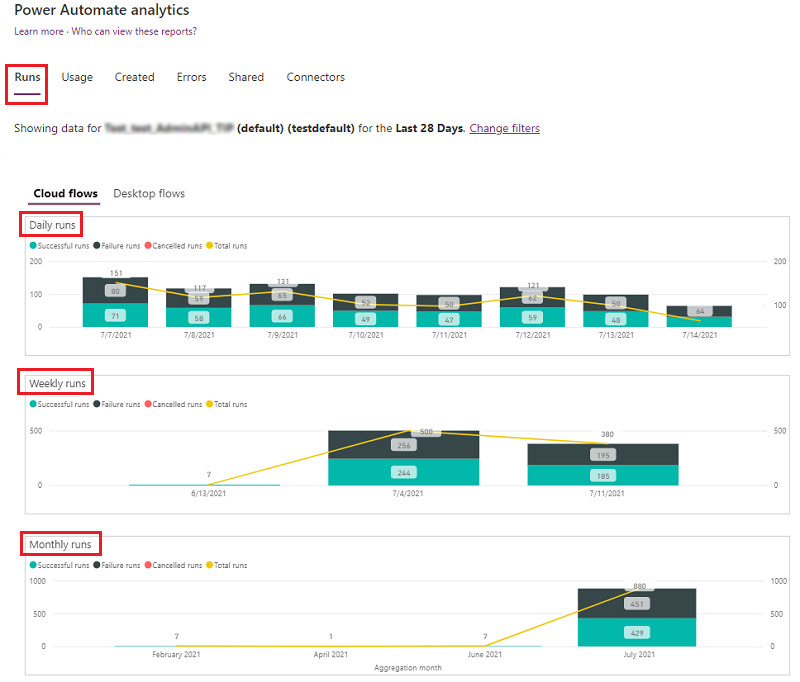
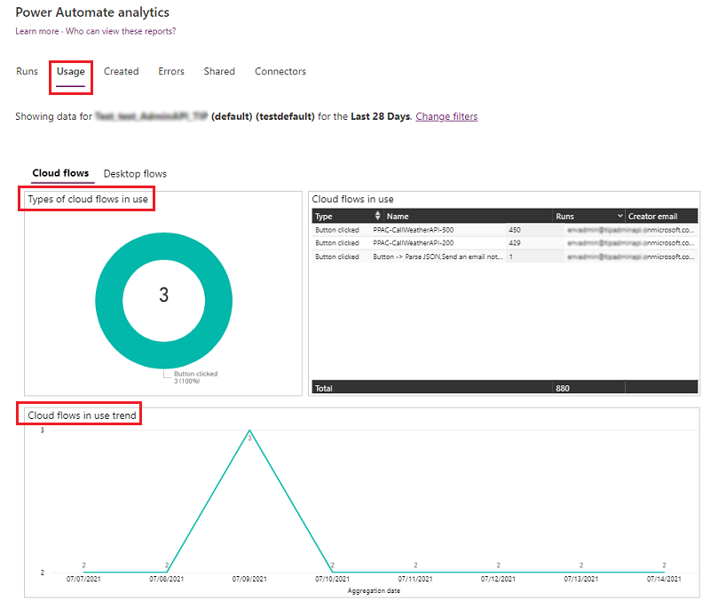
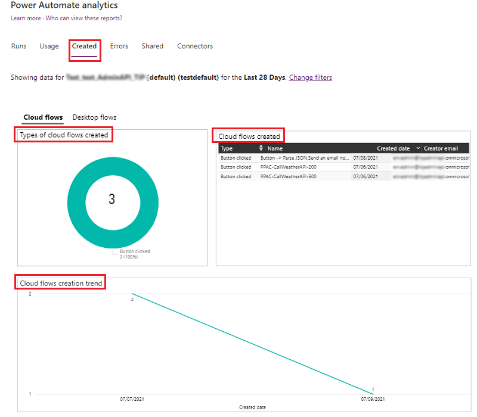
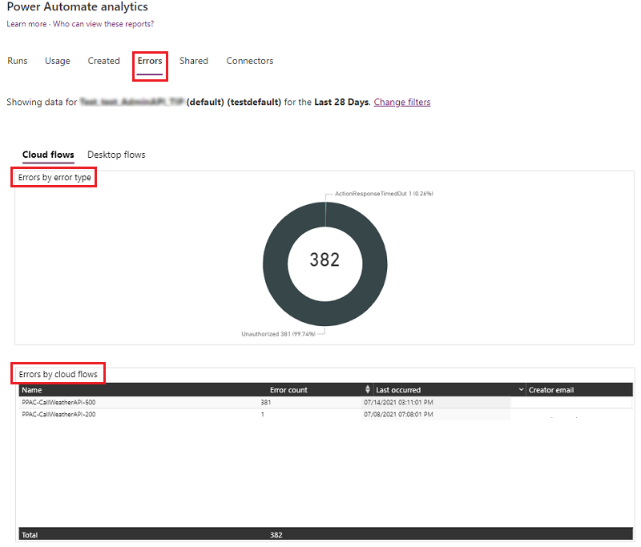

# View analytics for flows

Environment admins can access analytics for Power Automate in the Microsoft [Power Platform admin center](https://admin.powerplatform.microsoft.com/analytics/flow). The reports provide insights into runs, usage, errors, types of flows created, shared flows, and details on connectors associated with all the different flow types like automated flows, button flows, scheduled flows, approval flows, business process flows. These reports do not offer insights for Desktop Flows.
To access these reports:

1. Go to the navigation bar on the left side.
2. Select **Analytics**.
3. Select **Microsoft Power Automate**.
4. View the reports on the right side.

## Who can view these reports?

Admins with the following roles and a [license](pricing-billing-skus.md) can view the reports in Power Automate analytics:
- Environment Admin - can view reports for the environments that the admin has access to.
- Power Platform admin – can view reports for all environments.
- Dynamics 365 admin - can view reports for all environments.
- Microsoft 365 Global admin – can view reports for all environments.

For more information on the different roles for managing your tenant across the platform, see [Use service admin roles to manage your tenant](use-service-admin-role-manage-tenant.md).

## Data storage

When a user creates an environment in a region, the environment is hosted in that region. All data for that environment resides within that region for a maximum period of 28 days. 

The data refresh cycle is about 3 hours and you can find the last refresh time at the top right corner of the page.

## What are the available reports?

The following tenant-level reports are available for tenant and environment admins. 

### Power Automate - Usage report

Power Automate reports provide insights into tenant and environment usage and inventory of all flows and connectors. The report answers questions such as: 

- What is the total unique Cloud Flow users across the tenant or environments? 
- What is the count of Successful vs Failed runs across Cloud flows? 
- What is the total unique Cloud Flow users across the tenant or environments? 
- What is the count of Successful vs Failed runs across Cloud flows? 
- How many flows exist in my tenant or environment? 
- Which of my environments had the most unique users? 
- What were the top flows across my tenant or environments by runs? 

:::image type="content" source="media/power-automate-usage-report.png" alt-text="Power Automate Usage report":::

> [!NOTE]
> The service only starts collecting the data visualized in the Usage report when the feature is enabled. It can take up to 12 hours to reflect service activities from the previous day. 

### Power Automate - Maker Activity report 

The Power Automate report provide insights into the activities of citizen authors of Cloud flows across the tenant or environments. The report answers questions such as: 

- What is the total number of flows created Makers across the tenant or environments? 
- What is the count of first-time makers across Desktop flows? 
- Who are the top makers across the tenant or environments? 
- How many of these flows are using premium or standard connectors? 
- Allow me to filter the above list based on connector dependency. 

:::image type="content" source="media/power-automate-maker-activity.png" alt-text="Power Automate Maker Activity report":::

> [!NOTE]
> The service only starts collecting the data visualized in the Maker Activity report when the feature is enabled. It can take up to 12 hours to reflect service activities from the previous day. 

### Power Automate - Inventory report 

The Power Automate Inventory report offers a complete catalog of Cloud flows distributed across the tenant. This view includes filters that allow admins to search for flows based on various criteria. The report answers questions such as: 

- What is the total number of Cloud flows across the tenant or environments? 
- Which flows depend on specific connectors or connector types like Premium? 
- Who are the owners of the flows hosted in one or more environments? 
- What is the distribution of Cloud flows apps across the organization? 

:::image type="content" source="media/power-automate-inventory-report.png" alt-text="Power Automate Inventory report":::

> [!NOTE]
> Depending on the size of the organization, it can take up to 2 hours to initially populate the data sets backing the Inventory report. 

### Download Inventory 

Power Platform admin center reports can be downloaded directly from the report visuals. Users have the option of choosing between Summarized and Underlying data. 
- Summarized data: select this option to download the data underlying the current report visual 
- Underlying data: select this option to download the full result set backing the report 

:::image type="content" source="media/power-automate-inventory-report.png" alt-text="Power Automate download reports from Inventory tab":::

For more information on downloading data from the tenant level reports, see [Exporting data from Power BI visuals](/power-bi/consumer/end-user-export). 

## Other reports

The preview contains other reports with multiple KPIs in each report.  The reports within the **Runs**, **Usage**, **Created**, and **Errors** tabs provide insights for Cloud flows and Desktop flows.  By default, you see reports for the last viewed environment.

### Runs report

By default, you see the **Runs** report. It provides a view into the daily, weekly, and monthly run data of all flows in an environment.

### Usage report

This report provides insights into the different types of flows in use, the trends, and the flow creator's names.

### Created report

This report provides insights into the types of flows created, trends, and details like the created date and the creator's email address.

### Error report

This report provides insights into recurring error types and details like the error count, creator's email address, last occurred time, and the creator's email address for each flow.

### Shared report

This report provides details on the flows shared and trends in the environment.

### Connectors report

This report provides details on connectors and their associated flows. Metrics like the number of calls from each flow per connector, flow runs, and the flow creator's email address are available for both standard and custom connectors.

## Download reports

The reports are built with Power BI. Users can select the ellipsis (…) for a KPI and then select **Export data**.

## View reports in other environments

To view reports in another environment:

1. Select **Change Filters**.
1. Select the new environment from the **Environment** list and optionally, select a **Time Period**.
1. Select **Apply**.

[!INCLUDE[footer-include](../includes/footer-banner.md)]
