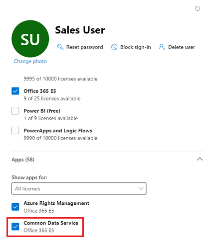

# Common Data Service capabilities with Microsoft 365 licenses

As Common Data Service continues to grow, more Microsoft applications like Microsoft Project are utilizing Common Data Service. To enable these Microsoft applications, limited Common Data Service functionalities are added to select Microsoft 365 licenses. This is achieved by adding a new service plan named "Common Data Service" to the Microsoft 365 licenses.  To see the new service plan in the Microsoft 365 admin center, select a user, select the **Licenses and Apps** tab, and then scroll down and expand the **Apps** section. 

> [!div class="mx-imgBorder"] 
> 

## Capabilities included 

Common Data Service functionality required by other Microsoft 365 applications appears as the "Common Data Service" service plan in the **Apps** section of the Microsoft 365 admin center.  

This new service plan allows select Microsoft 365 applications to leverage Common Data Service as a platform for storing application data and leverage the underlying business logic tier as part of extending application capabilities. This extension also helps these applications to use Common Data Service instances within the [default environment](environments-overview.md#the-default-environment). However, if you need to create a Common Data Service instance within production or sandbox environments (other than the default environment), you are still required to have a premium Power Apps or Power Automate license. 

These limited capabilities of Common Data Service are only available through select Microsoft 365 licenses and cannot be used to run any custom Power Apps applications or Power Automate flows or Power Virtual Agent bots or leverage any other data that doesn’t belong to the Microsoft 365 applications that leverage these capabilities. 

These limited capabilities are not the common set included with every Office application. They can be different based on the Microsoft 365 applications that leverage these capabilities. For the complete list of various limited capabilities, customers should refer to the service description of these Microsoft 365 applications that contain these Common Data Service plans. These limited capabilities of Common Data Service do not entitle the licensed user to run standalone Power Apps or Power Automate or any other Power Platform applications which leverage Common Data Service. 

Review the [Microsoft Project Service description](/office365/servicedescriptions/project-online-service-description/project-online-service-description) for more details on the limited use of Common Data Service that comes with Microsoft Project. 

## Frequently asked questions

### What are the select Office applications where Common Data Service plans are included?  
For now, the Common Data Service service plan is included for Microsoft Project. This list will evolve as more office applications leverage Common Data Service and Power Platform. 

### Does this addition of Common Data Service in Microsoft 365 mean that customers don’t need a Power Apps license to use Common Data Service?  

No, the capabilities of Common Data Service included with select Microsoft 365 licenses do not allow customers to create custom apps with Power Apps or use the premium connectors with Power Automate. The capabilities included with this license entitles Microsoft 365 applications to use Common Data Service for the purpose of enhancing the capabilities of the base Microsoft 365 application where Common Data Service is included.

### If customers cannot use the Common Data Service, why is this being shown in the Microsoft 365 Admin center during the license assignment experience?  

The service plan for Common Data Service is included and visible to customers to provide visibility to customers that Common Data Service is being leveraged to store and manage customer data related to the Microsoft 365 application using Common Data Service. Additionally, this was communicated to all customers so that customers can prepare for this change and to update any internal training or user documentation that might be needed for customers.  

### What will be the impact if the service plan for Common Data Service is turned off/unchecked?  

Common Data Service functionality appears as the **Common Data Service** plan in the **Apps** section of the Microsoft 365 admin center. Turning off the service plan will result in the Microsoft 365 features being disabled for the users of such license. For example, when this capability is turned off, any Office application reading the data from Common Data Service will fail to load for the user.  

### When can office licensed users be seen inside of Common Data Service?   

Users who have any Power Platform or Dynamics license are always synced into the Common Data Service environments. However, for Office licenses where Common Data Service service plans are included, users are not auto-synced into Common Data Service until the Office application is accessed by the user. This user can now get access to Common Data Service entity and records based on the additional security roles and privileges that are assigned to this user, by the administrator. Such users, with just the Office license, are not auto-assigned any other security roles or privileges other than Maker role privilege in [default environment](environments-overview.md#the-default-environment).  As a security best practice,  the administrator needs to ensure that security roles and privileges are assigned based on functional roles and needs only, and not auto-assigned based on the user being synced or present in Common Data Service.  