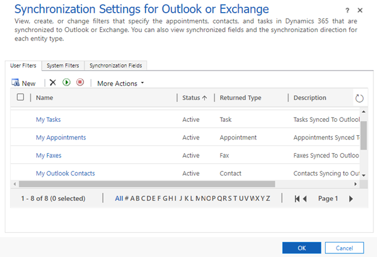
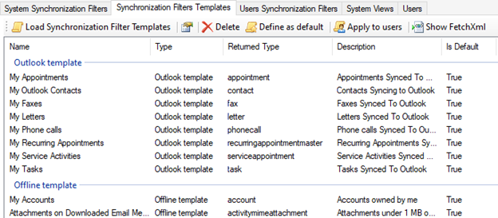
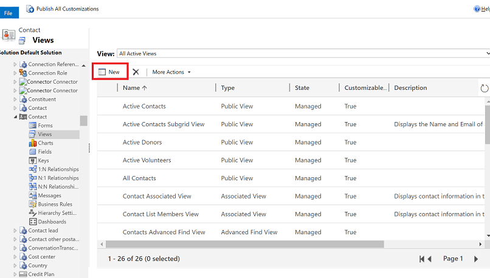
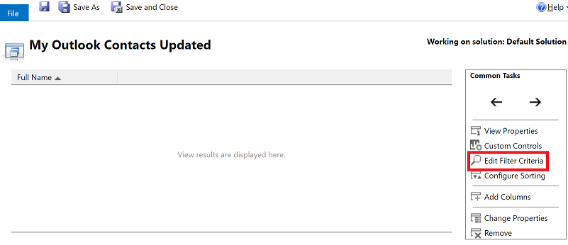
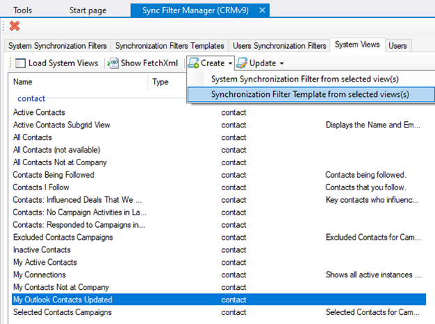
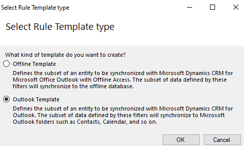
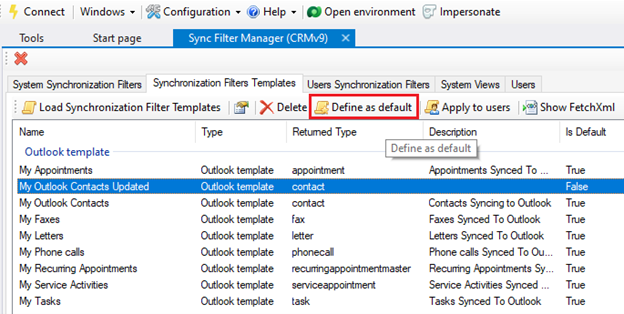

# Configure default sync filters for appointments, contacts, and tasks

   > [!div class="mx-imgBorder"] 
   > 

Server-side synchronization uses filter criteria that’s set in a user's synchronization filters to determine which app rows are synchronized with Exchange for each user. Sync filters are first initialized when server-side synchronization is first configured by a user for rows such as appointments, contacts, and tasks. For more information, see [Create or modify online synchronization filters](choose-records-synchronize-dynamics-365-outlook-exchange.md#create-or-modify-online-synchronization-filters).
 
When a user mailbox is set up to use server-side synchronization for appointments, contacts, and tasks, their personal option filters list will have default logic for each table applied immediately. When the next sync cycle happens server-side sync will use this logic to synchronize existing rows that meet the fetchXML logic provided in each filter.

> [!div class="mx-imgBorder"] 
> 

There are times when the default logic might synchronize rows which an organization doesn’t want to push to Exchange, such as the default **My Outlook Contacts** filter.

> [!div class="mx-imgBorder"] 
> 

As an example, an organization might not want to synchronize every active contact that is owned by the synchronizing user and wants to put additional restrictions in the filter logic distributed by default. This logic could be changed one by one for every user, but this is time consuming and it would need to be changed each time a user is setup with server-side sync.mAnother way to modify this logic is to change the default logic distributed to users when they’re set up with server-side synchronization for the first time. 

> [!NOTE]
> Default synchronization templates can’t be edited within the Dynamics 365 organization solution editor. This needs to be done through calls to the Dynamics 365 API using the XrmToolBox. The [XrmToolBox](https://www.xrmtoolbox.com/) is a third-party application that has multiple different tools for interacting with Dynamics 365 app data. For more information on the tool, see [Documentation for XrmToolBox](https://www.xrmtoolbox.com/documentation/). 

## Check the current default Outlook template filters

After installing XrmToolBox and connecting to your organization, follow these steps to ensure the **Sync Filter Manager** tool is installed using the **Tools Library**.

> [!div class="mx-imgBorder"] 
> 

> [!div class="mx-imgBorder"] 
> 

1. From the **Tools** menu, open the **Sync Filter Manager.** 

   > [!div class="mx-imgBorder"] 
   > 

    The default landing page for the tool will open and where you have access to change the default filters.

   > [!div class="mx-imgBorder"] 
   > 

2. To get the default filters for your organization, on the **Synchronization Filters Templates** tab, select **Load Synchronization Filter Templates**.
   
   > [!Note] 
   >  There is two types of templates, **Outlook templates** and **Offline templates**. Server-side synchronization uses **Outlook Templates**. You can igore the **Offline Templates** which was used for offline mode with the [deprecated Dynamics 365 for Outlook (COM add-in)](../important-changes-coming.md#dynamic-365-for-outlook-is-deprecated). 
  
   > [!div class="mx-imgBorder"] 
   > 

    As long as no changes have been made at a user level, the Outlook templates should match what a user has when accessing their filters from their Dynamics 365 app **Set Personal Options** settings. 

   > [!div class="mx-imgBorder"] 
   > 

   > [!div class="mx-imgBorder"] 
   > 

  

## Set a different filter as default

To set different default filter for a table, such as Contact row you'll need edit the default view.

1. Open [solution explorer](/powerapps/maker/model-driven-apps/advanced-navigation.md#solution-explorer), expand **Entities**, select the table that you want, and then select **Views**. 

2. Select **Create a new view**.

   > [!div class="mx-imgBorder"] 
   > 
 
3. On the **View Properties** dialog enter a nmae and descriptin for the view and then select **OK**.
4. Under **Common Tasks** select **Edit Filter Criteria**.

   > [!div class="mx-imgBorder"] 
   > 

5. In the **Edit Filter Critera** dialog, define the filter criteria for the view. For example, you can set the contact table filter with changes made to only synchronize contacts past a certain date. The other conditions that are in the existing **My Outlook Contacts** filter remain the same.

   > [!div class="mx-imgBorder"] 
   > 

6. Select ok **OK** to save the view.

### Open the view using XrmToolBox

After saving the view, load the view using the XrmToolBox.

1. Open the [XrmToolBox](https://www.xrmtoolbox.com/).
2. From the default landing page, select the **System Views** tab.
3. From the list of views, select the view that you created and then select **Create** > **Synchronization Filter Template from selected view(s)**.

   > [!div class="mx-imgBorder"] 
   > 

4. On the **Select Rule Tempalte type** dialog, select **Outlook Template** and then select **OK**.

   > [!div class="mx-imgBorder"] 
   > 

5. On the next screen, select **NO** when asked to apply to some users. Current users that are setup with server-side sync already the **My Outlook Contacts** filter applied, so adding will create an additional contact table filter.

6. Select the **Synchronization Filters Templates** tab and find the new view that was created as a template. Select it and then select **Define as Default**.

   > [!div class="mx-imgBorder"] 
   > 

Only the filter templates where the **Is Default** value set to **True** will be distribute to new users. When new users are setup in your organization they will use the **My Outlook Contacts Updated** set as the filter criteria along with all of the other default views shown in the above screenshot. This won't change the filter set of any existing user already configured to use server-side sync for appointments, contacts and tasks. You can delete the old **My Outlook Contacts** filter if you're not going to use it anymore.

## Replace current user's default filters with newly created templates

For users that have the old default filter configuration, the first step is to remove this filter en masse. To accomplish this, we first need to click on the "Users Synchronization Filters" tab and uncheck the "Display Offline Filters" checkbox:

**Click the "Load Users Synchronization Filters" button and select "For all users". This might take some time to pull depending on the number of users in the organization context:

Once the list has completed, select the "Group By" button and choose "Returned Type". This will group the filters by the table so they can be deleted as a group:

Select the row(s) to be deleted and click the delete button in the ribbon. Multiple rows can be selected at once.

Once removed, the new Outlook filter template needs to be applied to users within the organization context. Select "Synchronization Filter Templates" tab, highlight the newly created Outlook template, and click "Apply to users" in the ribbon:

In the pop-up, users can be searched one at a time or the search button can just be clicked to pull all users. Once you have selected the users to apply this Outlook template to, click "Ok".

The filter application can then be checked via the "User's Synchronization Filters" tab:

These users will also be able to see this filter appear within their personal options:

## Best practices for Synchronization filter logic

Changing default synchronization filter logic can change row synchronization significantly. Here are some best practices when making modifications:

-   Validation of custom synchronization filters should be performed within lower environments before being applied to production organization contexts.

-   Applying filter conditions to an advanced find filter will show the rows being synchronized within the current user context. This is important for troubleshooting filter conditions behaving in unintuitive/unexpected ways.

-   Activity parties and their party types shouldn't be changed, as they tie to values in Exchange. A good example is the "Owner" participation type, which has nothing to do with row ownership. A full breakdown of Activity Party SDK values can be found here:

    -   [ActivityParty TableType](https://docs.microsoft.com/en-us/dynamics365/customer-engagement/web-api/activityparty?view=dynamics-ce-odata-9)

-   The best approach to applying a more restrictive filter criteria is to add a custom field to the table being modified and add this field as a condition for synchronization.

    -   A common modification is to add the **Sync This Record** boolean field to the Contact table and set the Contact table synchronization filter criteria to require this field be set to yes/true.

## Frequently asked questions

*What happens if there are two filters that exist for the same table?*

When a synchronization occurs for that table, each filter is independently applied to a set of rows to synchronize, and any rows found in each of those filter sets is synchronized. This means that since each filter is applied independently, the different row sets will still synchronize in the event filters contain conflicting logic.

If filter A has "Synchronize everything" and filter B has "Synchronize this subset", the end result is everything will be synchronized, including that subset. The resulting sync filter is essentially a combination of all synchronization filter criteria specified for a certain table.

It's important to note that due to this, row **synchronization** **cannot be** **further restricted** **by adding additional filters, only by modifying or removing existing ones**.

*What happens if no enabled filters exist for a given table?*

If every filter for an table is removed for a user context, that user will not synchronize anything from that table, but will continue to sync items for any other table that still has enabled filters.

*How can the list of rows that will be synchronized by a filter set be checked to ensure the right rows are being created in Exchange?*

The filter logic present within the Synchronization Filters can be applied to an Advanced Find window verbatim. Any rows found in the results will be rows that are attempted to be created/synchronized with Exchange for user contexts employing that filter for the given table.
