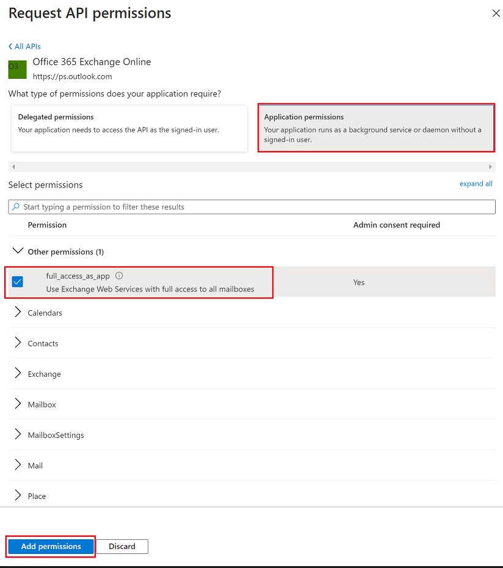
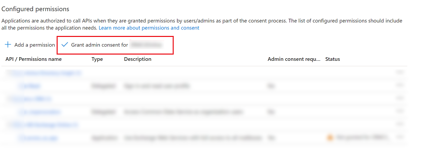

# Exchange Online cross-tenant authentication

[!INCLUDE [cc-beta-prerelease-disclaimer](../includes/cc-beta-prerelease-disclaimer.md)]

Use server-side synchronization to synchronize Exchange Online mailboxes that reside on different Exchange Online tenants. Follow the steps in this topic to complete the prerequisites before you set up an Exchange Online server profile that uses Oauth cross-tenant authentication. More information: [Create an email server profile for Exchange Online](connect-exchange-online.md#create-an-email-server-profile-for-exchange-online)

## Configuration

Sign in to the [Azure portal](https://portal.azure.com/), create the app registration, and then configure the email server profile.

## Register your app

Register your app on the Azure portal on the tenant where Exchange Online resides. To create the app registration, follow the steps in [Register an application](/azure/active-directory/develop/quickstart-register-app#register-an-application).

> [!NOTE]
> You don't need to enter anything for **Redirect URI** because it's not needed.

When you register your app, note the **Application (client) ID** and **Directory (tenant) ID**; you'll need this information later to configure the email server profile.

> [!div class="mx-imgBorder"] 
> 

## Add a client Secret

A client secret is a string value your app uses to identity itself. It's used by Dynamics 365 to authenticate to your app.

To create a client secret, follow the steps in [Add a client secret](/azure/active-directory/develop/quickstart-register-app#add-a-client-secret). Remember to note the **Secret Value**, because you'll need this information later to configure the email server profile.

> [!div class="mx-imgBorder"] 
> 

## Add API permissions 

To allow your app to have access to Exchange Online, you need to grant **Office 365 Exchange Online** API permission. 

1. Select **API permissions** &gt; **Add a permission**.
    
   > [!div class="mx-imgBorder"] 
   > 

2. Select the **APIs my organization uses** tab, and then select **Office 365 Exchange Online**.
   
   > [!div class="mx-imgBorder"] 
   > 

3. For type of permissions, select **Application permissions**, and then select the checkbox for **full\_access\_to\_app**. When you're done, select **Add permissions**.

   > [!div class="mx-imgBorder"] 
   > 

   > [!NOTE]
   > If it doesn't align with your business requirements to have an app with full access on all mailboxes, the Exchange Online admin can scope the mailboxes that the app can access by using Application Access Policy or configuring the Application Impersonation role on Exchange. More information:
   > - [Scoping application permissions to specific Exchange Online mailboxes](/graph/auth-limit-mailbox-access)
   > - [Configure impersonation](/exchange/client-developer/exchange-web-services/how-to-configure-impersonation)

4. On the **Configured permissions** screen, select **Grant admin consent for *tenant name***.

    > [!div class="mx-imgBorder"] 
    > 

5. In the confirmation dialog, select **Yes**.

## Email server profile for Exchange Online with authentication type Oauth (Cross Tenant)

To [create an email server profile for Exchange Online that uses Oauth (Cross Tenant) authentication](connect-exchange-online.md#create-an-email-server-profile-for-exchange-online), you need to collect the following information from the Azure portal:

- TenantId: The tenant ID of the tenant where Exchange Online is configured
- Application ID: The app ID used by Dynamics 365 to connect to Exchange Online
- Client secret: The client secret used by Dynamics 365 to authenticate as the app

> [!div class="mx-imgBorder"]
>  
