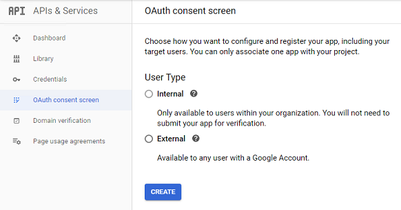
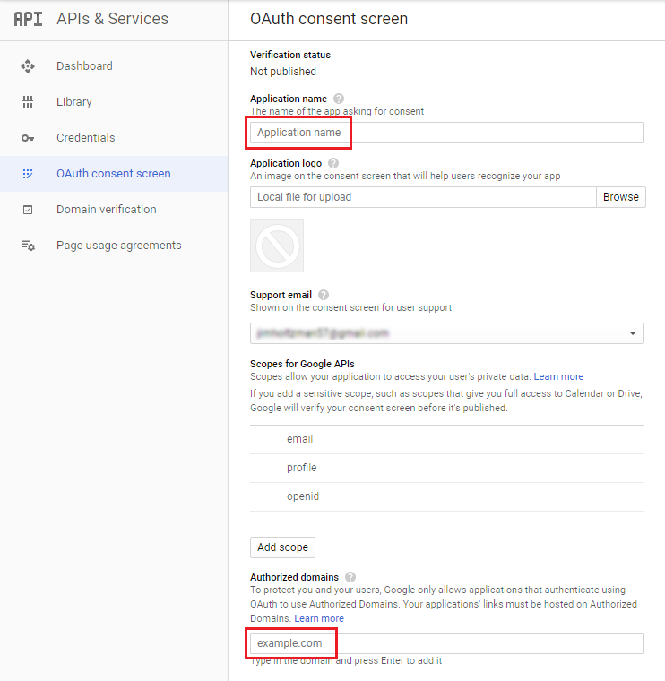
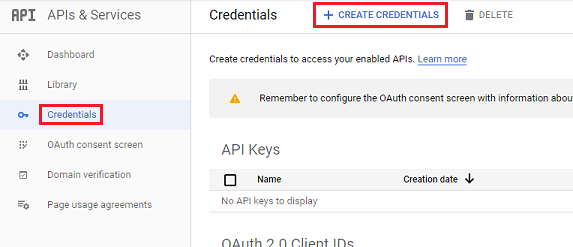

# Connect Gmail accounts using OAuth2 

This document provides a high-level overview on how to use the new feature that allows SSS to send and receive email in Dynamics 365 from Gmail accounts using OAuth2 as authorization mechanism.

## Step 1: Enable IMAP and POP in Gmail

For IMAP, follow the steps in: [Check Gmail through other email platforms](https://support.google.com/mail/answer/7126229)

For POP, follow the steps in: [Read Gmail messages on other email clients using POP](https://support.google.com/mail/answer/7104828)

## Step 2: Create a project

Using a Google account (could be the same one you’ll use to send and retrieve email or a different one), go to the Google Developers Console and create a new project.

Follow the steps for **Create a project** in: [Create, shut down, and restore projects ](https://support.google.com/googleapi/answer/6251787)

## Step 3: Configure OAuth consent 

1. Select the OAuth consent screen and select the user type. Select **Internal** if you're using a GSuite admin tenant and will be creating the app exclusively for your organization. Select **External** if you’re testing with a stand-alone Gmail account. 

   > [!div class="mx-imgBorder"] 
   > 

2. Select **Create**.

3. Enter an application name and your environment's fully qualified domain name (for example: contoso.crm.dynamics.com). Then, select **Save**.

   > [!div class="mx-imgBorder"] 
   > 

4. Select **Credentials** > **Create credentials**.

   > [!div class="mx-imgBorder"] 
   > 

5. Select **OAuth client ID**.

6. Select **Configure consent screen**.

7. Enter the following settings.

   |Setting  |Enter  |
   |---------|---------|
   |**Application type**     | Web application         |
   |Name     |  The name of your web client       |
   |**Authorized JavaScript origins**     | Your environment's  URL (for example, https://contoso.crm.dynamics.com)        |
   |**Authorized redirect URIs**     | Your environment's URL with "/_grid/cmds?dlg_gmailoauth.aspx" appended to it (for example, https://contoso.crm.dynamics.com/_grid/cmds/dlg_gmailoauth.aspx)        |

   > [!div class="mx-imgBorder"] 
   > 

8. Select **Create**.

## Step 4: Create an email server profile

## Step 5: Configure the mailbox

## Step 6: Test and enable