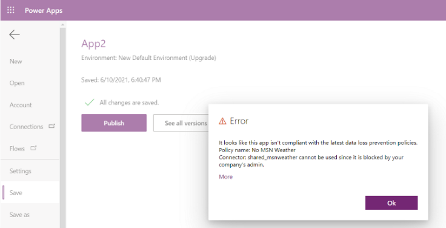
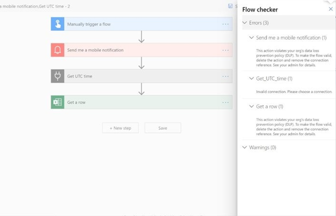

# Impact of DLP policies on apps and flows

If you've disallowed certain connectors to be used together in an environment by classifying them as **Business** or **Non-Business**, or marked certain connectors as **Blocked** by using tenant-level or environment-level data loss prevention (DLP) policies, these restrictions can negatively affect makers and users of Power Apps and Power Automate. The restrictions are enforced at both design time and at runtime.

As an admin, you should have a process and plan in place to handle these types of support needs if you're using DLP policies.

## Design-time impact on apps and flows

Users who create or edit a resource affected by the DLP policy will see an appropriate error message about any DLP policy conflicts. For example, Power Apps makers will see the following error when they use connectors in an app that don't belong together or have been blocked by DLP policies. The app won't add the connection.

> [!div class="mx-imgBorder"] 
> 

> [!div class="mx-imgBorder"] 
> 

Similarly, Power Automate makers will see the following error when they try to save a flow that uses connectors that don't belong together or have been blocked by DLP policies. The flow itself will be saved, but it will be marked as **Suspended** and won't be executed unless the maker resolves the DLP violation.

> [!div class="mx-imgBorder"] 
> 

## Runtime impact on apps and flows

As an admin, you can decide to modify the DLP policies for your tenant or for specific environments at any point. If apps and flows were created and executed in compliance with an earlier DLP policy, some of them might be negatively affected by any policy changes you make. 

Users who use a resource that's in violation of the latest DLP policy will see an error message about the DLP policy conflict. For example, Power Apps makers and users will see the following error when they try to open an app that uses connectors that don't belong together or have been blocked by DLP policies. 

> [!div class="mx-imgBorder"] 
> 

Similarly, Power Automate makers and users won't be able to start a flow that uses connectors that don't belong together or have been blocked by DLP policies. A background system process marks the flow as **Suspended**, and the flow won't be executed until the maker resolves the DLP policy violation.

> [!NOTE]
> The flow suspension process works in a polling mode. It takes about five minutes for the latest DLP policy changes to be assessed against active flows to mark them as suspended due to DLP policy violations. This change isn't instantaneous.

> [!div class="mx-imgBorder"] 
> 

## Providing an admin contact and reference link in DLP error messages

Power Platform DLP runtime enforcement experiences can include an admin contact and a link to governance reference material. The admin contact and reference link can be set using the PowerShell for [Governance error message content commands](powerapps-powershell.md#governance-error-message-content-commands). 

[!INCLUDE[footer-include](../includes/footer-banner.md)]
