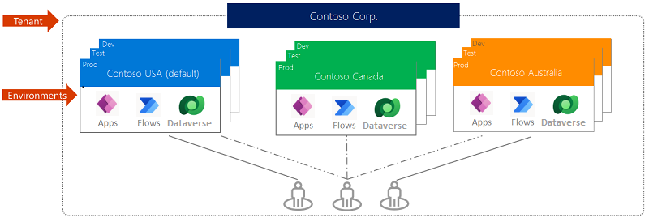
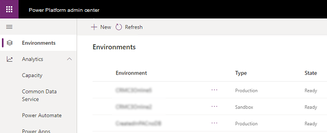

# Power Platform environment

A *Power Platform environment* is a space to store, manage, and share your organization's business data, apps, chatbots, and flows. It also serves as a container to separate apps that might have different roles, security requirements, or target audiences. How you choose to use environments depends on your organization and the apps you're trying to build. For example:

- You can choose to only build your apps or chatbots in a single environment.
- You might create separate environments that group the test and production versions of your apps or chatbots.
- You might create separate environments that correspond to specific teams or departments in your company, each containing the relevant data and apps for each audience.
- You might also create separate environments for different global branches of your company.  

## Scope of Power Platform environments

Each environment is created under a Microsoft Entra tenant, and its resources can only be accessed by users within that tenant. An environment is also bound to a geographic location, like the United States. When you create an app in an environment, that app is routed only to datacenters in that geographic location. Any items that you create in that environment (including chatbots, connections, gateways, flows using Microsoft Power Automate, and more) are also bound to their environment's location.

Every environment can have zero or one Microsoft Dataverse database, which provides storage for your apps and chatbots. Whether you can create a database for your environment depends on the license you purchase for Power Apps and your permissions within that environment. More information: [Pricing info](pricing-billing-skus.md)

When you create an app in an environment, that app is only permitted to connect to the data sources that are also deployed in that same environment, including connections, gateways, flows, and Dataverse databases. For example, consider a scenario where you've created two environments named Test and Dev, and created a Dataverse database in each of the environments. If you create an app in the Test environment, it will only be permitted to connect to the Test database; it won't be able to connect to the 'Dev' database.

You can also move resources between environments. More information: [Migrate resources](/powerapps/maker/data-platform/export-solutions)

## Power Platform environment roles

Environments have two built-in roles that provide access to permissions within an environment:

- The *Environment Admin* role can perform all administrative actions on an environment, including the following:
  - Add or remove a user or group from either the Environment Admin or Environment Maker role.
  - Provision a Dataverse database for the environment.
  - View and manage all resources created within the environment.
  - Set data loss prevention policies. More information: [Manage data loss prevention policies](prevent-data-loss.md) 
  After creating the database in the environment, you can use the System Administrator role instead of the Environment Admin role.
- The *Environment Maker* role can create resources within an environment including apps, connections, custom connectors, and flows using Power Automate.

Environment makers can also distribute the apps they build in an environment to other users in your organization by sharing the app with individual users, security groups, or all users in the organization. More information: [Share an app in Power Apps](/powerapps/maker/canvas-apps/share-app)

Users or groups assigned to these environment roles aren't automatically given access to the environment's database (if it exists) and must be given access separately.

Users or security groups can be assigned to either of these two roles by an environment admin by following the steps described in [Configure user security to resources in an environment](database-security.md).

## Power Platform environment types

There are multiple types of environments. The type indicates the purpose of the environment and determines its characteristics. The following table summarizes the current types of environments that you might encounter.

|Type  |Description  |Security  |
|---------|---------|---------|
|Production  |  This is intended to be used for permanent work in an organization. It can be created and owned by an administrator or anyone with a Power Apps license, provided there is 1&nbsp;GB available database capacity. These environments are also created for each existing Dataverse database when it is upgraded to version 9.0 or later. Production environments are what you should use for any environments on which you depend.     | Full control.     |
|Default   | These are a special type of production environment. Each tenant has a default environment that's created automatically. Its characteristics are discussed in the following section, [The default environment](#default-environment)   |  Limited control. All licensed users1 have the environment maker role.     |
|Sandbox  | These are non-production environments, which offer features like copy and reset. Sandbox environments are used for development and testing, separate from production. Provisioning sandbox environments can be restricted to admins (because production environment creation can be blocked), but converting from a production to a sandbox environment can't be blocked.     | Full control. If used for testing, only user access is needed. Developers require environment maker access to create resources.    |
|Trial    | Trial environments are intended to support short-term testing needs and are automatically cleaned up after a short period of time. They expire after 30 days and are limited to one per user. Provisioning trial environments can be restricted to admins.    |  Full control.    |
| Developer | Developer environments are created by users who have the Developer Plan license. They're special environments intended only for use by the owner. Provisioning developer environments can be restricted to admins. More information: [Control environment creation](control-environment-creation.md#developer-environments). The developer environment will be available as long as you actively use the Power Apps Developer Plan. More information: [Power Apps Developer Plan](/powerapps/maker/developer-plan)     |  Limited control.  Security groups can't be assigned to developer environments. |
| Microsoft Dataverse for Teams |  Dataverse for Teams environments are automatically created for the selected team when you create an app in Teams using the app for the first time or install an app from the app catalog. More information: [About the Dataverse for Teams environment](about-teams-environment.md)</a>.     |  Limited control. Admins have limited settings available for Teams environments. No customizations of security role or assignments are available. Teams members are automatically mapped to their Teams membership type - owners, members, and guests - with a corresponding security role assigned by the system.    |

1Users licensed for Power Apps, Power Automate, Microsoft 365, and Dynamics 365, standalone licenses, and free and trial licenses.

## Default environment

A single default environment is automatically created by Power Apps for each tenant and shared by all users in that tenant. Whenever a new user signs up for Power Apps, they're automatically added to the Maker role of the default environment. No users will be automatically added to the Environment Admin role of the default environment. The default environment is created in the region closest to the default region of the Microsoft Entra tenant, and is named as follows: "{Microsoft Entra tenant name} (default)".

You can't delete the default environment. You can't manually back up the default environment; system backups are done continuously.

The default environment is limited to 1 TB of storage capacity. To store more data, you can create a production environment. The default environment has the following included storage capacity:

- 3 GB Dataverse Database Capacity
- 3 GB Dataverse File Capacity
- 1 GB Dataverse Log Capacity

The capacity check conducted prior to creating new environments will exclude the default environment's included storage capacity when calculating whether you have  sufficient capacity to create a new environment.

### Assign administrators to the default environment

Microsoft 365 Power Platform administrators are automatically assigned the Dataverse system administrator security role in the default environment. However, no other users are automatically added to the default environment as an administrator. To avoid the possibility of an administrative lockout to the default environment, we recommend that you assign the system administrator security role to a few trusted users without assigning those users the Power Platform administrator role. More information: [Environments with a Dataverse database](database-security.md#environments-with-a-dataverse-database)

### Rename the default environment

The default environment is created using the naming convention {Microsoft Entra tenant name} (default).  Power Platform administrators should consider renaming the default environment to something more descriptive, such as *Personal Productivity Environment* that clearly calls out the intent of the environment.

> [!NOTE]
> After you change the name of the default environment, you can still identify it from the Power Platform admin center as the only environment with the environment **Type** of **Default**.

More information: [Edit properties of an environment](edit-properties-environment.md)

### Default environment best practices

For more guidance information with the default environment, go to [Manage the default environment](../guidance/adoption/manage-default-environment.md) and [Secure the default environment](../guidance/adoption/secure-default-environment.md).

## Production and trial environments

You can create environments for different purposes. A trial environment is for trying out the environment and the experience of using a database with Dataverse. It expires after a certain period.

## Manage environments in the Power Platform admin center

You can view and manage your environments on the **Environments** page in the [Power Platform admin center](https://admin.powerplatform.microsoft.com).

> [!div class="mx-imgBorder"]
> 

You can sort and search the list of environments; this is useful if you have a large number of environments to manage.

### Environment details

Select an environment to view the details of that environment, including the URL, region it is hosted in, and version. Select **See all** to see more environment details.

> [!div class="mx-imgBorder"]
> 

Select **Edit** to review and edit environment details.

> [!div class="mx-imgBorder"]
> 

### Environment history

Environment history gives admins a timeline of the full environment lifecycle from the moment it's created until it's completely deleted with all the actions performed on the environment in between, such as Edit, Copy, Reset, etc. Actions on the timeline format are:

- Action name: for example, create
- Start time
- End time: if applicable
- Initiated by: the user
- Status: for example, succeeded or failed

To see the environment history:

1. Sign in to the [Power Platform admin center](https://admin.powerplatform.microsoft.com) as an admin.

2. Select **Environments**, and then select an environment from the list.

3. On the command bar, select **History**.

:::image type="content" source="media/environment-history-data.png" alt-text="Environment history data":::

> [!NOTE]
>
> - Some actions such as Edit will show the edit as an action but not details of the action.
> - Once an environment is completely deleted, environment history is also deleted. So, it might not be possible to know who deleted an environment after it's been hard deleted.

### See also

[!INCLUDE[footer-include](../includes/footer-banner.md)]
