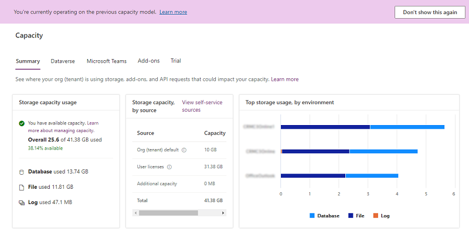

# Legacy storage capacity

In April 2019, we introduced Common Data Service capacity storage that is optimized for relational data, attachments, and audit logs. If you purchased storage prior to April 2019, you are using the legacy licensing model for storage discussed in this topic.

If you purchased storage in or after April 2019, or you have a mix of before and after April 2019 storage purchases, you will see your storage capacity entitlement and usage by database, file, and log as it appears in the Power Platform admin center today. For more information, see [Common Data Service storage capacity](capacity-storage.md).

> [!NOTE]
> The calculation of capacity storage into three storage types - database, file, and log - is the same for the legacy licensing storage model and the new licensing storage model. What differs is the presentation of the storage information in the user interface. See [Determining your storage model](#determining-your-storage-model).
> For more information on changes, see [What's new in storage](whats-new-storage.md).

## Determining your storage model

1. Sign in to the Power Platform admin center, and then select an environment. 

2. Select **Analytics** > **Capacity**.

3. View the data on the **Summary** page.

The legacy licensing storage model looks like this:

> [!div class="mx-imgBorder"] 
> 

The report displays available storage capacity by source as well as overall storage capacity usage. To help customers transition to the new licensing model, current usage is also shown by database, file, and log capacity. 

The new licensing storage model looks like this:

> [!div class="mx-imgBorder"] 
> 

### See also
[Common Data Service storage capacity](capacity-storage.md)
[What's new](whats-new-storage.md)

