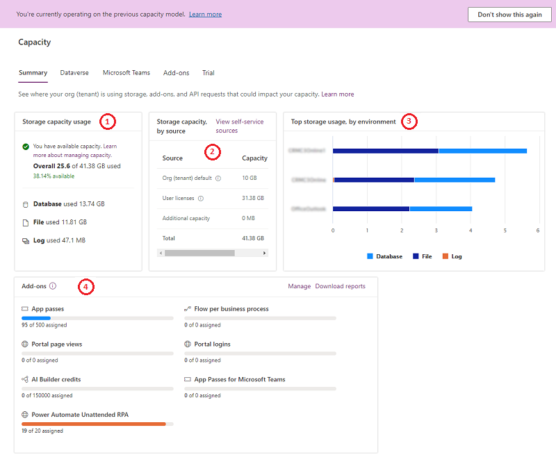

# Legacy storage capacity

In April 2019, we introduced Common Data Service capacity storage that is optimized for relational data, attachments, and audit logs. If you purchased storage prior to April 2019, you are using the legacy licensing model for storage discussed in this topic.

## Licenses for legacy storage model

The following licenses provide capacity using the legacy storage model. If you have any of these licenses, you will see the legacy model report. 

- Microsoft Dynamics CRM Online Additional Non-production Instance 
- Microsoft Dynamics CRM Online Additional Test Instance 
- Microsoft Dynamics CRM Online Instance 
- Microsoft Dynamics CRM Online Storage Add-On 

To see if you have any of these licenses, sign in to the Microsoft 365 admin center, and then go to **Billing** > **Products & Services**.

> [!NOTE]
> If you have a mix of the above legacy model licenses and the [new model licenses](capacity-storage.md#licenses-for-new-storage-model), you will see the [new model report](capacity-storage.md).
> 
> If you have a none of the above legacy model licenses or the [new model licenses](capacity-storage.md#licenses-for-new-storage-model), you will see the [new model report](capacity-storage.md).

## Verifying your legacy storage model

1. Sign in to the Power Platform admin center, and then select an environment. 

2. Select **Analytics** > **Capacity**.

3. View the data on the **Summary** page.

The legacy licensing storage model looks like this:

> [!div class="mx-imgBorder"] 
> 

The report displays available storage capacity by source as well as overall storage capacity usage. To help customers transition to the new licensing model, current usage is also shown by database, file, and log capacity. 

## Capacity page details

> [!NOTE]
> The calculation of capacity storage into three storage types - database, file, and log - is the same for the legacy licensing storage model and the new licensing storage model. What differs is the presentation of the storage information in the user interface. 

### Summary tab

This page provides a tenant-level view of where your organization is using storage capacity.

To view the **Summary** page, select **Analytics** > **Capacity** > **Summary** tab.

> [!div class="mx-imgBorder"] 
> 

|  |Description |
|---------|---------|
|(1)   |**Current usage**  <ul><li>**File**: The following entities are used: <ul><li>Attachment</li><li>AnnotationBase</li><li>Any custom or out-of-box (OOB) entity that has fields of datatype file or image (full size)</li></ul></li><li>**Log**: The following entities are used: <ul><li>AuditBase</li><li>PlugInTraceLogBase</li></ul><li>**Database**: All other entities are counted for your database</li></ul> |
|(2)    |**Capacity types and sources** <ul><li>**Organization base**: The default capacity given at the time of sign-up </li><li>**User licenses**: Additional capacity added for every User License purchased</li><li>**Additional storage**: Any additional storage you bought </li><li>**Total**: Total storage available </li><li>**View self-service sources**: See [View self-service license amounts and storage capacity](view-self-service-capacity.md)</li></ul>      |
|(3)     |**Top capacity usage, by environment**: Top environments that consume the most capacity        |

### Storage capacity tab

This page provides similar information as the **Summary** tab but with an environment-level view of where your organization is using capacity.

To view the **Storage capacity** page, select **Analytics** > **Capacity** > **Storage capacity** tab. See the next section for using the **Details** button () to see environment capacity analytics.

> [!div class="mx-imgBorder"] 
> 

> [!NOTE]
> - The following environments do not count against capacity and show as 0GB:
>   - Trial 
>   - Preview
>   - Support
>   - Developer
> - Admins can select environments showing 0GB to go to the **Environment Analytics** page and see the actual consumption.

### Environment capacity analytics

This page provides an environment-level detailed view of where your organization is using capacity as well as the three capacity types consumption. 

To view environment-level capacity analytics:

1. Select **Analytics** > **Capacity** > **Storage capacity** tab.
2. Select an environment.
3. Select the **Details** button ()

> [!div class="mx-imgBorder"] 
> 

Details provided:

- Actual database usage
- Top database tables and their growth over time
- Actual file usage
- Top files tables and their growth over time
- Actual log usage
- Top tables and their growth over time

## Example storage capacity scenario

### Scenario: Database storage is over capacity

|Type  |Entitled  |Consumed  |
|---------|---------|---------|
|**Database**     | 100GB        | 110GB        |

This tenant is 10GB over in storage usage. Therefore, there is a deficit and additional capacity should be purchased.

## Actions to take for a storage capacity deficit

You can always [free up storage](free-storage-space.md), [delete unwanted environments](delete-environment.md), or buy more capacity to be compliant with storage usage. To learn more about capacity add-ons, see the [Dynamics 365 Licensing Guide](https://go.microsoft.com/fwlink/p/?LinkId=866544) or the [Power Apps and Power Automate Licensing Guide](https://go.microsoft.com/fwlink/?linkid=2085130), the 'Add-ons' section. You can work through your organization's standard procurement process to purchase capacity add-ons.

## FAQ

### I have available instances (production and sandbox), but my capacity usage is more than capacity entitled. Will I be able to provision new environments? 
For now, you can provision a new environment if you have at least 1GB available database capacity. 

### I have storage licenses from the legacy licensing model and I also purchased new model storage licenses. Which report will I see?  
You will see the report for the new licensing model. 

### What are my options if I'm overusing capacity?  
You can buy more capacity to be compliant, and [free up](free-storage-space.md) or [delete](delete-environment.md) unused environments. 

### Do I get notified through email when my org is over capacity?  
When you sign in to the Power Platform admin center, you will be notified if your capacity usage is more than the entitled capacity. 

### See also
[Common Data Service storage capacity](capacity-storage.md)  
[What's new in storage](whats-new-storage.md)  
[Free storage space](free-storage-space.md)  
[Capacity add-ons](capacity-add-on.md)

