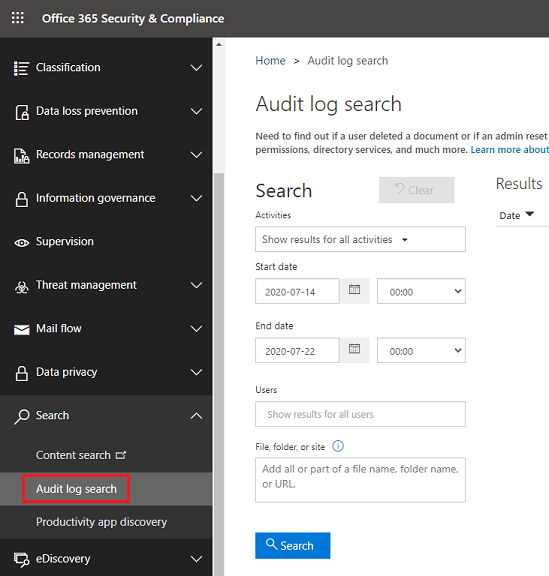

# Power Apps activity logging

Power Apps activities are tracked from the [Microsoft Purview compliance portal](/purview/purview). 

Follow these steps.

1. Sign in to the [Microsoft Purview compliance portal](https://compliance.microsoft.com) as a tenant admin.

2. Select **Search** > **Audit log search**. 

   > [!div class="mx-imgBorder"] 
   > 

Within the **Audit log search** screen, Power Platform admins can search audit logs across many popular services including eDiscovery, Exchange, Power BI, Microsoft Entra ID, Microsoft Teams, customer engagement apps (Dynamics 365 Sales, Dynamics 365 Customer Service, Dynamics 365 Field Service, Dynamics 365 Marketing, and Dynamics 365 Project Service Automation), and Microsoft Power Apps.

Once the Audit log search screen is accessed, an administrator can filter for specific activities by pulling down the **Activities** dropdown. By scrolling down the list, a section dedicated to Microsoft Power Apps activities can be found. 

## What events are audited
Logging takes place at the SDK layer which means a single action can trigger multiple events that are logged. The following are a sample of user events you can audit.

|Event  |Description  |
|---------|---------|
|Created app   |When the app gets created for the first time by a maker |
|Launched app    |When the app gets launched |
|Marked app as Featured   |Every time the app is marked as Featured|
|Restored app version   |The version of the app when restored|
|Edited app    |Any updates made to the app by the maker|
|Published app     |When the app is published and is made available to others in the environment|
|Edited app permission  |Every time a user's permissions to the app is changed|
|Deleted app |When the app is deleted  |
|Marked app as Hero |Every time the app is marked as Hero  |
|Deleted app permission |Every time a user's permissions to the app is removed  |
|Removed app as Hero  |Every time the app is unset as Hero |
|Removed app as Featured    |Every time the app is unset as Featured  |
|Patched app   |Every time the app is patched|
|Deleted app version   |The version of the app when deleted|
|Consented to the app's APIs    | When the current user has consented to the application's APIs|
|Imported new canvas app |Every time new canvas app is imported |
|Imported existing canvas app   |Every time existing canvas app is imported |
|Published solution canvas app version |When canvas app version from solution is published |
|Added DataLossPreventionEvaluationResult | When DLP evaluation occurs for the App |
|Admin restored deleted app    |When the deleted app is restored by the admin|
|Admin set desired logical name  |When the desired logical name of the app is set by the admin|
|Admin modified app owner |When the app owner is modified by the admin  |
|Admin modified app permissions |When the app permissions is modified by admin   |
|Admin deleted app |When the app is deleted by the admin |
|Admin set quarantine state |When the quarantine state of the app is set by the admin|
|Admin set conditional access   |When the conditional access of the app is set by the admin|
|Admin set bypass consent state |When the bypass consent state of the app is set by the admin|
|Admin set app as featured |Every time the app is marked as Featured by the admin |
|Admin allowed third party apps | When third party apps were allowed by the admin |

## Base schema
Schemas define which Power Apps fields are sent to the Microsoft Purview compliance portal.  Some fields are common to all applications that send audit data to Microsoft Purview, while others are specific to Power Apps. The Base schema contains the common fields. 

|Field name  |Type  |Mandatory  |Description  |
|---------|---------|---------|---------|
|Date     |Edm.Date|No         |Date and time of when the log was generated in UTC          |
|App Name   |Edm.String         |No         |Unique Identifier of the PowerApp        |
|Id     |Edm.Guid         |No         |Unique GUID for every row logged          |
|Result Status     |Edm.String         |No         |Status of the row logged. Success in most cases.          |
|Organization Id     |Edm.Guid         |Yes        |Unique identifier of the organization from which the log was generated.       |
|CreationTime     |Edm.Date         |No         |Date and time of when the log was generated in UTC          |
|Operation     |Edm.Date         |No         |Name of operation         |
|UserKey     |Edm.String         |No         |Unique Identifier of the User in Microsoft Entra ID       |
|UserType     |Self.UserType         |No         |The audit type (Admin, Regular, System)         |
|Additional Info     |Edm.String        |No         |Additional information if any (e.g. the environment name)       |

## Review your audit data using reports in Microsoft Purview compliance portal

You can review your audit data in the Microsoft Purview compliance portal. See [Search the audit log in the compliance Center](/microsoft-365/compliance/search-the-audit-log-in-security-and-compliance?view=o365-worldwide&preserve-view=true).

To use the preconfigured Power Apps reports, go to https://protection.office.com > **Search & investigation** > **Audit log search** and select the **Power Apps app activities** tab.

> [!div class="mx-imgBorder"] 
> 

### See also
 [Search the audit log in the compliance Center](/microsoft-365/compliance/search-the-audit-log-in-security-and-compliance?view=o365-worldwide&preserve-view=true) 
 [Office 365 Management APIs overview](/office/office-365-management-api/office-365-management-apis-overview) 
 [Permissions in the Security & Compliance Center](/office365/securitycompliance/permissions-in-the-security-and-compliance-center)

[!INCLUDE[footer-include](../includes/footer-banner.md)]
