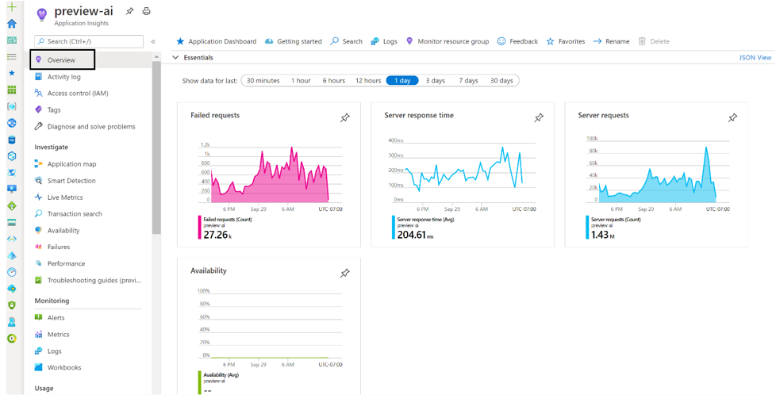
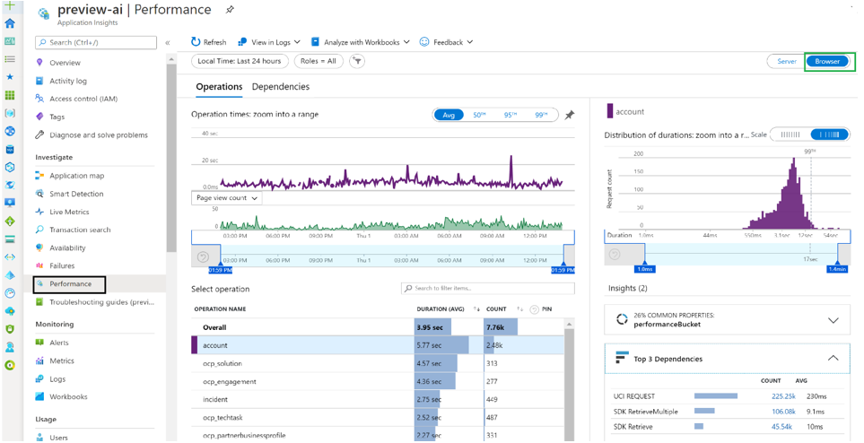
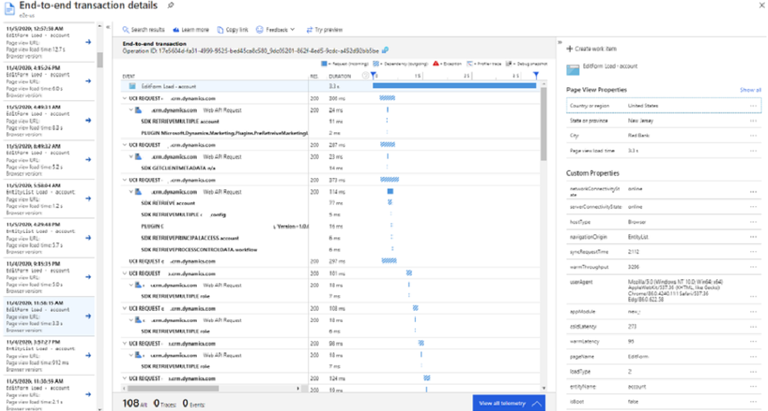

# Overview of integration with Application Insights

Application Insights, a part of the Azure monitoring ecosystem, is widely used within the enterprise landscape for monitoring and diagnostics. Data already collected from a specific tenant or environment will be pushed to your own Application Insights environment. The data is stored in Log Analytics by Application Insights and visualized in [Performance](https://docs.microsoft.com/azure/azure-monitor/learn/tutorial-performance) and [Failures](https://docs.microsoft.com/azure/azure-monitor/learn/tutorial-runtime-exceptions) panels under the **Investigate** menu. The data is exported to your Application Insights environment in the standard schema defined by Application Insights. The support, developer, and admin persona can leverage this feature to triage and resolve issues.

## What telemetry and which tables are being populated in Application Insights? 

|Telemetry type  |Application Insights table name  |
|---------|---------|
|UCI page loads      | pageViews        |
|UCI outbound network requests     | Dependency        |
|Dataverse API incoming calls     | Request        |
|Plug-in executions     | Dependency        |
|SDK executions (*Retrieve*, *RetrieveMultiple*, *FetchXML* transformation, etc.)     | Dependency        |
|Exceptions during execution of plug-in and SDK calls     | Exceptions       |

Application Insights has a wide range of features that will help you to leverage this data.

- [Create a dashboard](https://docs.microsoft.com/azure/azure-monitor/learn/tutorial-logs-dashboards) for an overview of the health of your org.
- Proactive monitoring using [Smart Detection](https://docs.microsoft.com/azure/azure-monitor/app/proactive-diagnostics).
- [Setting up alerts](https://docs.microsoft.com/azure/azure-monitor/learn/tutorial-alert) for important scenarios based on your org.
- Visualize and track common [navigation patterns](https://docs.microsoft.com/azure/azure-monitor/app/usage-flows) from a usage perspective. This will help you understand if a user always selects a specific tab first, before navigating back to the main tab and closing the form. It could, for example, indicate that a field should be positioned on the first tab, instead of another tab. This will save the user time every time they open this record.
- Custom queries to troubleshoot performance and errors by using the [Logs](https://docs.microsoft.com/azure/azure-monitor/log-query/log-query-overview) panel under the Monitoring menu.

Example: List top 10 records for formloads in the pageViews table 

pageViews 
| take 100

## Overview panel in Application Insights

Application Insights provides different views. The **Overview** panel shows a summary of the key diagnostic metrics of your app and is a gateway to the other features of the portal. You can drill into metrics for more details. See the following sample.

> [!div class="mx-imgBorder"] 
> 

## Performance panel in Application Insights

To open the **Performance** panel, either select the **Server Response Time** graph in the **Overview** panel or select **Performance** under the **Investigate** menu. Application Insights allows you to view data for both server-side and browser. By identifying those operations with the longest duration, you can diagnose potential problems.

The **Performance** panel shows the count and average duration of each operation for the application. You can use this information to identify those operations that most impact users.

Listed under the server section are the most frequently called API's and what the latency looks like. 

> [!div class="mx-imgBorder"] 
> 

Calls with higher number of calls and higher duration are potential items for investigation. In the above example, the POST /XRMServices/2011/Organization.svc/web has a high number of calls and a high duration.  Similarly, the GET /api/data/v9.0/accounts has a relatively higher duration. 

Selecting one of the operations will also show you details on the top three dependencies and time taken. You could see more details by selecting the **Dependencies** tab. 

If you toggle to the **Browser** view, you will see data on which pages are being viewed most frequently in the environment and the latency for each of these. You will see metrics including session counts and the dependencies associated with the different operations. For example, selecting the **Accounts** operation will provide requests made to the account entity.

> [!div class="mx-imgBorder"] 
> 

You could drill into a specific sample to see where time is spent on the particular operation. 

> [!div class="mx-imgBorder"] 
> 

See [Application Insights documentation](https://docs.microsoft.com/azure/azure-monitor/learn/tutorial-performance) for performance issues.

## Failures panel in Application Insights

To open the **Failures** panel, either select **Failures** under the **Investigate** menu or select the **Failed requests** graph.

> [!div class="mx-imgBorder"] 
> 

The exceptions table in Application Insights powers the **Failure** panel. It shows the count of failed requests and the number of users affected for each operation for the application. You can see error details for the operations and dependencies, for both server and browser.  Failures related to CRUD specific http methods (GET, POST, PUT, DELETE) used in the API operations are available here. This can be used to identify those failures that most impact users. For example, in the following sample you can see that the GET/api/data/v9.0/GetClientMetaData operation has a high number of failures and users. Selecting this operation shows more information about this operation in the right panel.  

> [!div class="mx-imgBorder"] 
> 

You can also see the failures related to the dependencies including summary view of the common response codes mapped to failures.

> [!div class="mx-imgBorder"] 
> 

You can drill into the details of the step where the bottleneck occurred.

> [!div class="mx-imgBorder"] 
> 

See using [Application Insights to find application run-time exceptions](https://docs.microsoft.com/azure/azure-monitor/learn/tutorial-runtime-exceptions).

## Querying the data in Application Insights 

In Application Insights, go to the the **Logs** panel under the **Monitoring** menu.

> [!div class="mx-imgBorder"] 
> 

**Common Fields**: All the [tables](#what-telemetry-and-which-tables-are-being-populated-in-the-application-insights) populated in Application insights have these common fields:

- **cloud_RoleInstance**: For events emitted as a part of this effort, this field will be set to “CDS Data Export” to ensure they can be identified versus other events in the same Application Insights environment.
- **operation_Id**: This links together all the operations in a single interaction - one way to get all related events to a failing event.
 union_requests, dependencies, pageViews  
| where operation_Id == “<insert id here>”
- **session_Id** : This uniquely identifies all activities in a single user session. The session value is reset when a user opens a new tab, selects F5/refresh, closes and reopens the mobile app.
- **user_Id, user_AuthenticatedId**: These are both currently set to the Azure Active Directory ID of the user. 
- **client_IP**: This field is always populated to 0.0.0.0 by Application Insights for General Data Protection Regulation (GDPR) compliance. The IP address provided is used to populate the *client_City*, *client_StateOrProvince*, and *client_CountryOrRegion* fields.
- **client_Type**: The value here is “Browser” if the logs are coming from UCI and “Server” if logs are coming from Dataverse. Note that the userAgent can be found in the **requests** table under **customDimensions** when available.

Since the Application Insights schema is fixed, and this feature pushed data into Application Insights as an export process, the *customDimensions* fields in Application Insights are used to add properties. 

