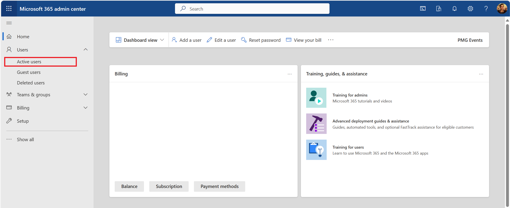
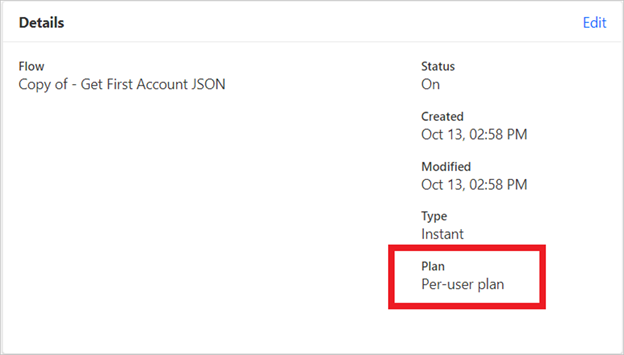
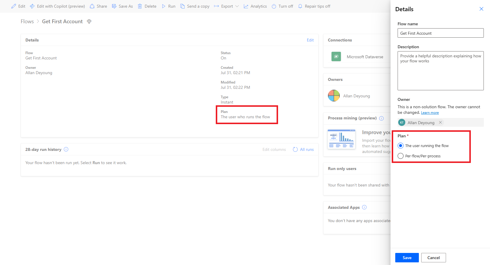
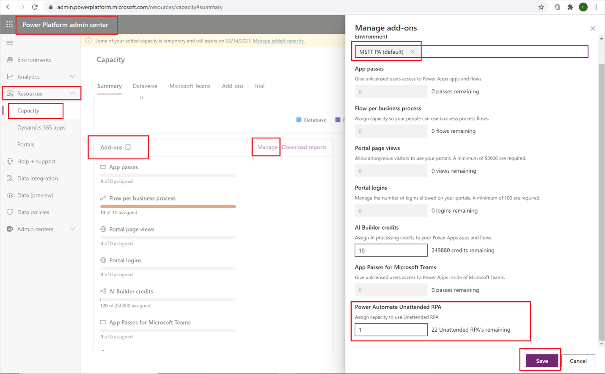
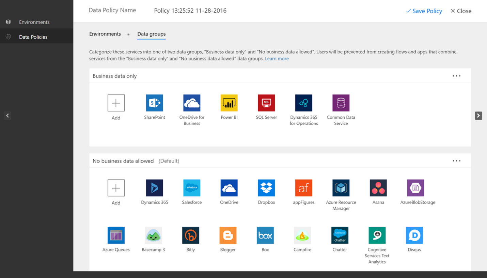
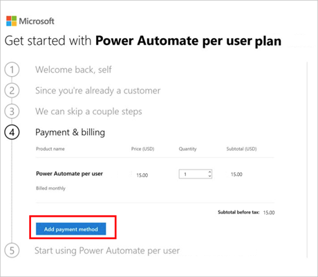
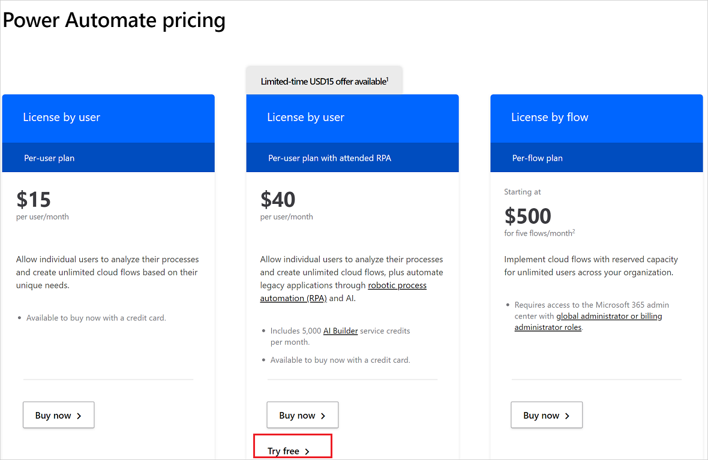
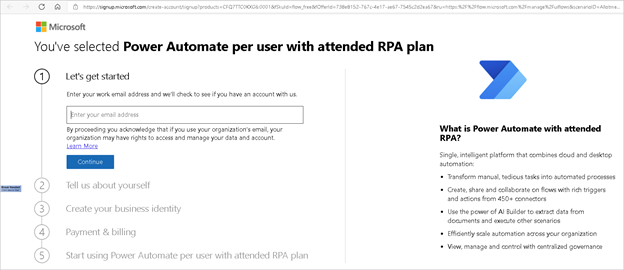

# Buy Power Automate licenses

## I'm an admin

Power Platform admins can purchase licenses for Power Automate and then manage those licenses in their organization.

### Buy Power Automate plans

You can purchase Power Automate plans from [Microsoft 365 admin center](https://admin.microsoft.com/).

1. Sign into the Microsoft 365 admin center.
1. Go to **Billing** > **Purchase services**, and then search for "Power Automate" to find all relevant plans.
1. Select the plan that you want to buy.

   

1. Provide the **Details** of the plan and then select **Buy**.

   

### Buy Unattended add-on

You can purchase the **Power Automate unattended RPA Trial add-on** from the [Microsoft 365 admin center](https://admin.microsoft.com/).

1. Sign into the Microsoft 365 admin center.
1. Go to **Billing** > **Purchase services**, and then search for "Power Automate" to find all relevant plans.
1. Search for the **Power Automate unattended RPA Trial add-on**.

   

1. Select **Details** on the **Power Automate unattended RPA Trial add-on** plan, and then select **Add-ons**.

   

1. Find the **Power Automate unattended RPA add-on Trial** and buy it.

   

After the purchase completes, the environment admin must assign the available (paid or trial) unattended add-on capacities to a specific environment in the [Power Platform admin center](https://admin.powerplatform.microsoft.com/).

## Manage licenses

### Assign per user licenses to user

1. Sign into the [Microsoft 365 admin center](https://admin.microsoft.com/), select **Users** > **Active users**.

   

1. Select the user to whom you'll assign the license.
1. Select **Licenses and apps**.

1. Select the checkbox for the license you want to assign to the user, and then save your changes.

   

### Assign per flow license

Here are the two steps you must take if you want to assign a per flow license to a user.

1. Allocate the per flow license to an environment in the Power Platform admin center.

1. Assign a per flow license to a flow.

It's easy and scalable to allocate the per flow add-ons you've purchased to the environments that need add-ons. In the [Power Platform admin center](https://admin.powerplatform.microsoft.com/) under capacity, you'll see a new section appears if your organization has purchased add-ons.

[!TIP]
To learn more about how to allocate the per flow license to an environment in the Power Platform admin center, see [capacity add-ons for Power Apps and Power Automate](../capacity-add-on.md) section.

Follow these steps to allocate add-ons to an environment.

1. Select **Resources** > **Capacity** on the left side of the screen.
1. Select **Add-ons** > **Manage** in the add-on section.
1. Select an environment.
1. Enter the amount of each add-on you would like to allocate to each environment.

   >[!TIP]
   >Flow per business process is same as per flow license.
   >[!NOTE]
>The per flow plan is environment specific. So, if you have multiple environments that need to run a flow, you need to assign per flow license to the flow in each environment.
1. Select **Save**.

   

   After you assign a per flow plan add-on to an environment, you can choose which flows can use that add-on.

1. In [Power Automate](https://flow.microsoft.com/), choose the flow to which you want to add the license. Owners, co-owners of the flow and admins can assign a per flow license to a flow.

   When you select a flow, you'll now see a new section in the details pane that tells you if the flow is assigned to a user, or if it is part of the per-flow plan. The default for a flow is to use the license of the user.

   

1. To have a flow use the per-flow plan, select  **Edit** in the details panel. You will then see the **Name**, **Description** and **Plan** that the flow uses. If your environment has the per flow add-on allocated, you can move that flow to use the per flow plan. Otherwise, you'll need to allocate capacity.

   

After you update your flow, anyone will be able to use that flow, even if it leverages premium connectors. Additionally, capacity will be dedicated to that flow.

### Assign unattended add-ons to an environment

In the [Power Platform admin center](https://admin.powerplatform.microsoft.com/), select **Resources** > **Capacity** > **Manage** in add-ons to assign add-ons.

Users can now run unattended desktop flows within the environment that has the unattended capacity.

>[!NOTE]
>The unattended add-on is environment specific. So, if you have multiple environments that need to run unattended RPA, you need to assign add-on capacity to each of them. Also, if you need to run multiple unattended desktop flows in parallel in a single environment, you need to assign the right number of unattended add-ons to the environment to support the parallel flow runs.

### Assign capacity add-on to an environment

Consult this article to learn more about [capacity add-ons for Power Apps and Power Automate](../capacity-add-on.md)

### Monitor license usage

Follow these steps to monitor license usage.

1. Sign into the [Microsoft 365 admin center](https://admin.microsoft.com/).

1. Go to **Billing** > **Licenses** to see all licenses that are assigned or available.

   

1. Select the progress bar in the **Assigned licenses** column to see which users have licenses assigned to them.

### FAQ

#### I assigned a premium license to a user, but the user can't use premium features. Why?

It might take up to a week for all the downstream systems to receive updates. To force an update for a particular flow, turn the flow off and on or edit and save the flow.

#### How do I remove Power Automate from the app launcher for a user?

If a user was assigned a Power Automate license, you can take the following steps to remove the license for that user. This action removes the Power Automate icon from the app launcher.

1. Go to the [Microsoft 365 admin center](https://admin.microsoft.com/).
2. In the left navigation bar, select  **Users**  >   **Active Users**.
3. Find the user for whom you want to remove the license, and then select their name.
4. On the user details pane, select the **Licenses and Apps**  tab, and then uncheck the license for Power Automate.
5. At the bottom, select  **Save changes**.

It's also possible to do a bulk removal of licenses through PowerShell. See [Remove licenses from user accounts with Microsoft 365 PowerShell](/microsoft-365/enterprise/remove-licenses-from-user-accounts-with-microsoft-365-powershell) for a detailed example.

Additional guidance about bulk removal of services within a license can be found in the [Disable access to services with Microsoft 365 PowerShell](/microsoft-365/enterprise/disable-access-to-services-with-microsoft-365-powershell) article.

>[!NOTE]
>This action removes the Power Automate tile by default. A user may still choose to use Power Automate as an individual.

#### Why did 10,000 licenses for Power Automate show up in my Microsoft 365 tenant?

Any person can try out Power Automate free for 90 days, and these trial licenses represent the available capacity for new Power Automate users in your tenant. There is no charge for these licenses.

If at least one user in your tenant has signed up for a Microsoft Power Automate free license, you will see 10,000 licenses (minus any assigned licenses) under **Billing** > **Licenses**  for your organization.

You can choose to assign additional licenses to users yourself through the Microsoft 365 admin center but note that these are trial licenses for Power Automate, and they will expire 90 days after you assigned them to a user.

#### Is trial free? Will I be charged for these licenses?

No user can incur any cost to your organization without your express consent, so neither free nor trial licenses can cause any charges to your organization. Moreover, they also don't use any quotas, such as run quotas.

#### I removed the Power Automate free license and users can still access it

The Power Automate free license is included only for tracking purposes. It's not possible to prevent another person from using Power Automate for individual purposes. Thus, the presence of a Power Automate free license does not actually grant or remove any capabilities.

#### Why can't I see all Power Automate licenses in the Microsoft 365 admin center?

Users can use Power Automate either as individuals or as a part of their organization. Licenses at the organizational level will always be visible in the Microsoft 365 admin center. However, if a user signs up for a trial as an individual then that is not managed by their Microsoft 365 admin and will it won't  display in the Microsoft 365 admin center.

#### How can I restrict my users' ability to access my organization's business data?

Power Automate allows you to create data groups for business and non-business data. After you implement these data loss prevention policies, users cannot design nor run flows that combine business and non-business data. For more details, See [Data loss prevention (DLP) policies](/power-automate/prevent-data-loss).

## I am a maker

### What is my license?

1. Sign into [Power Automate](https://powerautomate.com/).
2. Select your profile picture in the top right corner of the screen.
3. Select  **View account**.
4. Select the  **View** on the **Subscriptions**  tile.
5. Search for  **Power Automate**  under the  **Licenses**  section.

You will see the license(s) that you have for Power Automate.

Alternatively, see your [subscription page](https://portal.office.com/account/#subscriptions) to see licenses and trials assigned to you.

### Can a maker buy licenses?

Yes. To get started, use the [self-service purchase](/microsoft-365/commerce/subscriptions/self-service-purchase-faq) method for Microsoft Power Platform (Power BI, Power Apps, and Power Automate).

>[!IMPORTANT]
>This capability isn't available to government, non-profit, or education tenants in the United States.

Customers can make a self-service purchase from Power Automate. To do this, they first provide their email address to confirm if they are a user in an existing Azure Active Directory (Azure AD) tenant. Next, they'll need to log in by using their Azure AD credentials. After signing in, the they need to indicate the number subscriptions they want to purchase and provide a credit card for payment. When the purchase is complete, they'll can start using their subscription. The purchaser can also access a limited view of the Microsoft 365 admin center where they can enable other people in their organization to use the product.

Admins can turn off self-service purchasing on a per product basis via the [MSCommerce PowerShell module](/microsoft-365/commerce/subscriptions/allowselfservicepurchase-powershell).

Central procurement and IT teams view all users who buy and deploy self-service purchase solutions through the [Microsoft 365 admin center](https://go.microsoft.com/fwlink/p/?linkid=2024339). Admins can turn off self-service purchasing on a per product basis via PowerShell.

You can find more [FAQs on self service purchases](/microsoft-365/commerce/subscriptions/self-service-purchase-faq).

### Where does the self-service purchaser see and manage their purchases?

Self-service purchasers can manage their purchases in the limited view of the [Microsoft 365 admin center](https://go.microsoft.com/fwlink/p/?linkid=2024339). Self-service  purchasers can always get to the admin center from the  **Admin**  tile in the app launcher that's built into all Microsoft 365 and Dynamics online apps. Self-service  purchasers can view the purchases they've made, buy additional subscriptions to the same service, and assign licenses for those subscriptions to other users in their organization. Additionally, purchasers can view and pay their bill, update their payment method, and cancel their subscription.

### FAQ

#### Are there differences between Microsoft Accounts and work or school accounts for billing?

Yes. If you sign in with a Microsoft Account (such as an account that ends with @outlook.com or @gmail.com), you can use only the free plan. To take advantage of the features in the paid plan, sign in with a work or school email address.

#### I'm trying to upgrade, but I'm told my account isn't eligible

To upgrade, use a work or school account, or create a [Microsoft 365 trial account](https://powerbi.microsoft.com/documentation/powerbi-admin-signing-up-for-power-bi-with-a-new-office-365-trial/).

#### Who can buy Microsoft Power Apps and Power Automate plans?

Any customer can sign up for a free trial. Microsoft 365 admins can buy Power Automate plans for their teams or organization. Contact your Microsoft 365 admin when you're ready to buy.

#### Can makers request admins to assign license to them?

Yes.

1. Go to the [Microsoft Power Automate](https://flow.microsoft.com/pricing/) pricing page and select **Buy now** for the license that you need.

   

1. Fill in the details, and then send the request to your admin.

   

1. Admins can see your request in the Microsoft 365 admin center and assign a license to you.

[!INCLUDE[footer-include](../../includes/footer-banner.md)]
