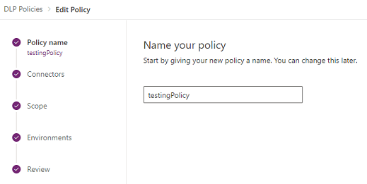

# Manage data loss prevention (DLP) policies
An organization's data is critical to its success. Its data needs to be readily available for decision-making, but it needs to be protected so that it isn't shared with audiences that shouldn't have access to it. To protect this data, Power Apps lets you create and enforce data loss prevention (DLP) policies that define which consumer connectors specific business data can be shared with. For example, an organization that uses Power Apps may not want its business data that's stored in SharePoint to be automatically published to its Twitter feed.

To create, edit, or delete DLP policies, you must have either Environment Admin or Power Platform service admin permissions. For more information, see [Environments administration in Power Apps](environments-administration.md).

For instructions on how to create a DLP policy, see [Create a data loss prevention (DLP) policy](create-dlp-policy.md).

## Find a DLP policy

1. Sign in to the Power Platform admin center.

2. In the navigation pane, select **Data policies**. If you have a long list of policies, use the **Search** box to find specific DLP policies.

   > [!div class="mx-imgBorder"] 
   > 

## Edit a DLP policy

1. In the list of data loss prevention policies, select an environment and then select **Edit Policy**.

   > [!div class="mx-imgBorder"] 
   > 

   > [!NOTE]
   > Environment admins can't edit environments created by the tenant admin.

2. Proceed through the Edit policy steps, and then select **Update Policy**.

   > [!NOTE]
   > Environment DLP policies cannot override tenant-wide DLP policies.

   > [!div class="mx-imgBorder"] 
   > 

## Delete a DLP policy

1. In the list of data loss prevention policies, select an environment and then select **Delete Policy**.

   > [!div class="mx-imgBorder"] 
   > 

   > [!NOTE]
   > Environment admins can't delete environments created by the tenant admin.

2. In the confirmation dialog box, select **Delete**.

   The policy is deleted and no longer appears in the list of data loss prevention policies.

## Change the default data group

1. In the list of data loss prevention policies, select an environment and then select **Edit Policy**.

   > [!div class="mx-imgBorder"] 
   > 

   > [!NOTE]
   > Environment admins can't edit environments created by the tenant admin.

2. Select the **Connectors** step in the **Edit Policy** process.

3. In the upper-right, select **Set default group**.

   > [!div class="mx-imgBorder"] 
   > 

4. Choose a default group, and then select **Apply**. See [Connector classification](wp-data-loss-prevention.md#connector-classification) and [Default data group for new connectors](wp-data-loss-prevention.md#default-data-group-for-new-connectors).

5. Select **Next** as needed to close the **Edit Policy** process.

The data group you chose will be the default group to auto classify any new connectors added to Power Platform after your policy has been created. 

### See also
[Data loss prevention policies](wp-data-loss-prevention.md)  
[Create a data loss prevention (DLP) policy](create-dlp-policy.md)  
[Data Loss Prevention (DLP) policy commands](powerapps-powershell.md#data-loss-prevention-dlp-policy-commands)