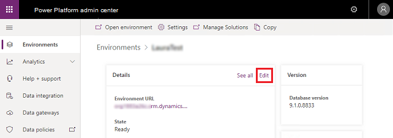
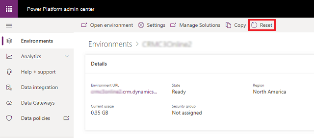

# Manage sandbox environments

A sandbox environment is any non-production environment of Microsoft Dataverse. Isolated from production, a sandbox environment is the place to safely develop and test application changes with low risk.

## View your sandbox environments  

Manage your sandbox environments from the Power Platform admin center.  
  
1. Go to [https://admin.powerplatform.microsoft.com/](https://admin.powerplatform.microsoft.com), and sign in using Environment Admin or System Administrator role credentials.
  
2. Open the **Environments** page. Select the **Type** tab to sort by environment type.
  
   > [!div class="mx-imgBorder"] 
   > 

## Create a sandbox environment

See [Create and manage environments in the Power Platform admin center](create-environment.md).

## Change a production environment to sandbox

1. Sign in to the Power Platform admin center at [https://admin.powerplatform.microsoft.com](https://admin.powerplatform.microsoft.com) as an admin (Service admin, Global admin, or Delegated admin).

2. From the left-side menu, select **Environments**, and then select a production environment.

3. Select **Edit**

   > [!div class="mx-imgBorder"] 
   > 

4. Under **Type**, choose the sandbox environment type. 

   > [!div class="mx-imgBorder"] 
   > 

5. Select **Save**.

## Reset a sandbox environment  

Reset a sandbox environment to delete and reprovision it. Consider a reset when you want to:  
  
- Create a new project  
- Free up storage space  
- Remove an environment containing personal data  
  
> [!IMPORTANT]
> - You can only reset sandbox environments. 
> - A reset will permanently delete environment components such as canvas apps, flows, custom connectors, and connections.

 **An example scenario**  
  
  Thomas is looking at the storage consumed by the various Contoso environments. Thomas is getting concerned that they'll run out of space in one of their production environments. Thomas also wants to free up some space to give the production environment some extra storage.  Thomas has also been notified that the Legal department has a retention policy regarding the use of production data in test environments.  
  
 After contacting Elisa, Thomas resets the Sales department's complete sandbox environment. The environment has been reprovisioned to factory settings. It's now ready for future use as a sandbox environment for a future project.  
 
### To reset an environment  

1. Go to the [Power Platform admin center](https://admin.powerplatform.microsoft.com) and sign in using Environment Admin or System Administrator role credentials.
  
2. From the left-side menu, select **Environments**, and then select an environment to reset.

3. Select **Reset** from the top menu bar.
  
   > [!div class="mx-imgBorder"] 
   > 

4. On the **Reset environment** page, adjust the environment settings as needed and understand the following consequences:  
  
   > [!WARNING]
   > - The sandbox environment will be deleted and reset to factory settings. You will not be able to recover any data that was previously in the environment. 
   > - When you reset an environment, the security group specified on the **Reset environment** page will be applied. If a security group isn’t specified during the reset, no security group will be assigned to the environment after the reset is completed.  Any existing security group configured before the reset is performed will no longer be applied to the environment. More information: [Control user access to environments: security groups and licenses](control-user-access.md)   
  
5. Select **Reset**, and then select **Confirm** to reset the selected environment.

The reset process starts.

> [!div class="mx-imgBorder"] 
> 
  
## Administration mode  

 When you place a sandbox environment in administration mode, only users with System Administrator or System Customizer security roles are able to sign in to that environment.
 
 Administration mode is useful when you want to make operational changes and not have regular users affect your work, and not have your work affect regular users.  

> [!NOTE]
> System Customizers will need to sign in to the environment directly through the URL as the environment in administration mode will not appear to System Customizers in the Environments page of the Power Platform admin center.

See [Administration mode](admin-mode.md).

[!INCLUDE[footer-include](../includes/footer-banner.md)]
