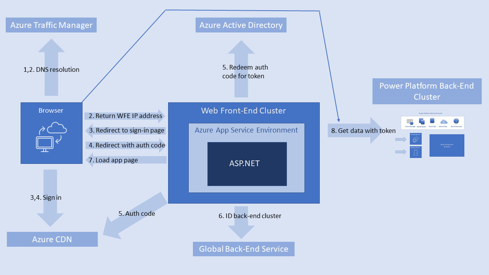

# Authenticating to Power Platform services

User authentication to the Power Platform services consists of a series of requests, responses, and redirects between the user's browser and the Power Platform service or the Azure services used by Power Platform. That sequence describes the process of user authentication in the Power Platform services, which follows the [Azure Active Directory's auth code](/azure/active-directory/develop/v2-oauth2-auth-code-flow) grant flow. For more information about options for an organization's user authentication models (sign-in models), see [Choosing a sign-in model for Microsoft 365](https://www.microsoft.com/microsoft-365/blog/2014/05/13/choosing-a-sign-in-model-for-office-365/).  

## End-user authentication steps to Power Platform

The user authentication sequence for the Power Platform services occurs as described in the following steps, which are illustrated in the image that follows.

1. A user initiates a connection to a Power Platform service from a browser, either by typing in the Power Platform address in the address bar or by selecting **Sign in** from a Power Platform service (for example, the Power Apps landing page). The connection is established using TLS 1.2 and HTTPS. All subsequent communication between the browser and the Power Platform service uses HTTPS.

2. The Azure Traffic Manager checks the user's DNS record to determine the most appropriate (usually nearest) datacenter where the Power Platform service is deployed and responds to the DNS with the IP address of the web front-end cluster to which the user should be sent.

3. The web front-end then redirects the user to the Microsoft Online Services login page.

4. After the user has been authenticated, the login page redirects the user to the previously determined nearest Power Platform service web front-end  cluster with an auth code.

5. The web front-end cluster checks with the Azure AD service to obtain an Azure AD security token by using the auth code. When Azure AD returns the successful authentication of the user and returns an Azure AD security token, the web front-end  cluster consults the Power Platform Global Service. The Power Platform Global Service maintains a list of tenants and their Power Platform back-end cluster locations and determines which Power Platform back-end service cluster contains the user's tenant. The web front-end  cluster then returns an application page to the user's browser with the session, access, and routing information required for its operation.

6. When the client's browser requires customer data, it will send requests to the back-end cluster address with the Azure AD access token in the Authorization header. The Power Platform back-end cluster reads the Azure AD access token and validates the signature to ensure that the identity for the request is valid. The Azure AD access token has a default lifetime of one hour, and to maintain the current session, the user's browser will make periodic requests to renew the access token before it expires.

  

The user authentication sequence, when a Power Platform service is embedded in SharePoint, Power BI, or Teams, is slightly more complicated as these services perform some of the steps; some steps still remain with the Power Platform service.

> [!NOTE]
> Authentication to external data sources is a separate step from authentication to the service. More information: [Connect to data sources](connect-data-sources.md).

