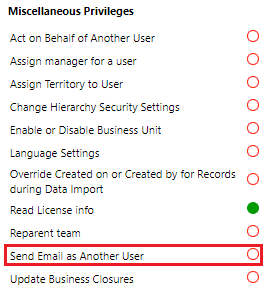

# Send email on behalf of another user 

Dynamics 365 users can send an outgoing email on behalf of another user by updating the **From** field to another user or queue.

## Prerequisites - 

- An admin should verify the user has a role in Dynamics 365 with “Send Email as Another User" privilege (**Settings** gear > **Advanced settings** > **Settings** > **Security** > **Security Roles** > select a role > **Business Management** tab > **Miscellaneous Privileges**).
  > [!div class="mx-imgBorder"] 
  > 
-	The other user being set as sender on the email needs to enable personal option "Allow other Microsoft Dynamics CRM users to send e-mail on your behalf" (**Settings** gear > **Personalization Settings** > **Email** tab).
  > [!div class="mx-imgBorder"] 
  > 
-	The user sending the email needs to have read access to the queue. Note, this option only applies to the send on behalf of queue. 

### Optional: Sending outgoing email as another user with Microsoft Exchange mailbox delegation 

For the email to be shown as “send on behalf” of another user in Microsoft Outlook ensure below prerequisites are met. 

-	All prerequisites outlined in the previous section 
-	OrgDbOrSetting  - “EnableMailboxDelegationForOutgoingEmail" must be enabled
-	User clicking send / submitting send request for the outgoing email in Dynamics 365 should have at least one of these three permissions:
  - Full access
  - Send as or Send on behalf on the Exchange mailbox of the user in the “From” field
  - Exchange permissions. See [Manage permissions for recipients](/Exchange/recipients/mailbox-permissions)

> [!NOTE]
> This feature is only available for the Exchange Server (on-premises) or Exchange Online email server profiles. 
> 
> Once enabled, all users in Dynamics 365 need to have proper permissions set up in Exchange if they want to use any other email address in the “From” field apart from their own email address. Otherwise, sending will fail with Exchange errors such as “ErrorSendAsDenied”.
>
> If the customer has multiple automated workflows owned by the same user configured to send emails via multiple users or queues, there may be Dynamics 365 and Exchange throttling as just the one mailbox (workflow owners’ mailbox) will be used to send all these emails.
