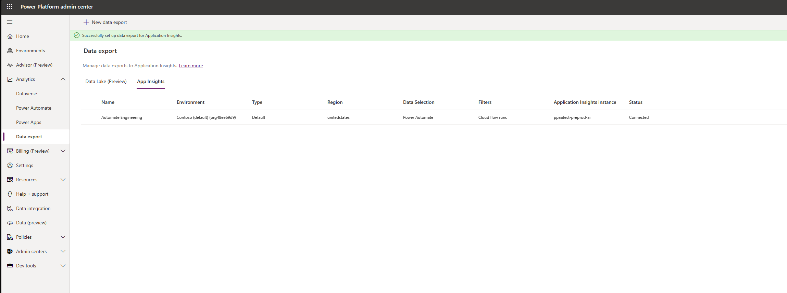

# Export data to Application Insights 

Learn how to export data to Application Insights from the Power Platform admin center.

## Prerequisites

- Ensure that you have an [Application Insights environment](/azure/azure-monitor/app/create-workspace-resource) set up for receiving the data, in addition to the [environment](environments-overview.md) that has a database.
  
   - For the Application Insights environment, you must have contributor, writer, or admin rights.
   - The Application Insights environment must be unique for an environment or tenant. Application Insights out-of-the-box reports won't function correctly if a single Application Insights environment contains data from multiple environments.

- To set up data export in the [Power Platform admin center](https://admin.powerplatform.microsoft.com/), you must be a member of one of these roles: Power Platform admin, Dynamics 365 admin, or Microsoft 365 Global admin.

    > [!IMPORTANT] 
    > The Application Insights exporting functionality for Power Automate and Dynamics Customer Services is in public preview in all Public Geos (Sovereigns).  Power Automate and Dynamics Customer Services functionality in public preview is not available in Government Community Cloud (GCC) or Government Community Cloud - High (GCC High) sovereign clouds.
    >
    > When this feature transitions to General Availability (GA), the feature will be available for Managed Environments only.  Users will need a Power Apps, Power Automate, or Dynamics 365 license with premium use rights. For this Public Preview only, the premium use rights requirement and the ME restriction are relaxed.

    > [!NOTE]
    > The SLA for the delivery of telemetry data streams from Power Platform products supported by this feature to Application Insights is 24 hours.

## Create an export package

1. In the [Power Platform admin center](https://admin.powerplatform.microsoft.com), select **Data export** in the navigation pane.

1. On the **Data export** page, select the **App Insights** tab. Then select **New data export**.

1. Provide a friendly name of the export package to identify the Azure Application Insights instance. Then select the specific data type you would like to export, such as **Dataverse diagnostics and performance** or **Power Automate**.
   
   If you select **Power Automate**, select whether to export cloud flow runs, triggers, and/or actions.
   
1. Select the environment that you're exporting data _from_. You can choose to filter based on the environment type. Select **Next**.

1. Select the Azure subscription, resource group, and Application Insights environment that you're exporting data _to_. Select **Next**.

    You must have contributor, writer, or admin rights to the Application Insights environment. Typically, one production environment or tenant maps to one Application Insights environment. 

1. Review the details that you entered for the new export package, and then select **Create** to set up the data export connection. 

   The data export connection should now be set up. Within the next 24 hours, data will start being exported to your Application Insights environment.

   > [!div class="mx-imgBorder"] 
   > 

## Delete an export package

1. In the Power Platform admin center, select **Data export** in the navigation pane.

1. On the **Data export** page, select the **App Insights** tab. 

1. Select the export package you want to delete and select **Delete export**.

   You can set up a new connection whenever you decide to restart the data export.

[!INCLUDE[footer-include](../includes/footer-banner.md)]
