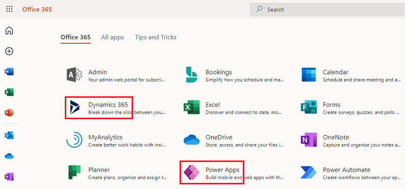
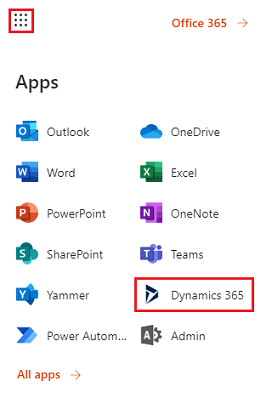
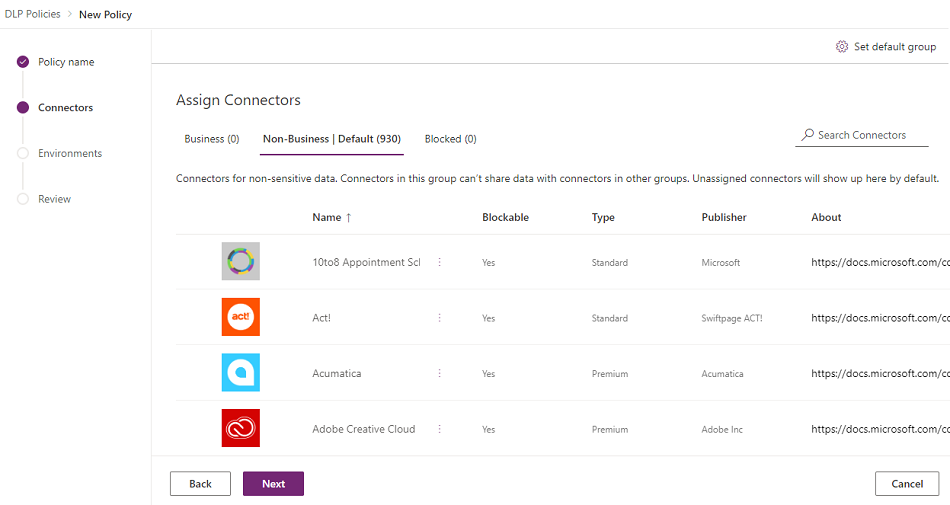

# Manage Power Apps licenses in your organization 

This topic describes how users in your organization can get access to use Power Apps, and how you can control access to the Power Apps service. Visit the [Power Automate administration FAQs](/power-automate/organization-q-and-a) to learn about admin controls.

## Sign up for Power Apps

### How do users sign up for Power Apps?
If a user doesn’t have any Power Apps licenses, the only sign-up option for individual users in your organization is the Power Apps trial, for which they can sign up through the Power Apps website:

#### Option 1
Users can sign up by going to [powerapps.microsoft.com](https://powerapps.microsoft.com), selecting **Try free**, and then completing the sign-up process for Power Apps.

#### Option 2
Users can sign up by going to [powerapps.microsoft.com](https://powerapps.microsoft.com), selecting **Sign in**, signing in with their work or school accounts, and sign up for the Power Apps trial by accepting the Power Apps terms of use.    

When a user in your organization signs up for Power Apps, that user is assigned a Power Apps license automatically.

#### Option 3
Users are prompted to begin a trial before they can use a shared app that requires additional licensing.

> [!NOTE]
> Users who sign up for a trial license with option 2 mentioned earlier, don't appear in the Microsoft 365 admin portal as Power Apps trial users (unless they have another license to Microsoft 365, customer engagement apps (Dynamics 365 Sales, Dynamics 365 Customer Service, Dynamics 365 Field Service, Dynamics 365 Marketing, and Dynamics 365 Project Service Automation), or Power Apps).

See [Self-service sign up for Power Apps](/powerapps/maker/signup-for-powerapps) for more details.

### How can users in my organization gain access to Power Apps?
Users within your organization can gain access to Power Apps in four ways:

* They can individually sign up for a Power Apps trial as outlined in the [How do users sign up for Power Apps?](#how-do-users-sign-up-for-power-apps) section.
* You can assign a Power Apps license to them within the Microsoft 365 admin portal.
* You can purchase Power Apps Per App Plans and allocate them in the Power Platform admin center. See [Power Apps per app plan](signup-for-powerapps-admin.md#power-apps-per-app-plan).
* The user has been assigned a Microsoft 365 or Dynamics 365 plan that includes access to the Power Apps service. See the [Power Apps pricing page](https://powerapps.microsoft.com/pricing) for the list of Microsoft 365 and Dynamics 365 plans that include Power Apps capabilities.

### Can I block users in my organization from signing up for Power Apps?
Any individual can try out the features of Microsoft Power Apps for 30 days, and incur no costs as outlined in the [How do users sign up for Power Apps](#how-do-users-sign-up-for-power-apps) section.

As a global admin, you can control your users' ability to sign up for Power Apps trial with option 1. You do this by enabling or disabling self-service sign-up. If you want to disable all self-service sign-ups, use Azure AD PowerShell commands to change the **AllowAdHocSubscriptions** setting. This option turns off self-service sign-up for all Microsoft cloud-based apps and services. 

For blocking via options 2 and 3, see [Block trial licenses commands](powerapps-powershell.md#block-trial-licenses-commands). Note, blocking trial licenses does not block creating apps in the tenant. 

If a person signs up for a 30 day trial of Microsoft Power Apps, and you choose to not support them inside of your organization, they cannot incur costs to your company. When an individual signs up for Microsoft Power Apps, that is a relationship between that individual and Microsoft directly, like any other public cloud services from Microsoft, such as Bing, Wunderlist, OneDrive or Outlook.com, and does not imply that the service is provided by your organization.

Finally, if your company wants to restrict the use of its data in Microsoft Power Apps, use [data loss prevention (DLP) policies](prevent-data-loss.md).

## Administration of Power Apps

### Why has the Power Apps icon appeared in the Microsoft 365 app launcher?
Microsoft Power Apps is a fundamental part of the Microsoft 365 suite and is enabled as a service as a part of existing Microsoft 365 SKU's. As users everywhere in the world can now use Microsoft Power Apps, it appears in 'All apps' in the app launcher screen. See [Licensing overview](pricing-billing-skus.md) to understand which Microsoft 365 SKUs now include Power Apps.

See the following section if you'd like to remove the Power Apps tile from 'All apps' by default.

### How do I remove Power Apps from existing users?
If a user was assigned a Power Apps license then you can take the following steps to remove the Power Apps license for that user:

1. Go to the [Microsoft 365 Admin Portal](https://portal.microsoftonline.com/).

2. In the left navigation bar, select **Users**, and then select **Active Users**.

3. Find the user you want to remove the license for, and then select their name.

4. On the user details pane, select the **Licenses and apps** section.

5. Find the Power Apps license, uncheck the box and select **Save changes**.

    

If a user has access to Power Apps through their Microsoft 365 and Dynamics 365 plan license, then you can disable their access to the Power Apps service by taking the following steps:

1. Go to the [Microsoft 365 Admin Portal](https://portal.microsoftonline.com/).

2. In the left navigation bar, select **Users**, and then select **Active Users**.

3. Find the user you want to remove access for, and then select their name.

4. On the user details pane, in the **Product licenses** section select **Edit**.

5. Expand the user's Microsoft 365 or Dynamics 365 license, uncheck the box to the service and select **Save changes**.

    

Bulk removal of licenses is also possible through PowerShell. See [Remove Microsoft 365 licenses from user accounts with PowerShell](/microsoft-365/enterprise/remove-licenses-from-user-accounts-with-microsoft-365-powershell) for a detailed example.   Finally, further guidance about bulk removal of services within a license can be found at [Disable access to Microsoft 365 services with PowerShell](/microsoft-365/enterprise/disable-access-to-services-with-microsoft-365-powershell).

Removing of the Power Apps license or service for a user in your organization will also result in the removal of the Power Apps and Dynamics 365 icons from the following locations for that user:

* [Office.com](https://office.com)

    
* Microsoft 365 AppLauncher "waffle"

    

### How can I restrict my users' ability to access my organization's business data using Power Apps?
Power Apps allows you to create data zones for business and non-business data, as shown below.  Once these data loss prevention policies are implemented, users are prevented from designing or running Power Apps that combine business and non-business data. For more details, See [Data loss prevention (DLP) policies](prevent-data-loss.md).

 

### Why did 10,000 licenses for Microsoft Power Apps show up in my Microsoft 365 tenant?
As a qualifying organization, users in your organization are eligible to try out Microsoft Power Apps  for 30 days, and these trial licenses represent the available capacity for new Power Apps users in your tenant. There is no charge for these licenses. Specifically, there are two possible reasons why you may see a capacity 10,000 (trial) licenses for Power Apps showing up in the Microsoft 365 admin portal:

* If any user in your tenant participated in the Power Apps public preview between April 2016 and October 2016, you will see 10,000 licenses labeled as "Microsoft Power Apps and Logic flows".

    
* If any user in your tenant has signed-up for a Power Apps trial through **Option 1** or **Option 3** outlined in the [How do users sign up for Power Apps](#how-do-users-sign-up-for-power-apps) section, you will see 10,000 licenses labeled "Microsoft Power Apps".

    

You can choose to assign additional licenses to users yourself through the Microsoft 365 admin portal, but please note that these are trial licenses for Microsoft Power Apps  and they will expire after 30 days of being assigned to a user.

### Is this free? Will I be charged for these licenses?
These licenses are free trial licenses for your users to try-out the Microsoft Power Apps for 30 days.

### How will this change the way I manage identities for users in my organization today?
If your organization already has an existing Microsoft 365 environment and all users in your organization have Microsoft 365 accounts, then identity management does not change.

If your organization already has an existing Microsoft 365 environment but not all users in your organization have Microsoft 365 accounts, then we create a user in the tenant and assign licenses based on the user's work or school email address. This means that the number of users you are managing at any particular time will grow as users in your organization sign up for the service.

If your organization does not have an Microsoft 365 environment connected to your email domain, there is no change in how you manage identity. Users will be added to a new, cloud-only user directory, and you will have the option to take over as the Microsoft Power Platform admin and manage them.

### What is the process to manage a tenant created by Microsoft for my users?
If a tenant was created by Microsoft, you can claim and manage that tenant using the following steps:

1. Join the tenant by signing up for Power Apps using an email address domain that matches the tenant domain you want to manage. For example, if Microsoft created the contoso.com tenant, then join the tenant with an email address ending with @contoso.com.
2. Claim admin control by verifying domain ownership: once you are in the tenant, you can promote yourself to the admin role by verifying domain ownership. To do so, follow these steps:
3. Go to [https://admin.microsoft.com](https://admin.microsoft.com/Start?sku=powerapps).
4. Select the app-launcher icon in the upper-left corner, and then choose Admin.
5. Read the instructions on the **Become the admin** page, and then choose **Yes, I want to be the admin**.  

> [!NOTE]
> If this option doesn't appear, a Microsoft 365 administrator is already in place.

### If I have multiple domains, can I control the Microsoft 365 tenant that users are added to?
If you do nothing, a tenant is created for each user email domain and subdomain.

If you want all users to be in the same tenant regardless of their email address extensions:  

* Create a target tenant ahead of time or use an existing tenant. Add all the existing domains and subdomains that you want consolidated within that tenant. Then all the users with email addresses ending in those domains and subdomains automatically join the target tenant when they sign up.

> [!IMPORTANT]
> There is no supported automated mechanism to move users across tenants once they have been created. To learn about adding domains to a single Microsoft 365 tenant, see [Add a domain to Microsoft 365](https://support.office.com/article/Add-your-users-and-domain-to-Office-365-ffdb2216-330d-4d73-832b-3e31bcb5b2a7).

[!INCLUDE[footer-include](../includes/footer-banner.md)]