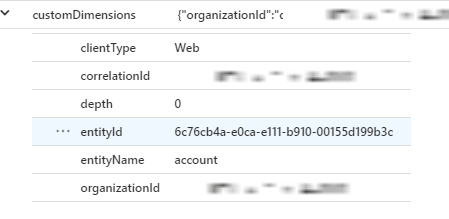
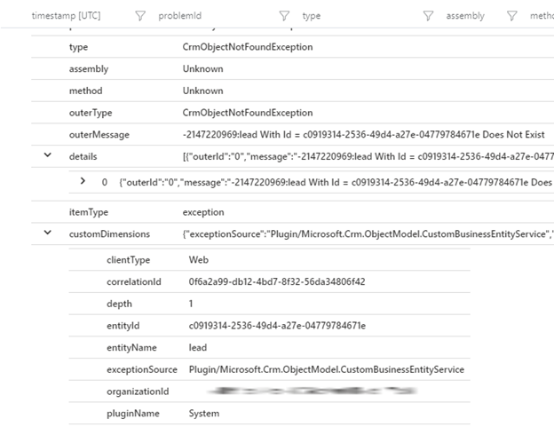
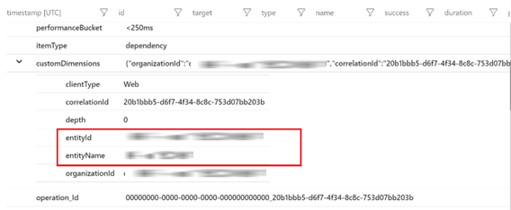

# Telemetry events for Microsoft Dataverse 

The data stream currently provides performance data related to Dataverse API incoming calls, Dataverse plug-in execution calls, and Dataverse SDK calls. It also provides data for failures in plug-in and Dataverse SDK operations.

## Dataverse API incoming calls

These are calls made to the Dataverse API. These could be from UCI, legacy web client, custom clients using the SDK etc. They can be found in the **requests** table of Application Insights. 

- **Name**: The type of request. These fall into two categories.
  1. **Web API Request**: A request to the OData v4 endpoint that is commonly used by UCI and modern clients. It is transformed into an operation that is common for both. Web API is a 'wrapper' to enable RESTful programming model, but once data is received, everything becomes the same within the server. When the response is returned, it is converted to JSON if the request came from the Web API.
  2. **Organization Service Request**: A request to the SOAP endpoint used by SDK clients or the legacy web client.
- **Duration**: The duration the server took to respond to the request.
- **Url**: The URL to which the call was made.
- **CustomDimensions**:
  - **UserAgent**: Application Insights automatically populates the user agent field with “PC” as these logs are being pushed from a server in a datacenter. Application Insights does not allow override of the user agent field. Sometimes, the user agent field is not available to populate. The user agent from which the call was made can be viewed with this query.
  
requests
```
summarize count() by tostring(customDimensions.userAgent)
```

  > [!div class="mx-imgBorder"] 
  > 

- **Operation_Name**: The readable name of the operation to display on views such as the end-to-end transaction view.

## Dataverse plug-in execution logs

These are logs for custom plug-ins running for a given operation and are found in the **dependency** table. 

dependencies
```
where type == "Plugin"
take 100
```

> [!div class="mx-imgBorder"] 
> 

- **Name/Target**: The fully qualified type name for the plug-in being executed.
- **Duration**: Duration of the plug-in execution.
- **CustomDimensions**: 
  - Depth: Current [depth](https://docs.microsoft.com/dotnet/api/microsoft.xrm.sdk.iexecutioncontext.depth?view=dynamics-general-ce-9) of execution in the call stack.
  - EntityName: Name of the entity being acted on by the plug-in.
  - IsolationType: A [value](https://docs.microsoft.com/dotnet/api/microsoft.xrm.sdk.iexecutioncontext.isolationmode?view=dynamics-general-ce-9) indicating if the plug-in is executing in the sandbox:
    - 1: None
    - 2: Sandbox
    - 3: External
  - PluginName: User friendly name of the plug-in.
  - PluginType: Type name of the plug-in being executed.
  - PluginVersion: The version of the published plug-in. The intention here is to be able to use this information to troubleshoot version updates.
  - Stage: Maps to the following internally:
    - PreValidation = 10,
    - PreOperation = 20,
    - PreOperationBeforeExternalPlugins = 15,
    - PreOperationAfterExternalPlugins = 25,
    - MainOperation = 30,
    - PostOperationBeforeExternalPlugins = 35,
    - PostOperationAfterExternalPlugins = 45,
    - PostOperation = 40,
    - PostOperationDeprecated = 50
  - StepName: The name of the SDK Message Processing step. This is usually generated by the Plug-in Registration tool using information about the PluginName, PluginType, and the name of the operation, for instance: *ErrorMessageTest.ThrowException: Create of account*

## Dataverse SDK logs

These are logs for SDK operations triggered as a part of an incoming request. These are logged to the **dependency** table in Application Insights, as they are tracked as dependencies for the request to execute. They are identified by the type name starting with SDK. Here is a sample query:

dependencies
```
where type starts with "SDK"
take 10
```

> [!div class="mx-imgBorder"] 
> 

- **Type**: The type of SDK request triggered. Examples include Retrieve, RetrieveMultiple, FetchXmlToQueryExpression, and WhoAmI.
- **Name/Target**: This is the name of the entity being targeted by the SDK operation.
- **CustomDimensions**: 
  - **ClientType**: The type of client the call is coming from. Some possible values are Web, UCIClient, and OutlookFull.
  - **EntityId**: Unique identifier of the entity being used.
  - **EntityName**: Name of the entity being used.

## Exceptions

You will see details of failures in plug-in and SDK operations in your Application Insights. The exceptions table in Application Insights powers the **Failure** panel.
These failure details correlate with the rest of the events in the Plugin and SDK calls in the End-to-End view. All available information is added to columns where possible and customDimensions where there is no exact column match. 

You will notice that some of the fields in the exceptions table are not populated. This is because these fields can only be set if the Application Insights SDK is used to emit logs from the source. This feature collects platform telemetry and then pushes it into Application Insights per the Application Insights schema. 

> [!div class="mx-imgBorder"] 
> 

exceptions
```
take 10
```

This query will return all the attribute details from the **exception** table.
- **problemId/type**: Type of Exception.
- **outerMessage**: Exception message.
- **customDimensions**: 
  - **clientType**: The type of client the call is coming from. Some possible values are Web, UCIClient, and OutlookFull.
  - **exceptionSource**: Plug-in/point where the exception was thrown.
  - **entityName**: Name of the entity being used.
  - **pluginName**: Name of the plug-in where the exception was thrown.

> [!div class="mx-imgBorder"] 
> 

If a user reports an error, you could use the userid (Azure AD ID) to understand details from the **exception** table.

exceptions
```
where user_Id == '12345678-68cd-4e73-908f-126342b36315'
```

The Entity id and Entity name are available in the customDimensions in the **dependency** table.
 
dependencies
```
where type == "SDK Retrieve"
```

> [!div class="mx-imgBorder"] 
> 

1.	How can I determine if my plug-in upgrade caused a performance degradation?

dependencies
```
where ['type'] == "Plugin"
where name startswith "<InsertYourPluginName>"
summarize avg(duration) by name
```

The plug-in name should also contain the version for custom plug-ins.

2.	How was the API performing prior to a reported issue based on time-of-day or location? Was API degradation gradual or sudden?

requests
```
where url == "https://<URLHere>"
summarize avg(duration), count() by bin(timestamp, 1h)
render timechart 
```

> [!div class="mx-imgBorder"] 
> 

In this chart, we can see the performance of the API endpoint over a period of time against the number of requests being made.

You can also setup an alert based on the performance of a particular API here within [Application Insights](https://docs.microsoft.com/azure/azure-monitor/learn/tutorial-alert).

3.	Can I drill down on errors/failures at specific times or for specific users to allow for understanding the call stack?

Looking at the **Failures** pane gives an overview of the failures in a given time period. You can then narrow down to a specific failure based on the API call or dependency type to see the end-to-end view.

> [!div class="mx-imgBorder"] 
> 

4.	I want to quickly build ad-hoc reports by Application/System management to understand details for my specific use case.

## Sample Queries

Sample questions that you should be able to answer once data is available in your own Application Insights.

1.	Can I determine plug-in usage performance for user(s) or failure rates during peak usage?

2.	Can I understand execution paths? Are calls made by the plug-in slowing the plug-in? 
 

