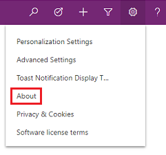
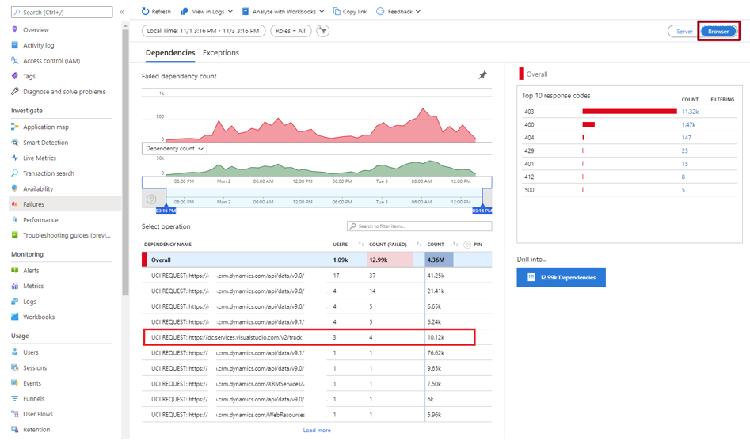

# Telemetry events for model-driven apps 

## What data is available for model-driven apps?

Performance data related to Page loads and UCI outbound network requests is available for model-driven apps.  

## What kind of page loads are available?

|Type  |Performance and diagnostics data available   |
|---------|---------|
|Dashboard Load (UCI) – Browser     | Yes        |
|Dashboard Load (UCI) – Embedded     | Yes        |
|Dashboard Load (UCI) - MobileApplication     | Yes        |
|Dashboard Load (UCI) – MailApp     | Yes        |
|Dashboard Load (UCI) - MobileApplication     | Yes        |
|EditForm Load (UCI) – Browser     | Yes        |
|EditForm Load (UCI) – Embedded     | Yes        |
|EditForm Load (UCI) – MailApp     | Yes        |
|EditForm Load (UCI) - MobileApplication     | Yes        |
|EntityList Load (UCI) – Browser     | Yes        |
|EntityList Load (UCI) - Embedded     | Yes        |
|EntityList Load (UCI) – MailApp     | Yes        |
|EntityList Load (UCI) - MobileApplication     | Yes        |
|Launch App - (UCI) – Browser     | Yes        |
|Launch App - (UCI) - Embedded     | Yes        |
|Launch App - (UCI) – MailApp     | Yes        |
|Launch App - (UCI) – MobileApplication     | Yes        |
|QuickCreateForm Load (UCI) – Browser     | Yes        |
|QuickCreateForm Load (UCI) – Embedded     | Yes        |
|QuickCreateForm Load (UCI) – MailApp     | Yes        |
|QuickCreateForm Load (UCI) – MobileApplication     | Yes        |
|SaveForm     | Not currently available        |
|CommandButton Actions     | Not currently available        |

## Where is the page load data available?

This data goes into the **pageView** table in Application Insights. An entry is logged every time a user loads a page in UCI. The data logged will only include clean loads. Loads that cannot accurately measure the duration - fast navigations, switching away from app, alert dialog - will not be included. Because of this, we do not recommend using this data for accurate numbers related to usage analytics.  

There are additional properties in **customDimensions** that provide more details for UCI page loads. For example, this query will return the values for all the attributes in the **pageView** table.

pageView
```
take 1
```

> [!div class="mx-imgBorder"] 
> 

**pageView table attributes:**
- **appModule**: App module name 
- **entityName**: This is present when relevant and available on page types like EditForm, EntityList and Dashboards when they are [bound to an entity](https://docs.microsoft.com/powerapps/maker/model-driven-apps/configure-interactive-experience-dashboards#create-an-entity-specific-dashboard). There are scenarios when the form is not bound to an entity and the value would show up as undefined.
- **hostType**: Browser/MobileApplication/Embedded
- **isBoot**: is it the first load of a session.
- **loadType**
  -	0: First visit to a particular-page type (for example, first form visit)
  -	1: First visit to a particular configuration (for example,  first account form visit)
  -	2: First visit to a particular record (for example, first visit to account record A2)
  -	3: Exact URL has been visited previously
- **navigationOrigin**: Type of page where the user navigated from
- **networkConnectivityState**: Whether the device has a connection or not
- **pageName**: Type of page load
- **serverConnectivityState**: Whether the app is connected to the server
- **syncRequestTime**: Time spent waiting on synchronous requests
- **coldLatency**: First estimation for network latency which includes SSL handshake time
- **warmLatency**: Subsequent estimation for network latency which is the typical expected latency for each request
- **warmThroughput**: Estimated throughput of the network in Kbps  
	
For Microsoft Dataverse events, the *ID* field or *operation_ParentId* in Application Insights is the *x-ms-service-request-id*. The *operationId* maps to the *activityId* on the backend for troubleshooting purposes and support requests.

## What kind of data is available for UCI outbound network requests?

These are calls to other dependencies made by UCI to render a certain page. This could be outgoing calls to Dataverse, or other integrations like Azure DevOps, Office etc. This data is available in the **dependency** table with the name “UCI Request”.

dependencies
```
where type == "UCI REQUEST"
```

**Fields**: 
- **Name**: The URL being invoked by UCI
- **Target**: Currently the same as Name.
- **Success**: Did the call succeed or fail . 
- **UserId**: The Dataverse system user ID of the logged in user.
- **Duration**: The duration of the call.
- **customDimensions**: Contains the following. 

  > [!div class="mx-imgBorder"] 
  > 

- **appModule**: The appModule making the call.
- **bodySize**: The size of the response encoded and decoded.
- **cached**: Whether the request went to the local cache or had to go to the server. Please note that this does not work as expected if the end user was on the Internet Explorer browser.
- **download**: Time taken to download the response.
- **stall**: Time where the request was waiting in the browser queue.
- **ttfb**: Time spent waiting for the initial response, also known as the Time To First Byte. This time captures the latency of a round trip to the server in addition to the time spent waiting for the server to deliver the response.
- **coldLatency**: First estimation for network latency which includes SSL handshake time.
- **warmLatency**: Subsequent estimation for network latency which is the typical expected latency for each request.
- **warmThroughput**: Estimated throughput of the network in Kbps.

## Discover and Analyze Scenarios

### Why are some of my users experiencing slowness on UCI?

One scenario where this can very valuable is when a user from a region (say Asia) has reported slow performance of a form. This user based in Asia could be accessing access an environment/org in North America. The details will show the total load time as well as the network related duration. It could be very well that this is a cause of the overall perceived performance by the end user.

*warmLatency*, *warmThroughput* and coldLatency can be used to understand the breakdown of where time is spent on page loads and other UCI requests as follows:

> [!div class="mx-imgBorder"] 
> 

In the above request, the UCI request takes longer than the actual Dataverse API (Web API request). The breakdown in this case is the duration of the Dataverse API call(56ms) + CustomProperties.warmLatency(89ms) which adds up to close to the complete operation duration(144ms). The warmLatency is indicative of slowness for that particular client and could be an issue analyzed at the user level with the following query:

dependencies
```
where ['type'] == "UCI REQUEST"
summarize avg(toint(customDimensions.warmLatency)), avg(toint(customDimensions.coldLatency)), avg(toint(customDimensions.warmThroughput)) by user_Id
```

pageViews
```
summarize avg(toint(customDimensions.warmLatency)), avg(toint(customDimensions.coldLatency)), avg(toint(customDimensions.warmThroughput)) by user_Id
```

### Can I determine how the user is accessing the system?

The *userAgent* attribute in the *customDimensions* field in the **requests** table of Application Insights has this data.  The below query can be used to get an overview of the different sources from where the users are accessing the system.

pageViews
```
summarize count() by tostring(customDimensions.userAgent), user_Id
```

dependencies
```
where ['type'] == "UCI REQUEST"
summarize count() by tostring(customDimensions.userAgent), user_Id
```

|When the customDimensions.userAgent value starts with  | Where is the user accessing the system from   |
|---------|---------|
|Mozilla     | Browser Type, version        |
|azure-logic-apps     |  azure-logic-apps       |
|FileStoreService     |         |
|URL Checker	     |         |
| MSWAC  |   |
|PowerApps     | PowerApps        |
|Microsoft Office Excel     | Office Excel        |
|Portals	     |  Portals       |
|DynamicsDataIntegration     | DynamicsDataIntegration        |
|XrmToolBox.exe     | XrmToolBox.exe        |
|PluginRegistration     | PluginRegistration        |
|LogicAppsDesigner     | LogicAppsDesigner        |
|Apache-HttpClient     |  Apache-HttpClient       |
|Microsoft Flow     | Microsoft Flow        |
|UnifiedServiceDesk     | UnifiedServiceDesk        |
|PostmanRuntime     | PostmanRuntime        |
|OfficeGroupsConnector     | OfficeGroupsConnector        |
|Microsoft.Data.Mashup     | Microsoft.Data.Mashup        |
|Apache-Olingo     | Apache-Olingo        |
|Dalvik     |  Android       |
|Jakarta Commons-Http     | Jakarta        |
|Informatica     | Informatica        |
|axios     | Axios        |
|node-fetch     |  NodeJS       |
|LinkedInBot     | LinkedInBot        |


### How do I get the count of users accessing from browser, mobile or embedded application?

pageViews
```
summarize count() by tostring(customDimensions.hostType)
```

Sample result-set:

> [!div class="mx-imgBorder"] 
> 

### To narrow down to a specific user:

pageViews
```
where user_Id == “<userid>”
summarize count() by tostring(customDimensions.hostType)
```

**Using Application Insights in conjunction with the [UCI Monitor tool](https://powerapps.microsoft.com/blog/monitor-now-supports-model-driven-apps/)**

The UCI monitor tool helps with real-time troubleshooting on a session from the UCI side. The end to end transaction requests should be available in Application Insights. To look at the logs for a given action, note the Activity Id from a row in the Event Details in Monitor. This can be used to query for logs as follows:

union *
```
where operation_Id contains "<ActivityIdHere>"
```

Note that the Monitor tool is a realtime debugging tool, however, data availability through this feature could take up to a few hours.

### Why are user(s) experiencing issues with a specific form?

The user can share their Session ID from the **About** section in UCI for the specific organization.

> [!div class="mx-imgBorder"] 
> 

This can then be used to look at all the activities in that session to look for issues.

> [!div class="mx-imgBorder"] 
> 

union *
```
where session_Id == '<sessionIdHere>'
```

### Which forms are being used in different locations and the load performance of the forms in these locations?

pageViews
```
summarize avg(duration) by name, client_City, client_CountryOrRegion
```

### Is an external API call the failure and can I drill down into the error stack to help with debug?

> [!div class="mx-imgBorder"] 
> 

The Browser section of the **Failures** pane contains UCI outgoing requests. The requests going to Dataverse or the organization contain the organization URL. There might be other requests going to other URLs (for instance, this organization has a customization calling out to dc.services.visualstudio.com). Failures for these external outgoing calls can then be further examined by looking at the end-to-end transaction.

### Can I set an alert on performance threshold for certain form actions? When the alert is received will it allow a maker to diagnose and troubleshoot the issue?

