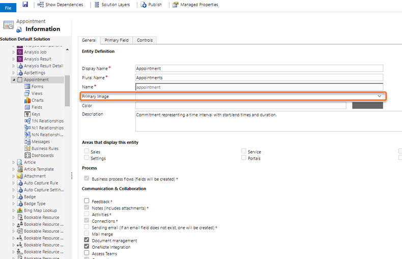
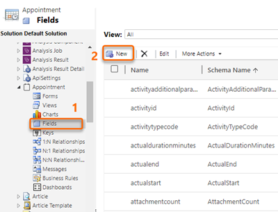
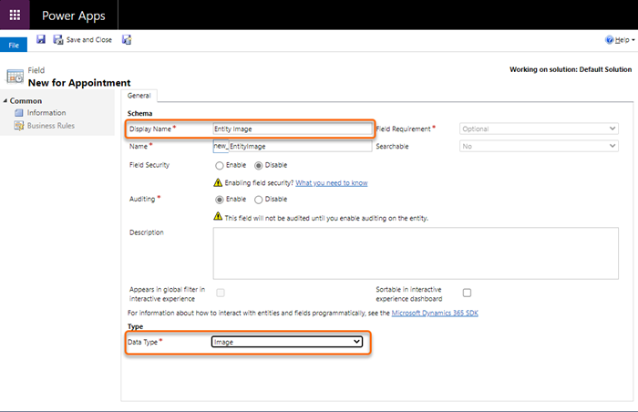
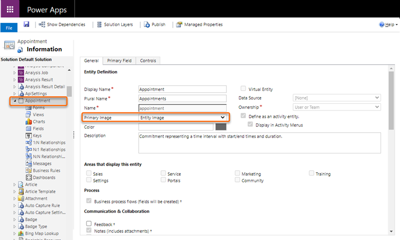
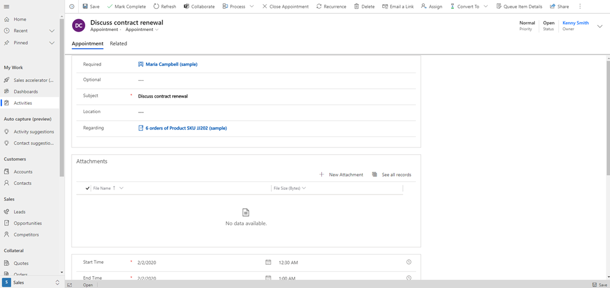
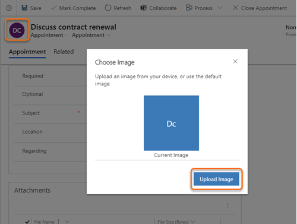
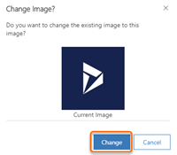
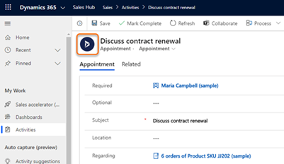
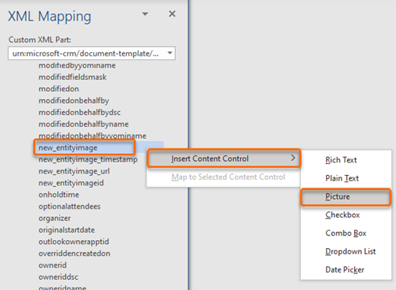

# Troubleshooting Word templates

This article helps you troubleshoot and resolve issues related to Word templates.

## Unable to see entity image in word template for certain out-of-the-box and custom entities

**Reason**

By default, only few out-of-the-box entities, such as Account, Contact, Opportunity, Order, Invoice, Product, Lead, Goal, and Territory are provided with **EntityImage** field, where you can upload image. However, for other out-of-the-box (such as Quote, Business Unit, Appointment, and Email) and custom entities, the **EntityImage** field is not available resulting in unable to upload entity image.

**Resolution** 

To show the image for these entities, follow these steps:

1.	Create image field for the entity for which you want to display the entity image. 

    a.	Go to **Settings** > **Customizations** > **Customize the System**.

    b.	In the solution explorer, under **Components**, expand **Entities** and then select the entity. In this example, we are selecting the **Appointment** entity.

    > [!div class="mx-imgBorder"]
    > 

    c.	In the **Appointment** entity, select **Fields** and then select **New**.

    > [!div class="mx-imgBorder"]
    > 
    
    d.	In the new field form, enter **Display Name** and then choose **Data Type** as **Image**. 

    > [!div class="mx-imgBorder"]
    >  

    e.	Save and close the form. 

    f.	To verify, select the entity name. in this example, we have added the primary image to **Appointment** entity.

    > [!div class="mx-imgBorder"]
    > 

    g.	Publish the customizations.

2.	Upload entity image to the record. 

    a.	Open the entity record. In this example, we are opening an appointment that is related to **Discuss contract renewal**.

    > [!div class="mx-imgBorder"]
    > 
 
    b.	Select the image and in the **Choose Image** dialog, select **Upload Image**.

    > [!div class="mx-imgBorder"]
    > 

    c.	Select the image and then select **Change**.

    > [!div class="mx-imgBorder"]
    > 

    The image appears beside the entity. Here we have uploaded the image to the **Discuss contract renewal** appointment.

    > [!div class="mx-imgBorder"]
    > 

3.	Add entity image to word template. 

    a.	Download and open the word template.

    The downloaded template is saved in the following format: Record Type-organization date format-time-local date format-time.docx. For example, the downloaded template name for appointment is: **Appointment 2020-7-15 15-39-27 17-7-2020 12-28-00 PM.docx**. 

    b.	Open the **XML Mapping** pane and right-click the **new_entityimage** and select **Insert Content Control** > **Picture**.

    > [!div class="mx-imgBorder"]
    > 
     
    The entity image field with the image is added to the Word template.

    c.	Save and upload the word template file to your Dynamics 365 Sales Hub app.
    
    Whenever, you download and open the uploaded word document, the document consists the added image.

    >[!NOTE]
    >Similarly, if you add an image to an entity form, follow this process to upload the image to the word template. 

To learn more on how to download, update, and upload word template, see [Use Word templates to create standardized documents](using-word-templates-dynamics-365.md).

### See also

[Use Word templates to create standardized documents](using-word-templates-dynamics-365.md)