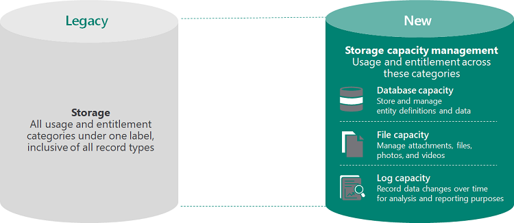

# What's new about storage

We've made some key enhancements to admin experiences for the Power Platform admin center and the Dynamics 365 admin center:

- Storage reporting is based on customer licenses and capacity add-on's.
- Changes for exceeding storage capacity entitlements.

## Updates to storage reporting

In April 2019, we introduced Common Data Service capacity storage that is optimized for relational data (database), attachments (file), and audit logs (log). New customers of Power Apps, Power Automate, and model-driven apps in Dynamics 365 (such as Dynamics 365 Sales and Dynamics 365 Customer Service) receive a tenant-wide default entitlement for each of these three storage types and additional per user subscription license entitlements. Additional storage can be purchased in 1 GB increments. Existing customers are not impacted by this change until the end of their current Power Apps or Dynamics 365 subscription, when renewal is required. 

Some of the benefits of this change:

- Scalability with purpose-built storage management solutions
- Ability to enable new business scenarios
- Reduced need to [free storage space](free-storage-space.md)
- Support for variety of data types
- Additional default and full user entitlements
- Flexibility to create new environments

Following the introduction of Common Data Service capacity, we updated our capacity reporting to show database, file, and log entitlement for all our customers. This change in reporting is not visible to those still on the legacy licensing storage model.

### Two versions of storage reporting

There are two versions for storage capacity reporting. 

- **Legacy capacity model**: Organizations with the [previous licensing model](legacy-capacity-storage.md#licenses-for-legacy-storage-model) for storage. Users with these licenses will see a single capacity for entitlement. See [Legacy storage capacity](legacy-capacity-storage.md).

- **New capacity model**: Organizations with the [new licensing model](capacity-storage.md#licenses-for-new-storage-model) for storage. Users with these licenses will see the storage capacity entitlement and usage by database, file, and log. See [Common Data Service storage capacity](capacity-storage.md). 

## Changes for exceeding storage capacity entitlements

We are making changes for what happens when an organization's storage capacity usage is greater than the capacity entitled or purchased via add-ons.

For now, if you exceed your storage capacity, you will receive notifications alerting you to the over capacity usage. These notifications will occur as alerts in the Power Platform admin center. In the future, certain admin  operations will no longer be available when a tenant exceeds storage capacity entitlements. Check back for updated information. For more information, see [Legacy storage capacity](legacy-capacity-storage.md) or [Common Data Service storage capacity](capacity-storage.md). 

### See also
[Common Data Service storage capacity](capacity-storage.md)  
[Legacy storage capacity](legacy-capacity-storage.md)  
[Free storage space](free-storage-space.md)  
[Delete and recover environments](delete-environment.md)