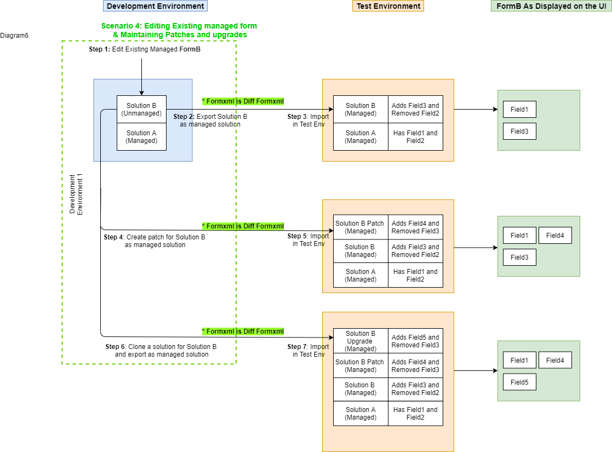
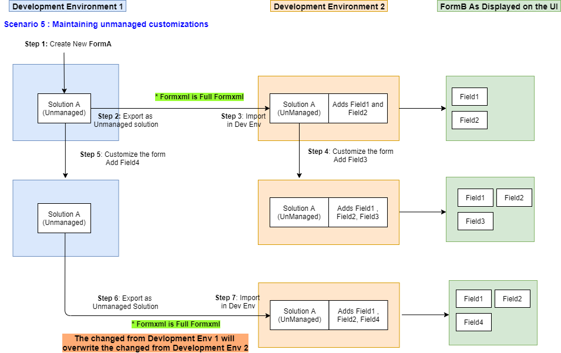
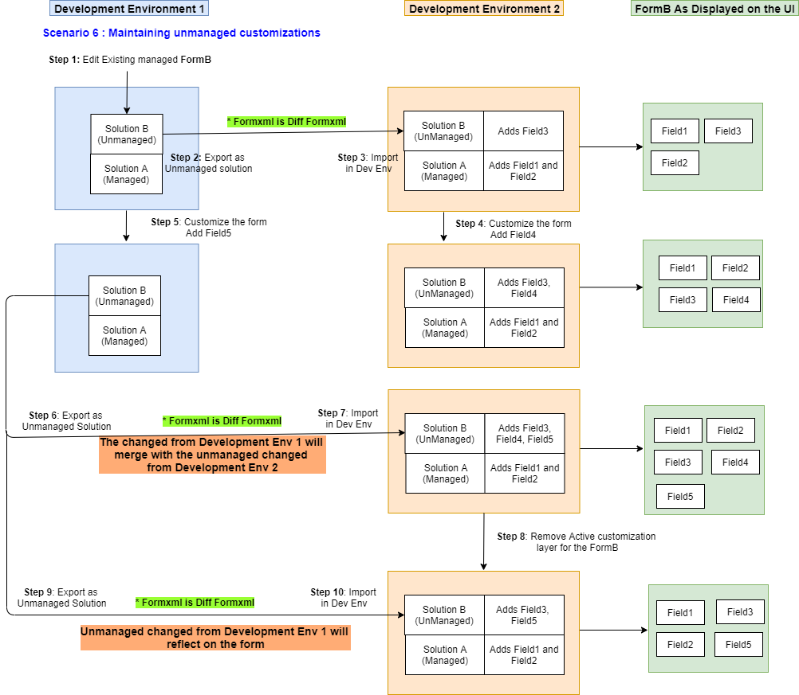

# Maintaining healthy model-driven app form ALM

This article provides you with information about the various scenarios on how to implement and practice healthy application lifecycle management (ALM) for customizing forms in your model-driven app solutions.

The following sections describe how form merge works and how to maintain customizations. The basic development scenarios with recommendations for maintaining successful ALM for a model-driven app form are covered in detail within each section that follows. Every scenario includes steps to follow that can help you implement a proper ALM process when updating your solution or model-driven app.

## Creating a new form and maintaining it using multiple managed solutions

Follow these steps to implement healthy form ALM for this scenario.

1. Create a new form named *FormA* in your development environment and perform customizations on the form.
1. Create a new solution (named *Solution A* in the below diagram) in the development environment, which will be an unmanaged solution and add your new form. Export the solution as managed. Note that this step will export a [full FormXml](#full-formxml) for the form.
1. In your test environment, import the managed solution from step 2, which creates *FormA* in the test environment. In the below diagram, *FormA* gets created in the test environment and the UI for the form shows *Field1* and *Field2* that *Solution A* added to the form.
1. If you want to further customize the form you created in Step 1 using new managed solutions, then make sure the development instance has *FormA* in a managed state. As shown in the diagram below, managed *Solution A* is imported in the development environment and the form is customized creating active customizations.  Then, *FormA* can then be added to a new unmanaged solution (*Solution B* in the diagram) and exported as a managed solution from the development environment. Note that this step will export a [differential (diff) FormXml](#differential-diff-formxml) for the form.
1. In your test environment, import the managed solution (*Solution B*) from step 4. As shown in the below diagram *Solution B* is adding a new *Field3* to *FormA* and removing *Field2*, which was added by *Solution A*. The UI for the form in the test environment now shows *Field3* and *Field1* on the form but not *Field2* after the merge.

:::image type="content" source="media/scenario1-form-alm-diagram.png" alt-text="Scenario 1 form ALM diagram":::

### Unhealthy example for this scenario

As seen in the below diagram, it is not a healthy ALM practice to create multiple managed solutions from the development environment where the base solution (*Solution A*) is in an unmanaged state. This is because, when you create another unmanaged solution (*Solution B*) for the unmanaged form, the FormXml is exported as a full FormXml, instead of a diff FormXml as shown in the valid scenario above. Subsequently, changes like removing a column won't take effect.

:::image type="content" source="media/unhealthy-form-alm-scenario1.png" alt-text="Unhealthy form ALM example for this scenario":::

## Creating a new form and making customizations using patches and upgrades

Follow these steps to implement healthy form ALM for this scenario.

1. Create a new for named *FormA* in your development environment and perform customizations on the form.
1. Create a solution (*Solution A* in the below diagram), which will be an unmanaged solution and add your new form. Export the solution as managed. Note that this step will export a [full FormXml](#full-formxml) for the form.
1. In your test environment, import the managed solution from step 2, thus creating the form in the test environment. In the below diagram *FormA* gets created in the test environment and the UI for the form shows *Field1* and *Field2* that *Solution A* added to the form.
1. If you want to further customize the form you created in Step 1 using patches, then using the same environment where *Solution A* is in an unmanaged state, create a patch for the solution and customize the form. Next, export the patch as a managed solution. Note that this step will export a [full formXml](#full-formxml) for the form.
1. In your test environment, import the managed patch solution from step 4. As shown in the below diagram, the *Solution A* patch is adding a new *Field3* to FormA and removing *Field2*, which was added by *Solution A*.

   > [!NOTE]
   > Patches are additive in nature and can't remove fields from the form, so *Field2* will not be removed from the form. The UI for the form in the test environment now shows *Field3*, *Field2*, and *Field1*.

1. If you want to further customize the form you created in Step 1 using upgrades, then using the same environment where *Solution A* is in an unmanaged state, clone *Solution A* to create the upgrade solution and customize the form. Then, export the *Solution A* upgrade as a managed solution. Note that this step will export a full FormXml for the form.
1. In your test environment, import the managed *Solution A* upgrade from step 6. As shown in the below diagram, the *Solution A* upgrade is adding a new *Field4* to *FormA* and removing *Field2*, which was added by *Solution A*. The UI for the form in the test environment now shows *Field1*, *Field3*, and *Field4* on the form, but *Field2* will be removed after the merge.

:::image type="content" source="media/scenario2-form-alm-diagram.png" alt-text="Scenario 2 form ALM diagram":::

## Customizing an existing managed form and maintaining it using multiple managed solutions

Follow these steps to implement healthy form ALM for this scenario.

1. Edit an existing managed, named *FormB* for this example, in your development environment and perform customizations on the form. Note that solution A is the managed solution already installed for the form in the development environment.
1. Create a new solution (*Solution B* in the below diagram), which is an unmanaged solution, and add *FormB*. Export the solution as managed. Note that this step will export a [differential (diff) FormXml](#differential-diff-formxml) for the form.
1. In your test environment, import the managed solution from step 2, thus creating a second solution layer for the form. In the above diagram *FormB* gets the merged changes from *Solution A* and *Solution B* in the test environment and the UI for the form shows *Field1* and *Field3* on the form but not *Field2* which was removed by *Solution B*.
1. If you want to further customize the form you customized in Step 1 using new managed solutions, then make sure the development environment has *FormB* in a managed state. As shown in the diagram below, *Solution A* and *Solution B* managed solutions are imported in the development environment. *FormB* is customized creating active customizations, which can then be added to a new solution (*Solution C* in the diagram) and exported as a managed solution. Note that this step will export a diff FormXml for the form.
1. In your test environment, import the managed *Solution C* from step 4. As shown in the below diagram, *Solution C* is adding a new *Field4* to the *FormB* and removing *Field3*, which was added by *Solution B*. The UI for the form in the test environment now shows *Field1* and *Field4* on the form, but not *Field2* and *Field3*.

:::image type="content" source="media/scenario3-form-alm-diagram.png" alt-text="Scenario 3 form ALM diagram":::

### Unhealthy example for this scenario

As shown in the below diagram, it is not a healthy ALM practice to create multiple managed solutions from the development environment that contains another unmanaged solution you created for the same form. Notice that *Solution B* is in unmanaged state. When you create another unmanaged solution (*Solution C*) for *FormB*, the FormXml is exported as a diff FormXml as shown in step 4 in the above scenario. But, *FormB* also contains the changes from *Solution B*, which will get overwritten by your new changes.

For example, as seen in the diagram below, *Field3* is added to *FormB* in *Solution B*, but now if you create a new *Solution C* in this environment, with Solution B in unmanaged state, and remove *Field3*, *Field3* will be removed in the development environment. *Field3* will not be tracked in the diff FormXml when the solution is exported, since the change of adding and removing this column was made in the same active layer. That means when managed *Solution C* is imported in the test environment, the form will still render the *Field3* because the diff FormXml never records it as removed (like it was removed in step 5 in the healthy form ALM scenario above). Performing your form customizations this way will lead to the development environment being inconsistent with the test environment.

:::image type="content" source="media/unhealthy-form-alm-scenario3.png" alt-text="Unhealthy form ALM example for this scenario":::

## Customizing an existing managed form and maintaining it using patches and upgrades

Follow these steps to implement healthy form ALM for this scenario.

1. Customize an existing managed form, named *FormB* in this example, in your development environment and perform customizations on the form. Note that *Solution A* is the managed solution already installed for the form in the development environment.
1. Create a solution (*Solution B*), which will be an unmanaged solution and add *FormB*. Export the solution as managed. Note that this step will export a [diff FormXml](#differential-diff-formxml) for the form.
1. In your test environment, import managed *Solution B* from step 2, thus creating a second solution layer for the form. In the below diagram, *FormB* gets the merged changes from *Solution A* and *Solution B* in the test environment. Additionally, the UI for the *FormB* shows *Field1* and *Field3* on the form but not Field2 which was removed by *Solution B*.
1. If you want to further customize the form you customized in Step 1 using a patch solution, then you can use the same development environment as step 1 where *Solution B* exists in an unmanaged state. As shown in the diagram below, *Solution A* is in a managed state and *Solution B* is in an unmanaged state. The form is further customized and then you create a patch for *Solution B* adding your form to this solution and exporting it as 1. In your test environment, import managed patch *Solution B* from step 4. As shown in the below diagram, *Solution B Patch* is adding a new *Field4* to *FormB* and removing *Field3*, which was added by *Solution B*. 

    > [!NOTE]
    > Patches are additive in nature and can't remove components, such as columns, from the form. So, *Field3* will not be removed from the form. The UI for the form in the test environment now shows *Field1*, *Field3*, and *Field4* on the form, but not *Field2*.
1. If you want to further customize the form you created in Step 1 using Upgrades, then using the same environment where *Solution B* is in an unmanaged state, clone *Solution B* to create the upgrade solution and customize *FormB*. Export the upgrade as a managed solution. Note that this step will export a [diff FormXml](#differential-diff-formxml) for the form.
1. In your test environment, import the managed *Solution B* upgrade solution from step 6. As shown in the below diagram, *Solution B Upgrade* is adding a new *Field5* to *FormB* and removing *Field3*, which was added by *Solution B*. The UI for the form in the test environment now shows *Field1*, *Field4*, and *Field5* on the form, but *Field2* and *Field3* will be removed.

## Maintaining unmanaged solutions and customizations across multiple development environments

Follow these steps to implement healthy form ALM for this scenario.

1. In *Development Environment 1*, create a new *FormA* and perform customizations on the form.
1. Create a solution (*Solution A* in the below diagram), which will be an unmanaged solution, and add your new form. Export the solution as unmanaged. Note that this step will export a [full FormXml](#full-formxml) for the form.
1. In *Development Environment 2*, import the unmanaged solution from step 2, which creates the form in *Development Environment 2*. In the below diagram, *FormA* gets created and the UI for the form shows *Field1* and *Field2* that *Solution A* added to the form.
1. You further customize the form in *Development Environment 2* making active customizations in the environment, such as adding a new colmun named *Field3*. *FormA* now shows *Field1*, *Field2*, and *Field3*.
1. In your *Development Environment 1*, you further customize the form also by adding *Field4*. The UI for the form in the *Development Environment 1* now shows *Field1*, *Field2*, and *Field4*.
1. Export unmanaged *Solution A* with the changes made in step 5. Note that this step will export a [full FormXml](#full-formxml) for the form.
1. In *Development Environment 2*, import unmanaged *Solution A Upgrade* from step 6. Since the solution you are importing contains the full FormXml for *FormA* it overwrites the active customization made in *Development Environment 1*. So, the form now shows only *Field1*, *Field2*, and *Field4*, but not *Field3*, which was the additional active customization done in *Development Environment 1*. Note that, this behavior occurs with any unmanaged solution import that has the full FormXml for the form.

## Scenario 6

Follow these steps to implement healthy form ALM for this scenario.

1. In *Development Environment 1*, customize an existing form, named *FormB* in this example. Then perform customizations on the form.
1. Create a solution (*Solution B* in the below diagram), which will be an unmanaged solution, and add *FormB*. Export the solution as unmanaged. Note that this step will export a [diff FormXml](#differential-diff-formxml) for the form.
1. In *Development Environment 2*, import the unmanaged solution from step 2, thus creating a second solution layer for the form. The *FormB* UI shows *Field1*, *Field2*, and *Field3* after the form merge.
1. You further customize the form in *Development Environment 2*, making active customizations in the environment, such as adding a new column named *Field4*. *FormB* now shows *Field1*, *Field2*, *Field3*, and *Field4*.
1. In *Development Environment 1*, you further customize the form adding a new column named *Field5*. The UI for the form in *Development Environment 1* now shows *Field3* and *Field5*.
1. Export unmanaged *Solution B* with the changes made in step 5. Note that this step will export a [diff FormXml](#differential-diff-formxml) for the form.
1. In *Development Environment 2*, import unmanaged *Solution B Upgrade* from step 6. Since the solution you are importing contains the diff FormXml for *FormB* it will merge with the active customization made in *Development Environment 1*. So, the form now shows *Field1*, *Field2*, *Field3*, *Field4*, and *Field5*. Note that this behavior occurs for any unmanaged solution import that has the diff FormXml for the form.
1. If the form merge in step 7 is not what you want even though you are importing a diff FormXml with the unmanaged solution and you want to be able to overwrite the active customizations made in *Development Environment 2*, then remove the active layer for *FormB*. More information: [Remove an unmanaged layer](/powerapps/maker/data-platform/solution-layers#remove-an-unmanaged-layer). 
1. Export unmanaged *Solution B* with the changes made in step 5. Note that this step will export a diff FormXml for the form.
1. In *Development Environment 2*, import unmanaged *Solution B Upgrade* from step 9. Since there is no active layer for the form in *Development Environment 2*, (see step 8), all the changes from unmanaged *Solution B* are imported even though you are importing diff FormXml for FormB. So, the form now shows only *Field1*, *Field2*, *Field3*, and *Field5*. Note that this behavior occurs for any unmanaged solution import that has the diff FormXml for the form. Note that this is the same result as step 7 in the [Maintaining unmanaged solutions and customizations across multiple development environments](#maintaining-unmanaged-solutions-and-customizations-across-multiple-development-environments) scenario. 

## Full and differential form XML

Every exported solution package includes a customizations.xml file. Whenever a form is included in a solution, the related form definition exists within the FormXml sections of the customizations.xml file. FormXml can either be *full* or *differential (diff)*.

### Full FormXml

The FormXml you get on exporting a solution for a form in an unmanaged state is called a *full* FormXml. Full means it contains the entire form definition. When you create a new form and export it, the form will always be a full FormXml because the form in the organization you are exporting from is in an unmanaged state and is in a create state. If you export any further solutions from this same organization – those will also include a full FormXml. Because the `solutionaction` attribute indicates a diff FormXml, the full FormXml in the customization.xml file in the solution you export will not contain any `solutionaction` attributes.

### Differential (diff) FormXml

The FormXml you get when exporting a solution for a form in a managed state is called a differential or *diff* FormXml. Diff means the FormXml contains only the changes does in the active customizations in that organization and not the entire form definition. When you customize an existing managed form and export it, the form will always be a diff FormXml because it will only contain the active changes done to it. Note that the diff FormXml in the customization.xml file in the solution you export will contain `solutionaction` attributes defining what the changes are, like **Added**, **Removed**, **Modified**.

Diff FormXml ensures that your solution will only express the changes your app needs and will be impacted less by changes from other layers. Diff FormXml also makes the solution less bulky and helps it import faster.

### See also
[Recommendations for healthy form ALM](form-alm-recommendations.md)