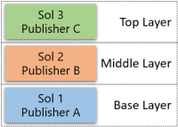
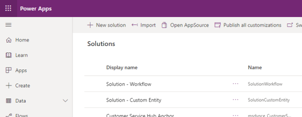
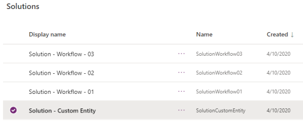
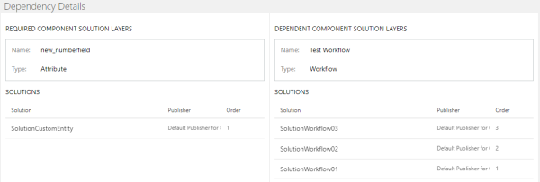
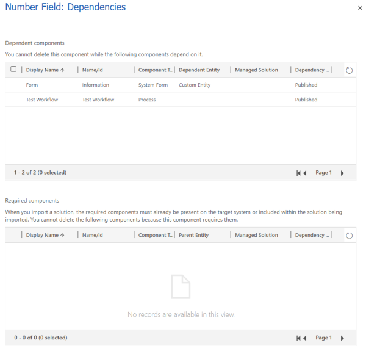
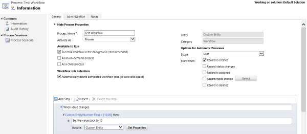
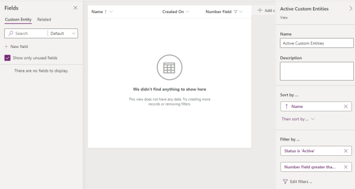

# Removing dependencies

Dependencies are records created automatically by the solutions framework to prevent actions that, if executed unchecked, can cause problems. As components are changed and extended, dependencies are created to indicate that&mdash;for example&mdash;a field is required for a form to function. If you ever try to execute an action that will result in the deletion of that field, the form will stop working.

Dependencies exist to prevent required components from being deleted while one or more dependent components still include references to them.

> [!NOTE]
> In this article, *delete* means that the component is completely removed from the system.

In this article, we'll discuss how to handle these dependencies and the strategies you can use to remove dependencies that you no longer need.

## Dependencies of unmanaged vs. managed components

First, it's important to understand that dependencies only prevent operations that will delete a required component. The actions that can delete a component are different, depending on whether it's unmanaged or managed.

### Unmanaged components

These components are represented by a single layer in the active solution. Any **Delete** operation on such a component results in the complete removal of the component.

### Managed components

The deletion of managed components depends on multiple factors: the number of solution layers, the relative position of the layer that's being uninstalled, and the component publishers. For example, when a component is deleted, consider the following scenarios and what will be the expected behavior when you uninstall the various layers.

### Example scenarios

The following example scenarios illustrate what happens to solution layers when solutions are uninstalled.
 
#### Scenario 1: Uninstall a single solution layer<!--Is this what "Uninstall with a single layer" means?-->

  

Uninstalling Solution 1 causes a component deletion because it's the only layer for the component.

#### Scenario 2: Uninstall solution layers from different publishers

 

   - Uninstalling Solution 2 doesn't cause a component deletion. Only that layer will be removed.
   - Uninstalling Solution 1 causes a component deletion, because the action happens in the base layer. In fact, Solution 1 can't be uninstalled in this scenario, because a solution from a different publisher extends the component.

#### Scenario 3: Uninstall multiple solution layers from different publishers

   
    
   - Uninstalling Solution 3 doesn't cause a component deletion. Only that layer will be removed.
   - Uninstalling Solution 2 doesn't cause a component deletion. Only that layer will be removed.
   - Uninstalling Solution 1 doesn't cause a component deletion, because in this case there's another solution from the same publisher (Publisher A = Publisher C)). The platform removes the layer from Solution 1 and replaces it with the layer from Solution 3.

#### Scenario 4: Uninstall solution layers in an unmanaged customization

   

   - Uninstalling the Active (unmanaged) layer doesn't cause a component deletion. Only that layer will be removed. Note that you can't uninstall the Active solution, but you can remove components by using the **Remove Active Customization** feature.
   - Uninstalling Solution 1 causes a component deletion. The action happens in the base layer. Unlike scenario 2, you can uninstall Solution 1. The Active solution isn't considered an extension, and both layers will be removed.

## Dependency Details page

The **Dependency Details**page lists the dependencies for the selected solution. It can be invoked by:

- Selecting **Show Dependencies** on the solution page.
- Trying to uninstall a solution, which will cause the platform to detect that dependencies exist.

The **Dependency Details** page has the following columns:

- **Display name**: The friendly name of the required component. Each component might show slightly different data to make the identification easier. In the preceding figure, you can see that the entity only shows its name, while the field displays its name and the name of its parent entity.
- **Name/Id**: The internal name of the required component.
- **Type**: The type of the required component.
- **Required by**: The friendly name of the component that requires it (the dependent component). If the dependent component has a customization page, its name becomes a link that opens that page.
- **Dependent Type**: The type of the dependent component.
- **Solution Layers**: A link where you can see more details about the components involved in the dependency.

> [!NOTE]
> The required component is the one that you want to delete. The dependent component is the one that has references to the required component. To remove a dependency, you must make changes that affect the dependent component, not the required component.

## Diagnosing dependencies

Let's consider the following scenario. The organization below has two solutions: **Solution - Workflow** and **Solution - Custom Entity**.

The owner of the organization decided that they no longer require **Solution - Custom Entity**, tried to delete it, and was presented with the following page:

Without going into detail, we can conclude that the uninstall of the solution is trying to delete an entity named **Custom Entity** and three fields&mdash;**Custom Entity**, **Name**, and **Number Field**&mdash;and all four components have dependencies.

> [!NOTE]
> Uninstalling the solution might potentially delete more components, but because they don't have dependencies, they won't appear on the list.

The next step is to check the **Solution Layers** link (rightmost column) for each dependency. That will help you decide what to do to remove the dependency.

The following figure shows dependency details between the Entity (Custom Entity) and Process (Test Workflow).

Based on the data displayed, you can see that the dependent component belongs to a solution named SolutionWorkflow. To remove this dependency, we can either:

- Update the definition of the workflow in SolutionWorkflow by removing any references to the entity or its subcomponents. Then **Update** or **Upgrade** the solution.
- Uninstall the SolutionWorkflow solution.
- Remove the workflow from a new version of the SolutionWorkflow solution, and then perform an **Upgrade**.

Because any one dependent component can prevent the removal of the solution, we recommend that you check all the dependencies and make all the required changes in a single operation.

The following figure shows dependency details between the Entity (Custom Entity) and a model-driven App (My App).

 and App (My App)")

Based on the data displayed, you can see that the dependent component belongs to a solution named Active. This indicates that the dependency was created by importing an unmanaged solution, or through an unmanaged customization that was executed through the modern UI or API.

To remove this dependency, you can either:

- Edit the definition of the model-driven app to remove any reference to the entity or its subcomponents. Because model-driven apps support publishing, you must publish your changes.
- Delete the model-driven app.

> [!NOTE]
> Uninstalling an unmanaged solution isn't an option for removing this dependency, because unmanaged solutions are just a means to group components.

## Actions to remove a managed dependency

Managed dependencies are the ones where the dependent component is associated to a managed solution. To resolve this kind of the dependency, you must act on the solution where the component was added. That action can be different depending on what you're trying to do.

**If you're trying to uninstall a solution**

Follow these steps:

  1. In the target organization, inspect the **Solution Layers** link to find what is the topmost solution on the list of the dependent component.
  1. In the source organization, prepare a new version of that solution where the solution either doesn't contain the dependent component, or has an updated version of the dependent component that doesn't contain references to the required component. Your goal is to remove any reference to the required components in the new version of the solution.
  1. Export the new version of the solution.
  1. In the target organization, **Upgrade** that solution.
  1. Retry the uninstall.

**If you're trying to upgrade a solution**

In this case, you must confirm that you wanted to delete the required component (remember that dependencies are enforced only on components that are being deleted).

If you didn't want to delete the component, you can fix the new version of the solution by adding the component back by doing the following:

   1. In the target organization, uninstall the staged solution (the solution that ends in _Upgrade).
   2. In the source organization, add the required component(s) back to the solution.
   3. Export the new version.
   4. Retry the upgrade.

If the deletion is intentional, you must remove the dependency. Try the steps outlined in the preceding section, "If you're trying to uninstall a solution."

### Layers and dependencies

The dependent components can be layered, so you might need to change more than one solution to completely remove a dependency. The dependency framework only calculates dependencies between the topmost layers for the required and dependent components. That means you need to work your way from the top to the bottom of the solutions of the dependent component.

Consider the following scenario:

You try to uninstall **Solution - Custom Entity**, and the operation is blocked by dependencies.

You start diagnosing the dependency by selecting **Solution Layers** on the **new_numberfield** attribute. You see the following screen:

Because dependencies are created only between the topmost layers of each component, the first step is to deal with the dependency between the **new_numberfield** attribute in SolutionCustomEntity and the **Test Workflow** workflow in SolutionWorkflow3.

To remove the dependency, you decide to uninstall SolutionWorkflow3. You do so, but when you try to uninstall the solution once more, you're presented by the same page of dependencies:

However, the **new_numberfield** attribute is no longer listed, even if it existed in more layers.

## Actions to remove an unmanaged dependency

To remove unmanaged dependencies, you need to act directly on the components, not in the solutions they belong to. For example, if you want to remove the dependencies between an attribute and a form, you must edit it in the Form Editor and remove the attribute from the form. The dependency will be removed after you select **Save** and **Publish**.

> [!NOTE]
> You can also delete the dependent component. That action deletes all dependencies, along with the component.

To see the dependencies of a component, locate it in the customizations page, and then select **Show dependencies**.

The page of dependencies has two distinct parts:

  - Dependent components: A list of components that depend on the selected field. In other words, these components will have this field as their required component.
  - Required components: A list of components that this field requires in order to work. In other words, these components will have this field as their dependent component.

## Field and workflow

To remove dependencies between fields (attributes) and workflows (processes), locate the workflow in the customizations page.

When viewing the workflow details, find the reference to the component you no longer want the workflow to depend on. In this example, you can see the field **Number Field** being referenced in a process step.

Delete (or change) the step, and then save the workflow.

## Field and view

To remove dependencies between fields (attributes) and views (saved queries), locate the view in the customizations page.

In the field editor, find the reference to the component you no longer want the view to depend on. In this example, you see the field **Number Field** being used as a select column and a filter.

Remove both, save, and then publish the view.

## Entity and model-driven apps

To remove dependencies between entities and model-driven apps (App Module), locate the app in the **Apps** list of the modern UI.

In the app designer, find the reference to the component you no longer want the app to depend on. In this example, you see the entity **Custom Entity** under **Entity View**.

Also, inspect the site map associated with the app, because it's likely that you'll find references there.

Remove all references, and then save and publish both the app and the site map.

> [!NOTE]
> After being edited, components can be added to managed solutions and transported to other organizations to remove managed dependencies.
  
### See also

 [Solution concepts](/power-platform/alm/solution-concepts-alm)  
 [Solution layers](/power-platform/alm/solution-layers-alm)  
 [Create, export, or import an unmanaged solution](create-export-import-unmanaged-solution.md)  
 [Create, install, and update a managed solution](create-install-update-managed-solution.md)  
 [Uninstall or delete a solution](uninstall-delete-solution.md)  
 [Solution entity reference](reference/entities/solution.md)
