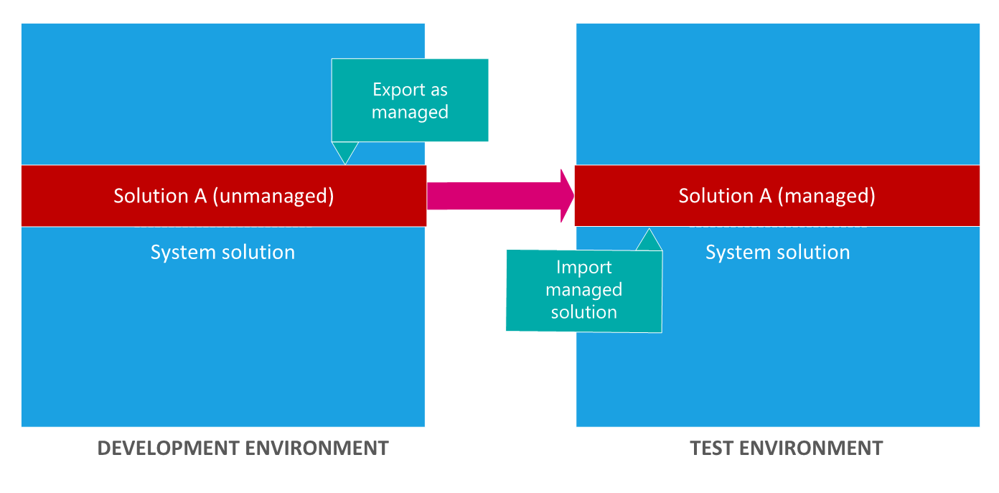
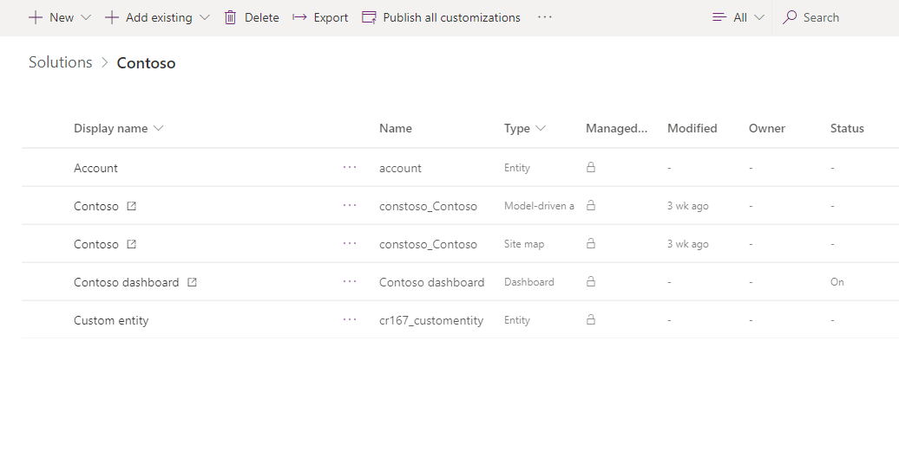

# Solution concepts 
Solutions are the mechanism for implementing ALM in Power Apps and Power Automate. This article describes the following:
- Two different types of solutions
- Lifecycle of a solution
- Solution publisher

## Managed and unmanaged solutions

A solution is either *managed* or *unmanaged*.

-   **Unmanaged solutions** are used in development environments while you make
    changes to your application. Unmanaged solutions are exported as such and
    should be checked into your source control system. Unmanaged solutions
    should be considered your source for Microsoft Power Platform assets.

-   **Managed solutions** are used to deploy to any environment that isn't a
    development environment for that solution. This includes test, UAT, SIT, and
    production environments. Managed solutions can be serviced independently
    from other managed solutions in an environment. As an ALM best practice,
    managed solutions should be generated by a build server and considered a
    build artifact.

Makers and developers work in development environments using unmanaged
solutions, then import them to other downstream environments&mdash;such as test&mdash;as
managed solutions.

> [!NOTE]
> When you customize in the development environment, you're working in
> the unmanaged layer. Then, when you export the unmanaged solution as a
> managed solution to distribute to another environment, the managed solution
> is imported into the environment in the managed layer. More information:
> [Solution layers](solution-layers-alm.md)<!--Edit okay? The link was to a different "Solution layers" article at https://review.docs.microsoft.com/en-us/powerapps/maker/common-data-service/solution-layers?branch=matp-master-aug).-->

## Solution lifecycle

Solutions support the following actions that help support application lifecycle
processes:

-   **Create** Author and export unmanaged solutions.

-   **Update** Create updates to a managed solution that are deployed to the parent
    managed solution. You can't delete components with an update.<!--Suggested.-->

-   **Upgrade** Import the solution as an upgrade to an existing managed solution,
    which removes unused components and implements upgrade logic. Upgrades
    involve rolling up (merging) all patches to the solution into a new version
    of the solution. Solution upgrades will delete components that existed but
    are no longer included in the upgraded version. You can choose to upgrade
    immediately or to stage the upgrade so that you can do some additional
    actions prior to completing the upgrade.

-   **Patch** A patch contains only the changes for a parent managed solution, such
    as adding or editing components and assets. Use patches when making small
    updates (similar to a hotfix). When patches are imported, they're layered on
    top of the parent solution. You can't delete components with a
    patch.

## Solution publisher 

Every app you create or customization you make is part of a solution. Because
every solution has a publisher, you should create your own publisher rather than use the default<!--Suggested, to avoid a momentary confusion.-->. You specify the publisher when you create a solution.

The base publisher of a solution that defines a component is considered the
owner and controls what changes other publishers of the solution are allowed to make or
restricted from making. It's possible to move the ownership of a component from one
solution to another within the same publisher, but not across publishers. Because of this, it's often best to define a single publisher so you can change the
layering model across publishers later.

The solution publisher specifies who developed the app. For this reason, you
should create a solution publisher name that's meaningful.

### Solution publisher prefix

A solution publisher includes a prefix. The publisher prefix is a mechanism to help avoid naming collisions. This allows for solutions from
different publishers to be installed in an environment with few conflicts.
For example, the Contoso solution displayed here includes a solution publisher
prefix of *contoso*.

> [!NOTE]
> When you change a solution publisher prefix, you should do it before
you create any new apps or metadata items because you can't change the names of
metadata items after they're initially created.

## Solution components
A component represents something that you can potentially customize. Anything that can be included in a solution is a component. To view the components included in a solution, in Power Apps select **Solutions**  and then open the solution you want. The components are listed in the **Components** list. Notice that you can't edit components contained in a managed solution. 

> [!div class="mx-imgBorder"] 
> 

To view a list of component types that can be added to any solution, see [ComponentType Options](/powerapps/developer/common-data-service/reference/entities/solutioncomponent#componenttype-options).

Some components are nested within other components. For example, an entity contains forms, views, charts, fields, entity relationships, messages, and business rules. Each of those components requires an entity to exist. A field can’t exist outside of an entity. We say that the field is dependent on the entity. 

The purpose of having components is to keep track of any limitations on what can be customized using managed properties and all the dependencies so that it can be exported, imported, and (in managed solutions) deleted without leaving anything behind. More information: [Managed properties](managed-properties-alm.md)

### See also
[Solution layers](solution-layers-alm.md)  
[Create and manage environments in the Power Platform admin center](https://docs.microsoft.com/power-platform/admin/create-environment)  
[Create a solution publisher](/powerapps/maker/common-data-service/change-solution-publisher-prefix#create-a-solution-publisher)
