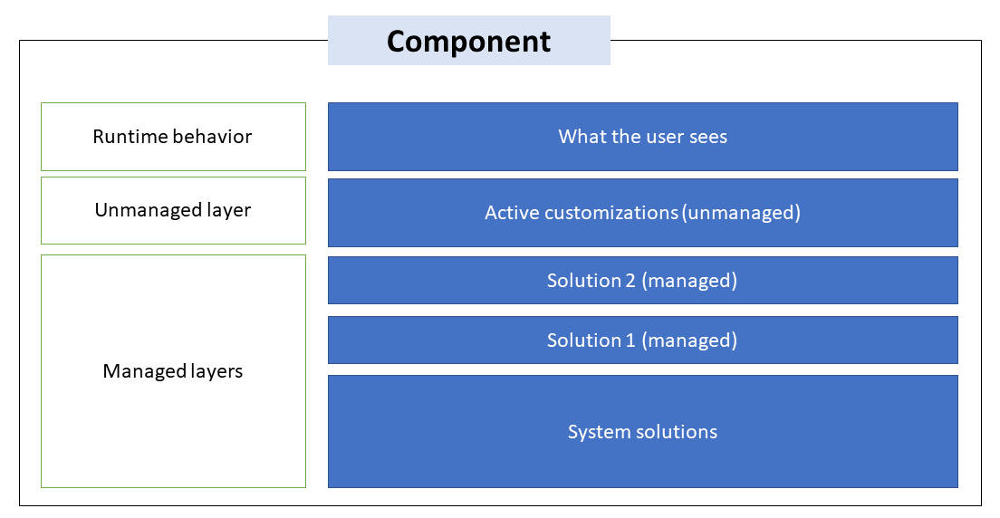
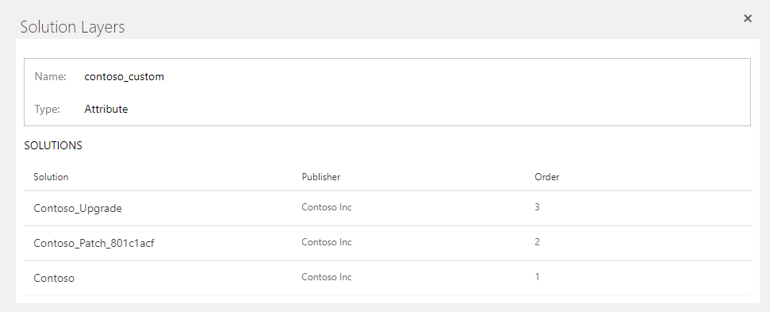

# Solution layers

Solution layering is implemented at a component level. Managed and
unmanaged solutions exist at different layers within a Microsoft Dataverse
environment. In Dataverse, there are two distinct layers:

-   **Unmanaged layer** All imported unmanaged solutions and ad-hoc customizations
    exist at this layer. All unmanaged solutions share a single unmanaged layer.

-   **Managed layers** All imported, managed solutions and the system solution exist
    at this level. When multiple managed solutions are installed, the last one
    installed is above the managed solution installed previously. This means
    that the second solution installed can customize the one installed before
    it. When two managed solutions have conflicting definitions, the runtime
    behavior is either "Last one wins" or a merge logic is implemented. If you
    uninstall a managed solution, the managed solution below it takes effect. If
    you uninstall all managed solutions, the default behavior defined within the
    system solution is applied. At the base of the managed layers level is the
    system layer. The system layer contains the entities and components that are
    required for the platform to function.<!--Very nice explanation! -->

## Layering within a managed solution 

For each managed component, there are layers within a solution, which&mdash;depending
on whether one or more patches or a pending upgrade to the solution has been
imported&mdash;can include the following layers:

-   **Base** Located at the bottom of the solution layer "stack" is the base layer.
    This layer includes the solution publisher, which identifies the owner of
    the component and the managed properties associated with it.

-   **Top** The top layer is considered the current layer and defines the runtime behavior of the component. The top layer can be an upgrade or a patch, or if no patches or upgrades have been applied to the solution, the base solution determines the component runtime behavior.

-   Layers added from updates:

    -   **Patches** If the component has one or more solution patches imported,
        they're stacked on top of the base layer, with the most recent patch
        residing above the previous patch.

    -   **Pending upgrade** If a staged upgrade (named \_Upgrade) is imported, it
        resides on top of the base and patch (if any) layers.

   

> [!IMPORTANT]
> Using patches isn't recommended. More information: [Create solution patches](/powerapps/maker/common-data-service/solution-patches)

The following image shows an example of solution layers for a custom column that displays the base solution, a patch, and a pending upgrade.

> [!div class="mx-imgBorder"] 
> 

For information about how to view layers for a component within a solution, see
[Solution layers](/powerapps/maker/common-data-service/solution-layers).

### Merge behavior

Solution makers should understand the merge behavior when a solution is updated
or when multiple solutions are installed that affect the same component. Notice
that only model-driven app, form, and site map component types will be merged. All other
components use "top level wins" behavior.

### "Top wins" behavior

With the exception of the model-driven app, form, and site map components, other solution components use a "top wins" behavior where the layer that resides at the top determines how the component works at app runtime. A top layer can be introduced by a staged (pending) upgrade.

#### Top layer introduced by a pending upgrade

Here’s an example of a top wins component behavior introduced by a stage for upgrade update to a solution. More information: [Apply the upgrade or update in the target environment](/powerapps/maker/data-platform/update-solutions#apply-the-upgrade-or-update-in-the-target-environment)

1. The current top (base) layer has the **Max length** property of the **Comments** text column for the account table using the default setting of 100.

   :::image type="content" source="media/component-merge-top-wins1.png" alt-text="Table component in the base solution":::

1. A solution upgrade is imported using the stage for upgrade option, which creates a new top layer. The pending upgrade includes the **Comments** text column for the account table with the **Max length** property value changed to 150.

   :::image type="content" source="media/component-merge-top-wins2.png" alt-text="Active layer introduced on top of the base layer":::

In this situation, the **Comments** column for account records will allow up to a maximum of 150 characters during app run time.

### Solution update and upgrade merge behavior

As described in the previous section, patches and a staged upgrade are stacked
on top of the base solution. These can be merged by selecting **Apply upgrade**
from the **Solutions** area in Power Apps, which flattens the layers and creates
a new base solution.

### Multiple solutions merge behavior

When you prepare your managed solution for distribution, remember that an
environment might have multiple solutions installed or that other solutions might be
installed in the future. Construct a solution that follows best practices so
that your solution won't interfere with other solutions. More information: [Use segmented solutions](segmented-solutions-alm.md)

The processes that Dataverse uses to merge customizations emphasize
maintaining the functionality of the solution. Although every effort is made to
preserve the presentation, some incompatibilities between customizations might
require that the computed resolution change some presentation details in
favor of maintaining the customization functionality. 

### See also

[Understand how managed solutions are merged](how-managed-solutions-merged.md)

[!INCLUDE[footer-include](../includes/footer-banner.md)]