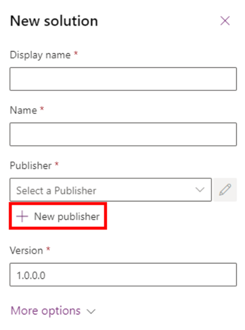
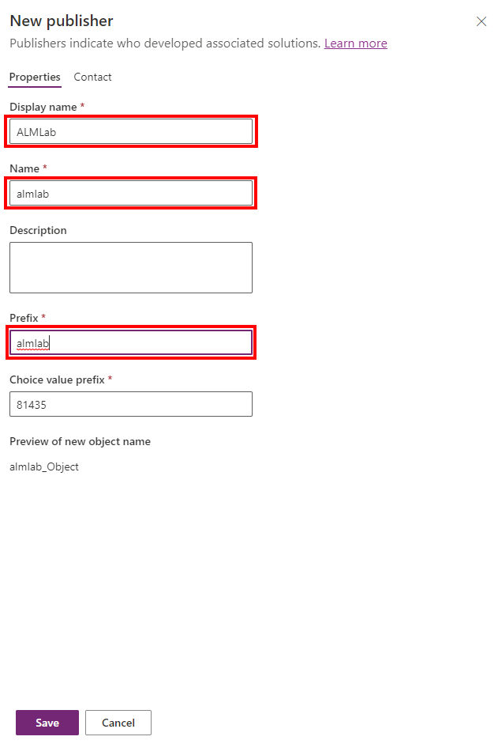
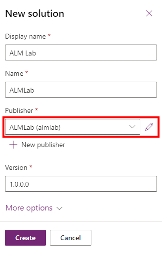
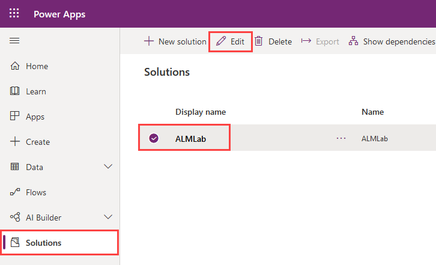
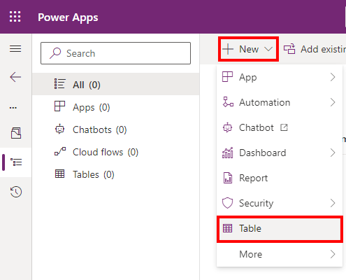
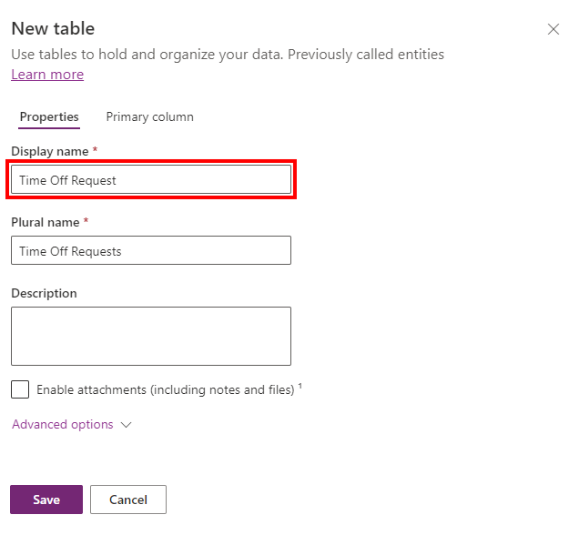
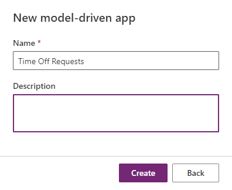
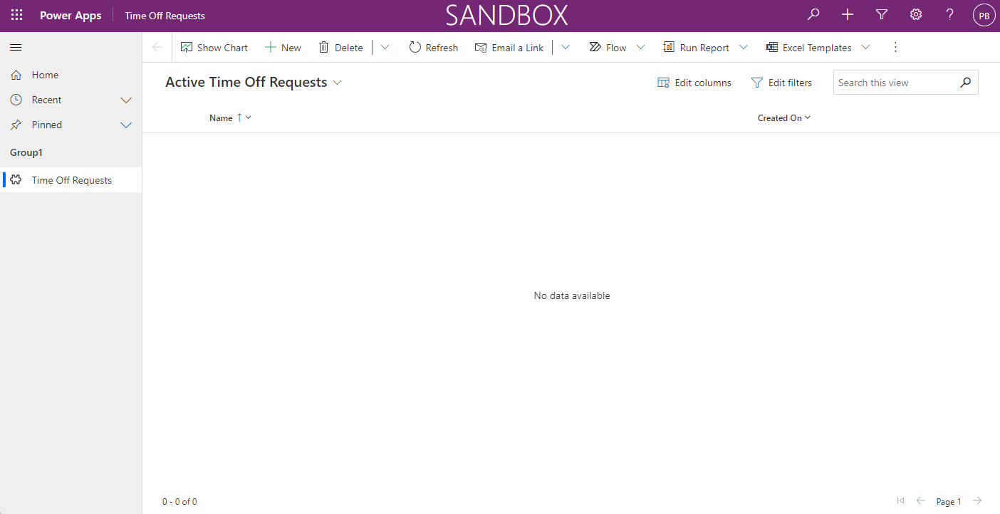

# Tutorial: Build a model-driven app for deployment using GitHub Actions for Microsoft Power Platform

In this tutorial you will be creating a basic model-driven app to use in the next tutorial where you will learn how to automate the application lifecycle management of the app.

1.	Navigate to make.powerapps.com and sign in with your credentials.  Click the environment selector dropdown in the header and select your development environment.

2.	Click the Solutions area in the left navigation then click the New solution button to create a new solution.

 
3.	In the side panel that appears, enter a name for the application and click the dropdown for the publisher and click the Add Publisher option
Note: The solution publisher specifies who developed the app. For this reason, you should create a solution publisher name that's meaningful.
Note: The solution publisher specifies who developed the app, so you should always create a solution publisher name that is meaningful. Furthermore, the solution publisher includes a prefix, which helps you distinguish system components or components introduced by others and is also a mechanism to help avoid naming collisions. This allows for solutions from different publishers to be installed in an environment with minimal conflicts.

4.	A new window will pop up.  If a window does not pop up, check your popup blocker settings.  For the purposes of this lab, enter your ALMLab for the display name, name, and prefix and click Save and Close.

5.	On the new solution panel, select the publisher that you just created, give the application a version number, and click Create to create a new unmanaged solution in the environment.

6.	In the solutions list, select the solution you just created and click the Edit button.

7.	Your new solution will be empty, and you need to add components to it.  In this lab we will create a custom entity and .  Click the New dropdown from the top navigation and select Entity

8.	Enter a display name and plural name.  The system will fill out the entity name and other fields for you.  Click Create to create the entity.

9.	Once your entity is created, click the solution name again to go back to the solution view to add another component

10.	Click the New dropdown, then App, and Model-driven app

11.	Enter an application name and click the Done button

12.	In the application designer, click the Site Map to edit it.

13.	In the sitemap editor, select the New Subarea to get its current properties

14.	Select the Entity dropdown and select your custom entity to add to the sitemap

15.	Click Save, then Publish, then Save and Close to go back to the application designer

16.	Click Save then Validate to validate the application

17.	You should see one warning.  View the warning, then click Publish then Play

18.	This will take you to the application so that you can see how it looks.  You can use the application and close the tab when you are satisfied.

> [!div class="nextstepaction"]
> [Next steps](./github-actions-deploy.md)