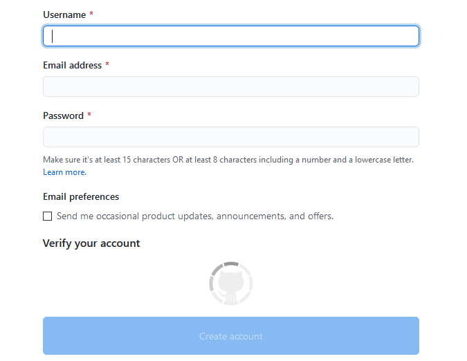
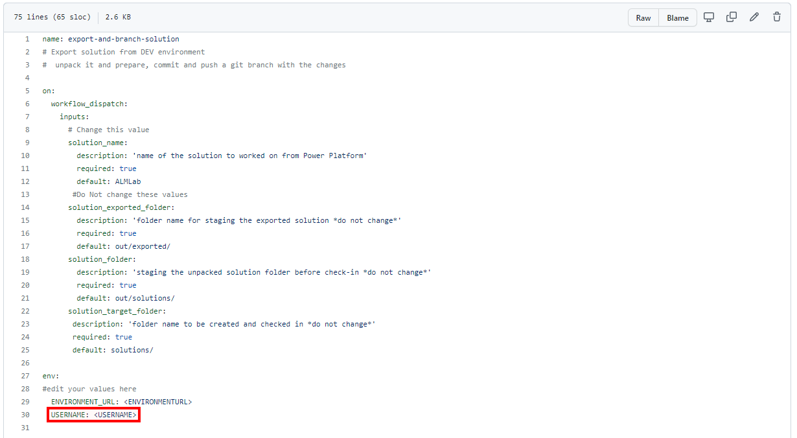
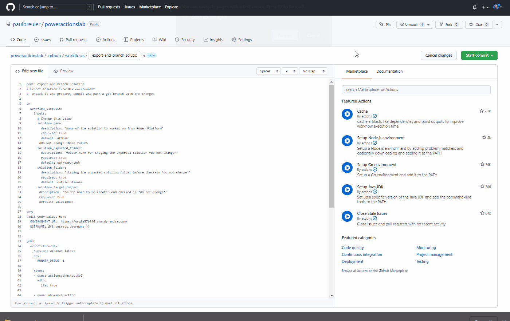
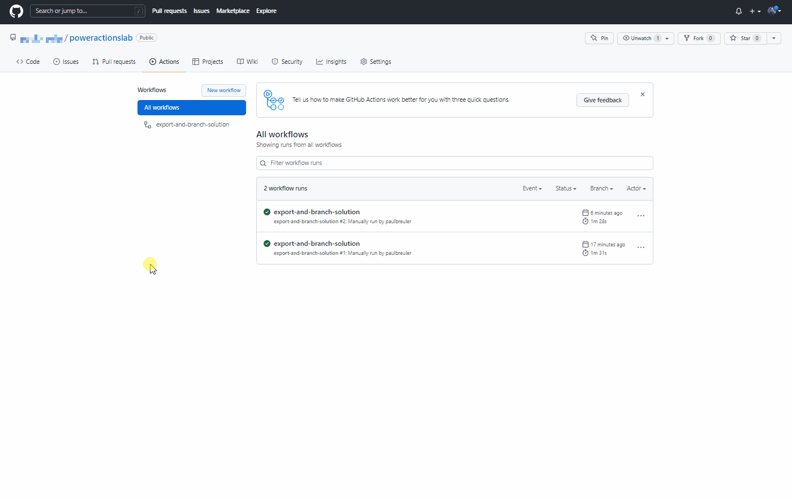
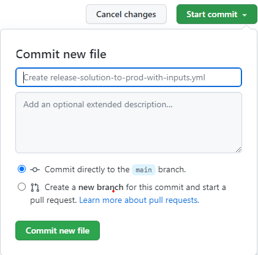
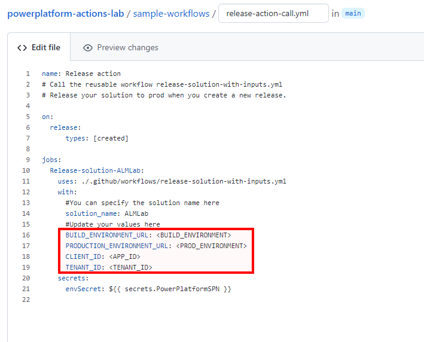
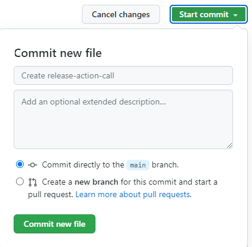
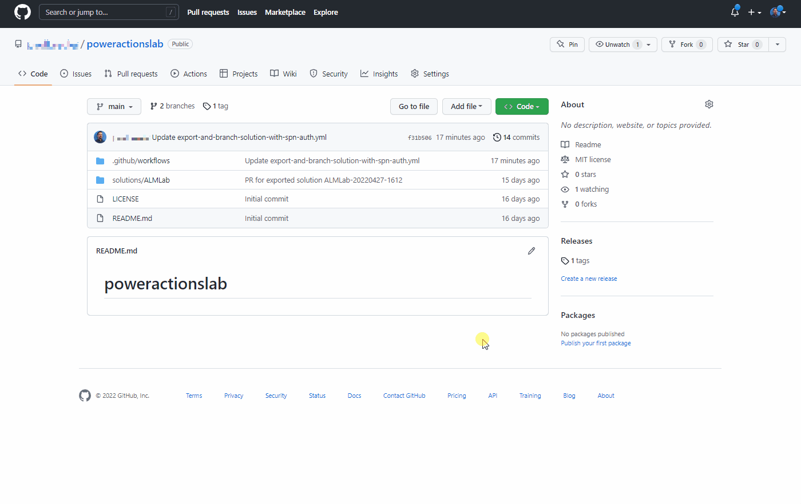
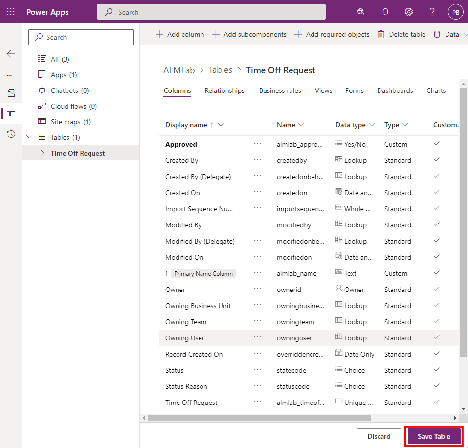

# Tutorial: Automate solution deployment using GitHub Actions for Microsoft Power Platform

In this tutorial, you will learn how to:

> [!div class="checklist"]
> * Create a new GitHub repository
> * Create two GitHub workflows using GitHub Actions for Microsoft Power Platform

 The workflows can automatically export your app (as an unmanaged solution) from a development environment, generate a build artifact (managed solution), and deploy the app into your production environment. This tutorial uses the [ALMLab solution](https://github.com/microsoft/powerplatform-actions-lab/blob/main/solutions/ALMLab_1_0_0_1.zip) you built and the environments you set up in previous tutorials.

Related tutorials: [Get started](github-actions-start.md), and [Build a model-driven app](github-actions-build.md).

## Create a GitHub Account

1. Go to https://github.com and click **Sign up** or **Start a free trial** (or sign in if you have an existing account).

    

2. After you have created your account, create a repository by selecting **Create repository** or **New**.

    

    You might see the following alternative landing screen:

    

3. Create your new repository and name it 'poweractionslab'. Make sure you select **Add a README file** to initiate the repo and choose **Create repository**.

    

### Creating a new secret for Service Principal Authentication
1. Navigate to you repository and click **Settings**, then expand **Secrets**, and then and click **Actions**.

2. On the *Secrets* page, name the secret 'PowerPlatformSPN'. Use the client secret from the application registration created in Microsoft Entra and enter it into the **Value** field, and then select **Add secret**. The client secret will be referenced in the YML files used to define the GitHub workflows later in this lab.

    

    The client secret is now securely stored as a GitHub secret.

## Create a workflow to export and unpack the solution file to a new branch

1. click on **Actions** and click **set up a workflow yourself** or click Configure in the *Simple workflow* box under the *suggested for this repository* section.

    

2. This will start a new YAML file with a basic workflow to help you get started with GitHub actions.

    

3. Delete the pre-created content, paste the content from the [export-and-branch-solution-with-spn-auth.yml](https://github.com/microsoft/powerplatform-actions-lab/blob/main/sample-workflows/export-and-branch-solution-with-spn-auth.yml) file, and then rename the file to 'export-and-branch-solution'.yml.

    

4. Update `<ENVIRONMENTURL>` with the URL for the development environment you want to export from (for example: `https://poweractionsdev.crm.dynamics.com`).

5. Update `<APPID>` and `<TENANT ID>` with your values. 

    * If you are using credentials, paste the [export-and-branch-solution.yml](https://github.com/microsoft/powerplatform-actions-lab/blob/main/sample-workflows/export-and-branch-solution.yml) file instead of the *export-and-branch-solution-with-spn-auth.yml* file contents. Update `<USERNAME>` with the username you are using to connect to the environment.  

        

    > [!TIP]
    > If you are not familiar with GitHub Actions and want to learn more check out the official documentation at https://docs.github.com/en/actions. 

6. You are now ready to commit your changes. Select **Start commit**, type **Create export yml** in the title field, and then add a description (optional). Next, click **Commit new file**.

    

Congratulations, you have just created your first GitHub workflow using the following actions:

- **Who Am I**: Ensures that you can successfully connect to the environment you are exporting from.
- **Export Solution**: Exports the solution file from your development environment.
- **Unpack Solution**: The solution file that is exported from the server is a compressed (zip) file with consolidated configuration files. These initial files are not suitable for source code management as they are not structured to make it feasible for source code management systems to properly do differencing on the files and capture the changes you want to commit to source control. You need to 'unpack' the solution files to make them suitable for source control storage and processing.
- **Branch Solution**: Creates a new branch to store the exported solution.

## Test the export and unpack workflow

1. Next, test that the workflow runs. Navigate to **Actions**, **Run workflow**, and choose **Run workflow**. If you have a different solution name than 'ALMLab' then change the value here but leave the other values as is. 

    

2. After 5–10 seconds the workflow will start, and you can select the running workflow to monitor progress.

    

    

3. After the workflow has completed, validate that a new branch has been created with the solution unpacked to the solutions/ALMLab folder. **Navigate to the *Code* tab** and **expand the *branches* drop-down**.

4. Select the branch that was created by the action.

5. Validate that the solutions/ALMLab folder has been created in the new branch and then create a Pull request to merge the changes into the main branch. **Click *Contribute*** and in the flyout **click *Open Pull request***.

6. On the *Open a Pull request* screen, add a title and description, as desired, then **click *Create pull request.***

7. The screen will update showing the newly create pull request. As the pull request is created confirmation will be provided showing that our branch has no conflict with the main branch. This confirmation means that the changes can be merged into the main branch automatically. **Click *Merge pull request***  and then **click *Confirm merge***. Optionally, click delete branch to clean up the now defunct branch.

    

8. Navigate back to the default (main) branch and validate the solution is now available there as well.

## Create a reusable workflow to generate a build artifact and import to production

In this section, we will create an additional workflow that:
- Creates a managed solution and publishes it as a GitHub artifact
- Imports the build artifact into the production environment

1. Navigate to **Actions** and select **New workflow**.

    

2. Chose **setup a workflow yourself**.

    

3. Rename the title of the workflow to 'release-solution-to-prod-with-inputs' and copy the content from the [release-solution-to-prod-with-inputs.yml](https://github.com/microsoft/powerplatform-actions-lab/blob/main/sample-workflows/release-solution-to-prod-with-inputs.yml) file and paste it into the **Edit new file** screen.

    

4. Commit the changes. Choose **Start commit** and then add a title and description (optional). Next, select **Commit new file**.

    

## Call the reusable workflow on the release event

In this section, we will call the reusable workflow on the [release event](https://docs.github.com/en/actions/using-workflows/events-that-trigger-workflows#release).

1. Navigate to **Actions** and select **New workflow**.

    

2. Choose **setup a workflow yourself**.

    

3. Rename the title of the workflow to 'release-action-call' and copy the content from the [release-action-call.yml](https://github.com/microsoft/powerplatform-actions-lab/blob/main/sample-workflows/release-action-call.yml) file and paste it into the **Edit new file** screen.

    

4. Update the following variables in the new workflow file:
    - Update `<BUILD_ENVIRONMENT>` with the URL for the build environment you are using to generate the managed solution. For example: `https://poweractionsbuild.crm.dynamics.com`.
    - Update `<PROD_ENVIRONMENT>` with the URL for the production environment you are deploying to. For example: https://poweractionsprod.crm.dynamics.com.
    - Update `<APP_ID>` with the Application (Client) ID that can be found in the [App registrations blade of the Microsoft Azure Portal](https://portal.azure.com/#blade/Microsoft_AAD_RegisteredApps/ApplicationsListBlade) by clicking into the registration created previously in this tutorial.
    - Update `<TENANT_ID>` with the Directory (tenant) ID that can be found in the [App registrations blade of the Microsoft Azure Portal](https://portal.azure.com/#blade/Microsoft_AAD_RegisteredApps/ApplicationsListBlade) by clicking into the registration created previously in this tutorial.

5. Commit the changes. Choose **Start commit** and then add a title (optional) and description (optional). Next, select **Commit new file**.

    

## Test the release to production workflow

You are now ready to test the last workflow. This workflow is triggered when a new release is deployed to production.

1. Navigate to **Releases**.

    

2. Select **Draft a new release**.

3. Add a release tag, a title, and choose **Publish release**.

4. Select **Actions** to view the running workflow.

    

5. Choose the running workflow to view the actions as they run.

    

6. Wait for each action to complete.

    

7. After the workflow has completed, log into your production environment and validate that the solution has been deployed as a managed solution.

## Deploy the update and review changes before production release

We will now test the end-to-end process and then see how we can view and validate changes to an app before it is deployed to production.

1. Navigate to the ALMLab solution in your development environment and choose **Edit** or click the solutions display name.

    

2. Select and view the **Time off Request** table.

    

3. Click **+ Add column** and create the new column as shown in the figure below.

    

    **Updated Field values**:**

    - **Display name**: Approved
    - **Data type**: Yes/No

4. Click **Done**.

5. Click **Save Table**
    

6. Navigate back to your GitHub repositories **Actions** tab, choose **Run workflow**, and select the **Run workflow** button.

    

7. After 5–10 seconds, the workflow will start and you can click on the running workflow to monitor its progress.

    

    

8. After the workflow completes, navigate to the new branch by selecting **Code** and then **Branches**.

    

9. Select the branch that was created by the expand **contribute** and click **Open pull request**.

10. Add a title (optional) and then click **Create pull request**.

11. After the content updates, click the **Files changed** tab.

12. Notice that the changes to the solution are highlighted in green to indicate that this section of the file was added when compared to the same file in the main branch.

13. Navigate back to the **Conversation** tab. Select **Pull requests** and then select the pull request previously created.

14. On the **Pull request** page, select **Squash and merge** to merge the updated solution file into your main branch, optionally delete that is now merged into main.

     

15. Follow the steps in the [Test the release to production workflow](#test-the-release-to-production-workflow) section to create a new release and validate that the updated solution has been deployed to your production environment.

Congratulations, you have successfully setup a sample CI/CD workflow using GitHub actions!

### See Also

[Automate your workflow from idea to production](https://github.com/features/actions)

[!INCLUDE[footer-include](../../includes/footer-banner.md)]