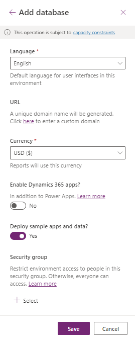

# Tutorial: Get started with GitHub Actions for Power Platform

This three part tutorial will give you an opportunity to get hands on with best practices to automate building and deploying your app using GitHub Actions. In this first tutorial, you will need access to three Common Data Service environments (Development, Build, and Production) along with a GitHub account to automate deployments.

> [!div class="checklist"]
> * Create three Common Data Service environments in your tenant

In the following two tutorials, you will complete these tasks.

> [!div class="checklist"]
> * Get your app into source control
> * Generate a managed solution (a build artifact) from source
> * Deploy the app into another environment

## Create required environments

You will need to create, or have access to, three Common Data Service environments in your demo or customer tenant. To create these environments, follow the instructions below. Otherwise, proceed to the end of this tutorial for the next steps.

1. Log into a tenant that you have access to and that minimum 3GB available capacity which is required to create three environments.
2. Go to https://admin.powerapps.com, this will take you to the Power Platform admin center.
3. Select **Environments** in the navigation area.

4. Select **+ New Environment** to create your first new environment.

5. The first environment should be named “Your Name – dev”, set the region to **United States (default)**, set the environment type to *Production* (if available),  if not use **Trial**.

6. Select **Create environment**.

7. Now that your environment has been created select **Create database**.

8. Set the currency to **USD** and language to **English**. Include the sample apps and data, and then select **Create database**.

9. Your development environment has been created, follow steps 4 – 8 above to create a second environment called “Your Name – build” , and then create a third environment called “Your Name – prod”. Note that the third environment can be a trial environment type.

10.	Now you have the environments that you will need in the next module of this tutorial.

> [!div class="nextstepaction"]
> [Next steps](./github-actions-build.md)

### See Also

[Automate your workflow from idea to production](https://github.com/features/actions)
