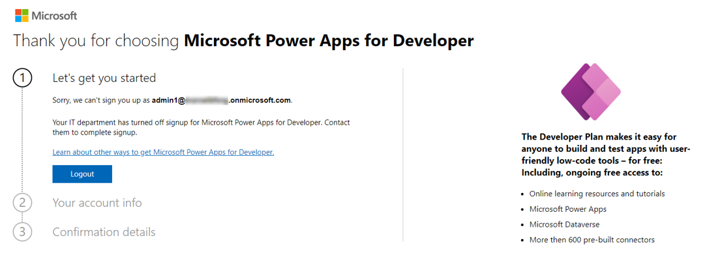

# Create a developer environment

The simplest way to get access to a [Power Platform environment](/power-platform/admin/environments-overview) is to sign up for the Power Apps Developer plan. You can explore Power Platform at full potential for learning at no cost.

To fully use it as a developer, you'll need an Azure account and a work account. This article will guide you through the process for creating a Power Platform environment and a test tenant if needed.

## Where do I start?

If you have a work account, and want to use it to learn Power Platform, go to the next section.

If you don't have a work account or prefer a Sandbox tenant to learn Power Platform, read information in the [create a test tenant](#how-to-create-a-test-tenant) section later in this article before signing up for the developer environment.

## Sign up for the Power Apps Developer Plan

The Power Apps Developer Plan gives you a free development environment to build and test with Power Apps, Power Automate, and Microsoft Dataverse.

It's simple to sign up for the Power Apps Developer Plan:

1. Ensure that you have a work account. If you don't, [create a test tenant](#how-to-create-a-test-tenant) first.
2. Sign up on the [Power Apps Developer Plan website](https://aka.ms/PowerAppsDevPlan).

    :::image type="content" source="media/create-developer-environment-devplan-signup.png" alt-text="Sign-up for the developer plan":::

    After signing up for the Developer Plan, you'll be redirected to [Power Apps](https://make.powerapps.com). The environment will be shown with your name, for example "John Doe's environment." If there's already an environment with that name, the developer new environment will be named "John Doe's (1) environment."

    :::image type="content" source="media/create-developer-environment-makerportal.png" alt-text="Power Apps":::

> [!IMPORTANT]
>
> - Use the developer environment instead of your tenant's default environment to work with certain capabilities such as premium and custom connectors.
> - You might need to select your developer environment from the top-right corner of the screen in Power Apps.
> - It might take a couple of minutes for the new environment to be provisioned and become available in the list of the environments. You can see the progress of the environment creation in the [Power Platform admin center](https://admin.powerplatform.com).
> - In some situations, your admin might have turned off the sign up process. In this case, please contact your administrator, or create a test tenant.
> 

For detailed information about the developer plan, go to [Sign up for the Power Apps Developer Plan](/power-apps/maker/developer-plan).

## How to create a test tenant

If you don't already have a dedicated test tenant, you can create one for free by using the Microsoft 365 Developer Program or manually create one yourself.

The [Microsoft 365 Developer Program](/office/developer-program/microsoft-365-developer-program) is free and can have test user accounts and sample data packs automatically added to the tenant.

You'll need a work account or a microsoft account to sign up. Use either your personal email address or set up a separate email address/Microsoft account to be used when you start the registration process for the Microsoft 365 Developer Program.

1. Select the **Join now** button on the screen.
2. Sign in with a new Microsoft Account or use an existing (work) account you already have.
3. On the sign-up page select your region, enter a company name and accept the terms and conditions of the program before you select **Next**.
4. Select **Set Up Subscription**. Specify the region where you want to create your new tenant, create a username, domain, and enter a password. This step will create a new tenant and the first administrator of the tenant.
5. Enter the security information, which is needed to protect the administrator account of your new tenant.  This step will set up multi-factor authentication for the account.

:::image type="content" source="media/create-developer-environment-m365-signup.png" alt-text="Sign-up for the Microsoft 365 Developer Program":::

You can also [manually create a test tenant](/azure/active-directory/develop/quickstart-create-new-tenant).

Now that you have your test tenant, sign up for the Power Apps Developer Plan as explained earlier in this article.

### See also

[Power Platform for developers](get-started.md) 
[Fusion Development](fusion-development.md) 

[!INCLUDE[footer-include](../includes/footer-banner.md)]
