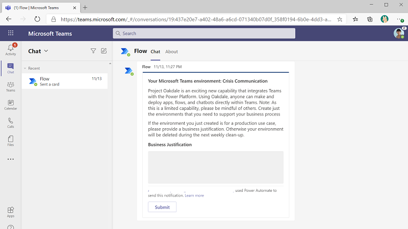
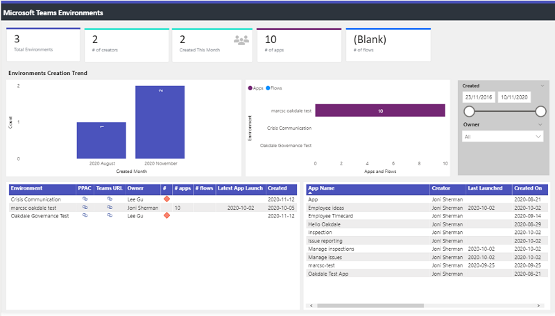

# Manage Microsoft Dataverse for Teams environments

Microsoft Dataverse for Teams empowers users to build custom apps, bots, and flows in Teams by using Power Apps, Power Virtual Agents, and Power Automate. When a team owner adds this capability to their team, a Power Platform environment with a Microsoft Dataverse for Teams database is created and linked to their team. Learn more: [About Microsoft Teams Environments](https://docs.microsoft.com/power-platform/admin/about-teams-environment).

Dataverse for Teams honors the existing data governance paradigms of Microsoft Power Platform and enables access control in the Teams Admin Center like any other Teams feature. The Power Platform admin center provides more detail, including monitoring dedicated capacity utilization and [Data Loss Prevention (DLP) policies](https://docs.microsoft.com/power-platform/admin/wp-data-loss-prevention).  

Dataverse for Teams greatly simplifies environment lifecycle management and user security role management by aligning to Teams constructs. Learn more: [User access to Microsoft Teams environments](https://docs.microsoft.com/power-platform/admin/about-teams-environment#user-access-to-project-oakdale-environments).

Dataverse for Teams is a fully embedded experience, therefore governance controls specific to Power Platform are also provided directly in the context of the Teams admin center. Learn more: [Manage Microsoft Power Platform apps in the Microsoft Teams admin center](https://docs.microsoft.com/microsoftteams/manage-power-platform-apps).

Leverage our philosophy of using Power Platform to manage Power Platform by building automation to send welcome emails to owners of new Dataverse for Teams environments and requesting business justification for the newly created environments. This ensures that central IT teams can effectively engage with new makers onboarding the platform and ensure that Dataverse for Teams capacity is leveraged effectively in your tenant and distributed to the most effective business use cases. Similar workflows can be used to apply specific DLP policies to Dataverse for Teams environments as needed and to invoke clean-up of unused assets that can be repurposed for more compelling scenarios in the tenant.

## Govern Environment Creation

We recommend setting up reactive governance workflows and monitoring abilities to provide Team owners the ability to provide a business justification, and to provide admins with the ability to review the business justification:

1. Team owner is prompted to **provide a business justification** for their new environment within X days of creating the environment

    

1. **Admins approve or reject** the submitted business justifications, and optionally mark them for a later review.

    

1. An **automated clean up** runs periodically and deletes rejected or unclaimed (no justification provided) environments. If needed, deleted environments can be restored within 7 days using [Power Platform Admin Center - Recover environment](https://docs.microsoft.com/power-platform/admin/recover-environment#power-platform-admin-center).
1. Admins can also **review usage data and resource details** for Dataverse for Teams environments periodically, and can choose to delete unused environments to free up assets for important use cases.

The [CoE Starter Kit](https://aka.ms/coestarterkit) provides a set of templates that implement our best practices and are designed to help organizations get started with developing a strategy for adopting, maintaining and supporting the Power Platform. A template implementation of the reactive governance workflows to govern Dataverse for Teams environment creation is included in the CoE Starter Kit. As the CoE Starter Kit is a template implementation, admins can customize the conditions for deletion by creating a copy of the flows.

In addition to dedicated Dataverse for Teams environments for appropriate business user cases admins can choose to set up public Teams teams already backed up by Dataverse for Teams environments where test/trial users can be directed to in order to ensure that the tenant capacity limits are judiciously applied to appropriate business use cases while still allowing individual users to test the new capabilities.  

## Monitor Dataverse in Teams Capacity and Usage

Admins can leverage Power Apps and Power Automate Analytics reports in Power Platform Admin Center to view usage, performance and errors related to Dataverse for Teams environments.

Admins can monitor capacity usage for Teams environments using dedicated [capacity views in Power Platform Admin Center](https://docs.microsoft.com/power-platform/admin/about-teams-environment#capacity-limits). Appropriate notifications are sent to the Teams makers when the environment is nearing 80% of its capacity. Notifications are also sent to tenant admins when the tenant is reaching 80% of its capacity. These capacity limits cannot be extended. Admins can monitor inactive Microsoft Teams environments in the tenant and invoke cleanup as appropriate, as well as have an automated cleanup of unused environments in place to free up capacity for more compelling scenarios.

A dashboard in the CoE Starter Kit can be leveraged to further identify usage of Dataverse for Teams environments, makers who are creating multiple Dataverse for Teams environments as well as inactive environments with no apps or flows.

## Set up Data Loss Prevention policies

Manage the data governance policies for newly created Dataverse for Teams environments admins by implementing one of the two options for DLP configuration:

- Create a policy spanning all environments except selected ones (for example, your production environments), and keep the available connectors in this policy limited to the set that you want to expose to makers in Dataverse for Teams environments. By setting the scope of the DLP policy to *Exclude certain environments*, this policy will apply to any new environments that will be created in your tenant – including Dataverse for Teams or Trial environments. Any other type of new environments like a Production or Sandbox environment can be removed explicitly from this tenant wide DLP policy and added to appropriate dedicated DLP policies suited for their use case.

- OR Create a policy specific for Dataverse for Teams environments and keep the available connectors in this policy limited to the ones you want Team members to have access to. Then, set up a script using [PowerShell cmdlets](https://docs.microsoft.com/power-platform/admin/powerapps-powershell#data-loss-prevention-dlp-policy-commands) or a flow using admin connector that runs on a schedule and adds any newly created Dataverse for Teams environments to this policy and removes them from the default tenant level policy.

Learn more: [Best Practices for establishing a DLP Strategy](https://docs.microsoft.com/power-platform/guidance/adoption/dlp-strategy)

## Leverage Teams Admin Center Controls

Global or Teams admins can choose to leverage Teams app controls through Teams admin center to enable/disable Power Platform features within Teams. Like all Teams app controls these are supported at an individual user level through Teams app permission policies and at tenant level through Teams Teams manage apps settings.

|Teams Apps Control|Capabilities|
|------------------|---------|
|**Power Apps**|Ability to create new Power Apps using Teams embedded maker experience. This in turn is tied to the implicit ability to create new Dataverse for Teams environments Ability to use Dataverse or Dataverse in Teams apps within Teams using Power Apps app  |
|**Power Virtual Agents**|Ability to create new Power Virtual Agents using Teams embedded maker experience. This in turn is tied to the implicit ability to create new Dataverse for Teams environments Ability to use Dataverse or Dataverse in Teams Power Virtual Agents within Teams using Power Virtual Agent app|
|**Shared Power Apps**|Ability to use Dataverse or Dataverse in Teams Power Apps within Teams using *Built by your colleagues* catalogue|
|**Shared Power Virtual Agents**|Ability to use Dataverse or Dataverse in Teams Power Virtual Agents within Teams using *Built by your colleagues* catalogue|
|**Various Sample Apps**| Ability to instantiate/create new Power Apps, Power Automate and Power Virtual Agents by leveraging sample apps within Teams. This in turn is tied to the implicit ability to create new Dataverse for Teams environments Ability to use Power Apps, Power Automate and Power Virtual Agents instantiated/created leveraging sample apps within Teams|

We recommend that given the coarse nature of these controls where environment creator, maker, user access is all blocked by using these controls, admins should instead leverage reactive constructs - either by building their own or by using the templates in the in the CoE Starter Kit - in order to govern Dataverse in Teams environment creation workflows.
