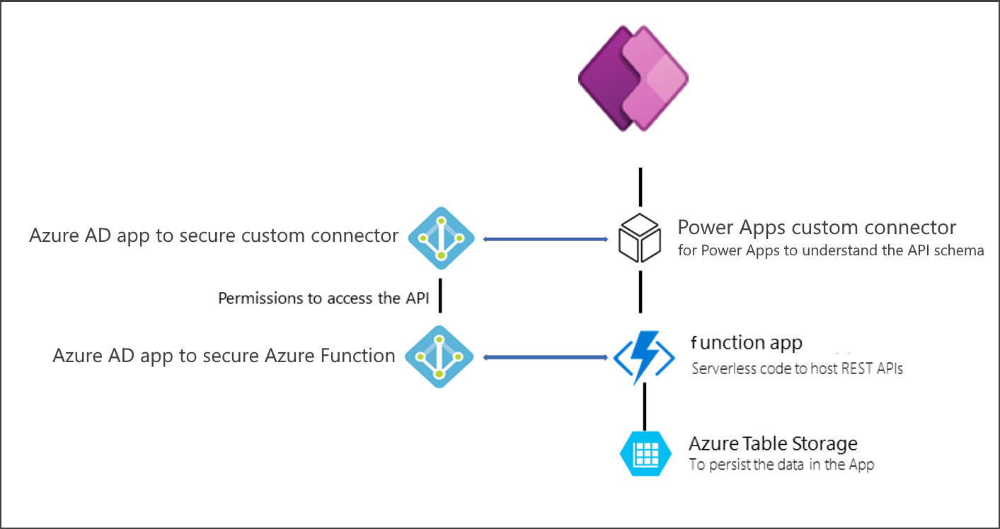
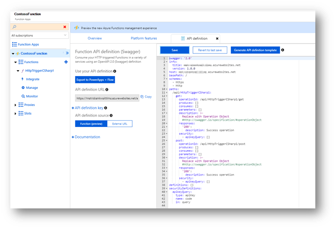

# Using Azure functions to extend functionality of canvas apps 

Microsoft Power Platform enables you to extend the functionality of your app using Azure functions. When dealing with complex algorithms or with many data sources, Azure functions become an ideal choice to help keep your formulas within Power Apps simple while moving the more complex functionality server-side. Azure functions require professional developers familiar with the Azure Stack, but are easy to maintain and scale due to their serverless nature.

Azure Functions driven by RESTful HTTP requests can also be exported for additional functionality. Behind the scenes, you can create a custom connector using the OpenAPI definition automatically generated within the Azure portal, which you can then export so that it can be consumed in Power Apps or Power Automate.

As an example of customers using Azure functions in their solution, you can read the Metro Bank customer story at [Case study: Metro Bank uses Power Apps to improve the in-store customer experience](https://powerapps.microsoft.com/blog/metro-bank-customer-greet-app/). 

In this case study, you will see how Metro bank used an Azure function to build a complex algorithm to estimate wait time, and pair up the customer with the appropriate bank representative.

