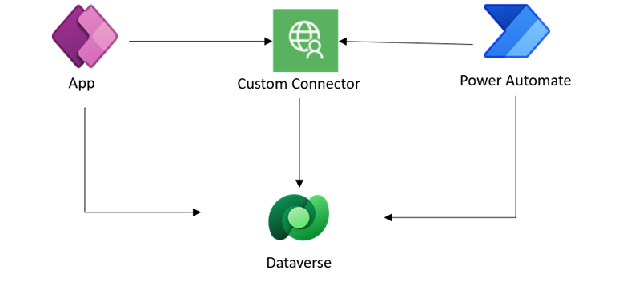

# Using business process flows, Dataverse, codeless custom connectors, and Power Automate with canvas apps 

With [business process flows](/power-automate/business-process-flows-overview), you can ensure that users enter data consistently and follow the same steps every time. The out-of-the-box experience of business process flows is composed of stages and steps that are then displayed in a control at the top of the form.

<!--
note from editor: Please verify whether this long description is adequate.-->
:::image type="complex" source="./media/BPF_1.png" alt-text="Screenshot of a business process flow.":::
   Screenshot showing an Opportunity Sales Process flow with the stages Qualify, Develop, Propose, and Close. The Qualify stage is selected, and the flyout shows the steps required to complete it. When those steps are done, the user selects the Next Stage button to advance to the Develop stage.
:::image-end:::

For experiences that require a custom user experience, Microsoft Dataverse offers a rich set of APIs to create a rich business process flow experience within canvas apps. The following image shows an example of a business process flow implemented in a canvas app.

<!--
note from editor: Please verify this long description. I assume the names in this screenshot are from sample data or are otherwise blessed by CELA?-->
:::image type="complex" source="./media/BPF_2.png" alt-text="Screenshot showing a business process flow in a canvas app.":::
   Screenshot showing an Employee Onboarding app that has a business process flow with the different stages that new employees need to go through. The app lists employee names and the stage that they're either currently in or have completed.
:::image-end:::

To render a business process flow within a canvas app, you can make use of a "codeless" custom connector that implements some key Dataverse APIs related to business process flow functionality. A codeless custom connector is a connector in which we only need to use the OpenAPI specification that lines up with the underlying Dataverse API service, without building the service itself. 

<!--
note from editor: I'd try to describe this diagram, but I don't know what it's actually trying to say. Is there any significance to the fact that the arrows only point one way? -->
:::image type="complex" source="./media/BPF_3.png" alt-text="Diagram of custom connector architecture.":::
   <!--NOTE FROM EDITOR: NEED DETAILED ALT TEXT HERE-->
:::image-end:::

In the case of business process flows, important APIs are available to retrieve the different business process flow stages, active stage, and metadata related to the controls defined in each stage. To learn more about business process flows APIs, go to [Work with business process flows using code](/power-automate/developer/business-process-flows-code) in the Power Automate docs. 

Within the canvas app, you can consume these APIs by adding the custom connector and invoking the exposed functions. However, it's sometimes more convenient to transform and shape the data returned from the custom connector server-side. In that case, Power Automate becomes a "low code" mechanism to process data server-side and return shaped responses to Power Apps. You can use Power Automate as a substitute for a full-fledged API service; this can improve performance, but would potentially be more costly to build and would require professional developer skills.

You can build canvas apps that implement a business process without the use of business process flows. However, when you're building an app that also has complex security requirements, it's much more powerful to use the out-of-the-box business process flows with the advanced security model offered by Dataverse.<!--note from editor: Here and in previous paragraph, edits are suggested to avoid some passive voice and make it a bit clearer who the agent of action is.-->

For a real-world example, view this blog on how T-Mobile built an app called Orbit used by project leads and executives to approve all new initiatives across the company: [Blog: T-Mobile manages company wide initiatives and more with Microsoft Power Platform](https://powerapps.microsoft.com/blog/tmobile/). 

