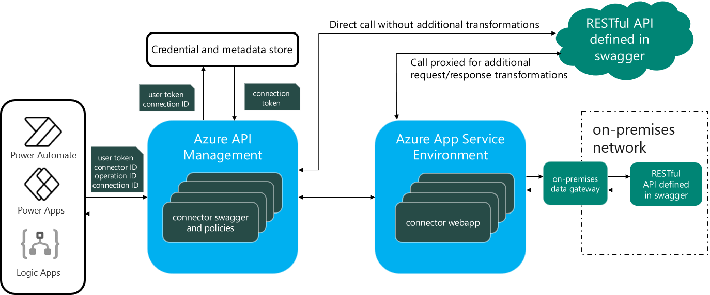

# Using REST APIs via custom connectors with canvas apps in Power Apps

With custom connectors, developers can capitalize on existing organization investments in REST API services or create new APIs to expose complex server-side operations that are not available with the out-of-the-box connectors. In this case, we're dealing with a middle-tier architecture where Power Apps is used as a UI layer. This architecture offers flexibility, but also means that more pro-developer work is needed to develop and maintain the web service and data layer. In general, as the complexity of the app increases, you should strongly consider this type of architecture. For example, when multiple data sources are needed to build a single view, we recommend that you use an API layer to deliver a performant experience, because the data response can be shaped server-side and delivered to the client more efficiently. The use of this middle-tier layer means that you can add a server-side caching layer and implement richer telemetry for the app. 

To enable Logic Apps, Power Automate, or Power Apps to communicate with the REST or SOAP API, use a custom connector, which is a wrapper around a REST API (Logic Apps also supports SOAP APIs). A high-level architecture of how custom connectors work is shown in the following image.

<!---->
:::image type="complex" source="./media/CustomConnectorArchitecture.png" alt-text="connector architecture - runtime flow":::
The diagram shows Power Automate, Power Apps and Logic apps performing request via the Azure API Management service which in turns relays the requests directly to the Restful API endpoint. The Azure App Service environment is used in case  additional request/response transformations are needed or in case the Restful API is hosted on premises.
:::image-end:::

For detailed information, go to [Connectors overview](/connectors/connectors).

As an example, Microsoft built a suite of employee engagement mobile apps that have been deployed worldwide to more than 100,000 employees. The apps are built on top of existing APIs deployed by IT.

<!---->
:::image type="complex" source="./media/Thrivearch.png" alt-text="Diagram of Thrive apps architecture.":::
 The diagram shows the suite of apps called the thrive apps. These apps are consuming data coming from many cloud based services: Power Apps RP, Flow Push Notification service, Enterprise Card System Stream, SharePoint Online, Application Insights, CRM Online, O365 Graph and MSIT Azure Subscription.
:::image-end:::

View the full story here: [Blog: Microsoft HR uses the Power Platform to transform employee experiences](https://powerapps.microsoft.com/blog/microsoft-thrive/)

