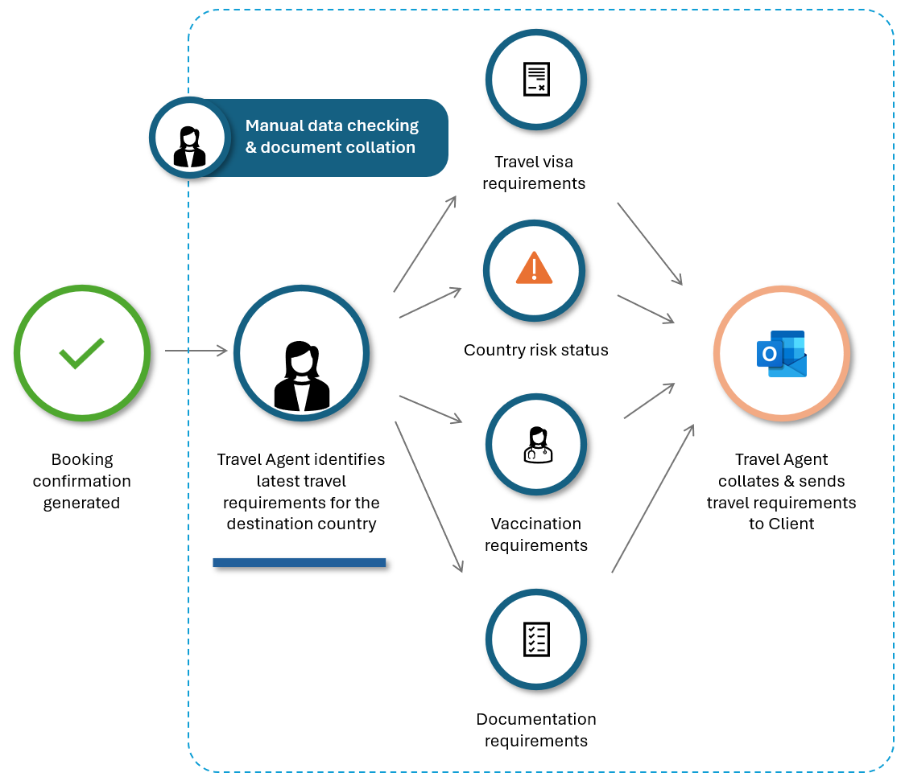
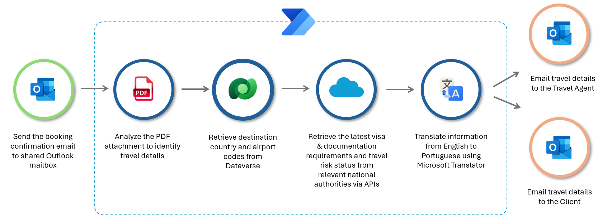
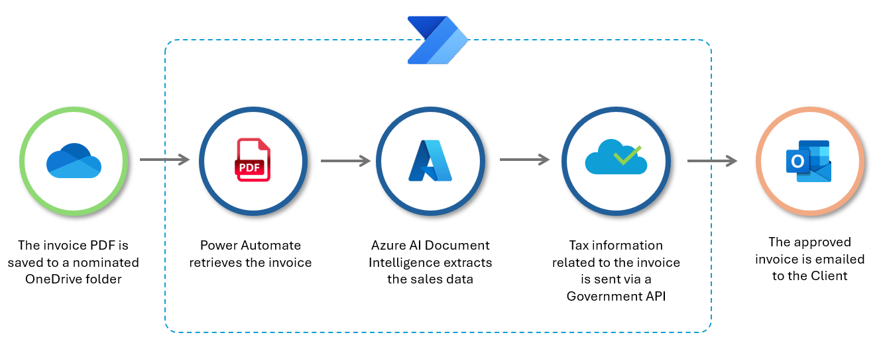
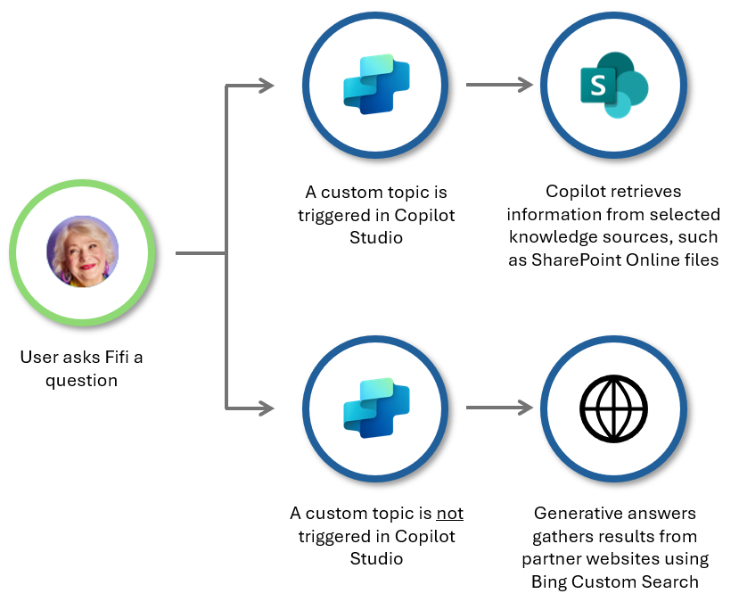
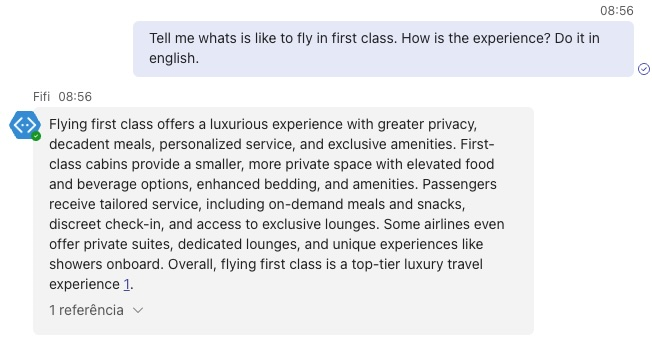
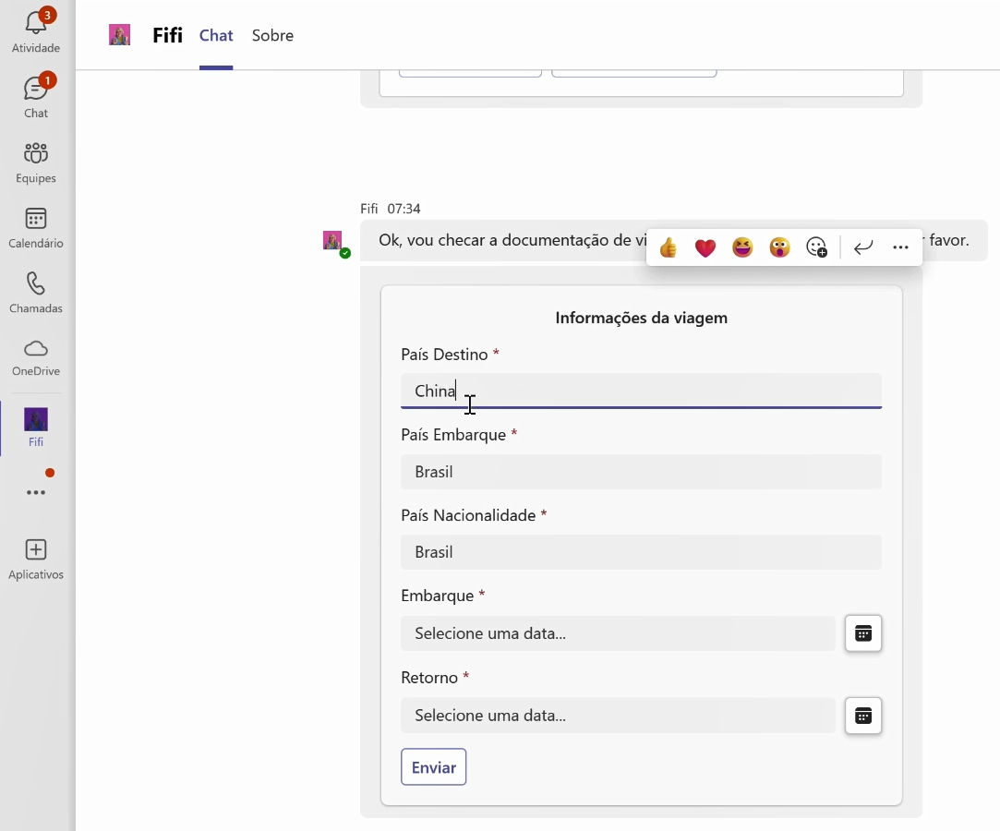
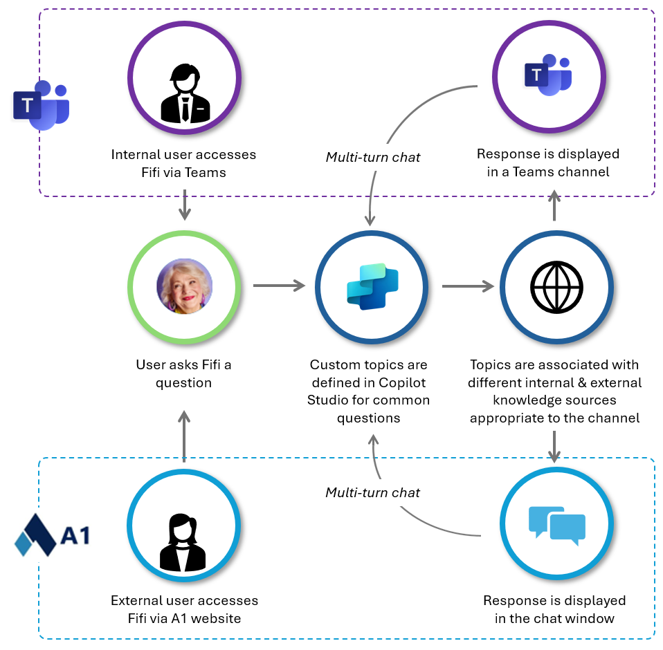
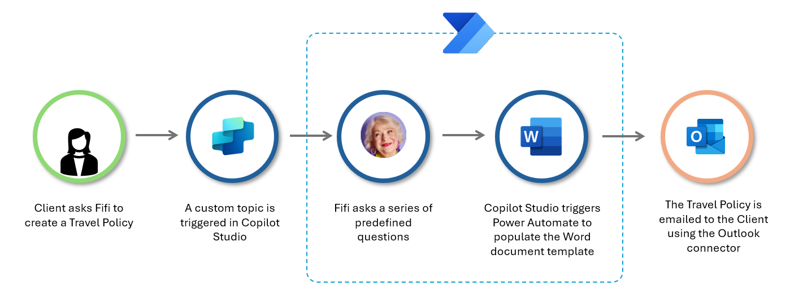
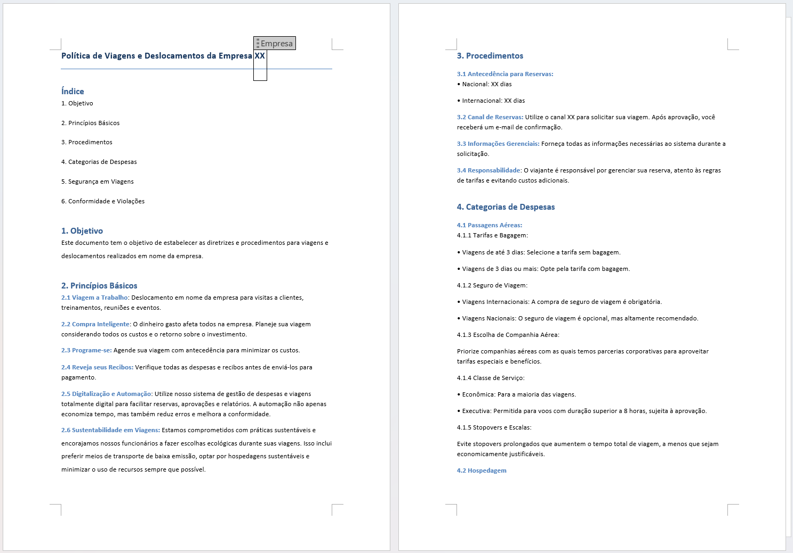
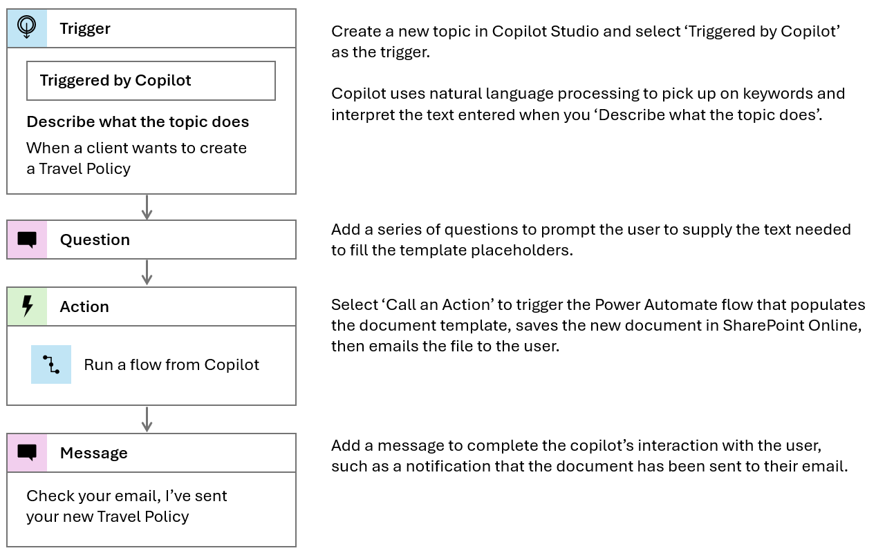

# Boosting team efficiency & customer experience with Power Automate and generative AI

Brazil-based corporate travel agency, A1 Inteligência em Viagens has transformed the travel coordination process with their clients - and their team collaboration - using the power of Power Automate and Copilot Studio.

Established over 30 years ago, the agency specializes in coordinating international travel and luxury vacations for their executive client base. With a global partner network of airlines and hotels to personalize each traveler's experience, travel plans are rarely the same.

Daniel Schaurich de Oliviera is the company's Founder and CEO. As clients traveled less frequently during the Covid pandemic, Daniel utilized the time to work on improving business processes through automation - starting with the time-consuming research and coordination for international travel, which required his Travel Agents to search multiple government websites and call embassies for the latest travel guidelines.

Accessing real-time information was vital for the agency as travel rules and border closures were quickly and frequently changing during the pandemic.

Developing *'Fifi'* - a copilot with the persona of a wise, elderly lady who knows everything about the company and the travel industry - was the next game changer. Embedded in A1's website to provide immediate customer assistance, and in Microsoft Teams for easy access by staff, Fifi is considered to be a colleague not just a chat bot.

> *"Power Platform changed our business in a way that we never expected. It gave us the power to make things that we didn't believe were possible. Before Power Platform and Copilot Studio, we never thought it was possible for us to create software - it gave us the power to put our ideas to work easily and in an affordable way for a small company".*
> *Daniel Schaurich de Oliviera, CEO*

> *Daniel Schaurich de Oliviera*

In this technical case study, you learn:

- How corporate travel agency A1 Inteligência em Viagens in Brazil digitally transformed their travel booking process using Power Automate and Copilot Studio
- How Power Automate can replace time consuming & error-prone manual data collation tasks
- How to build upon an existing automation to create more business solutions
- How to build a copilot with generative AI to improve customer experience
- How to establish a copilot as a core part of your team

## The scenario

Daniel's team at A1 Inteligência em Viagens coordinates travel bookings with their corporate clients, who often travel to international destinations with diverse visa, documentation and vaccination requirements and subject to changing travel risk status. These travel requirements must be communicated to the client predeparture to ensure their trip goes smoothly.

Daniel saw the potential for Power Automate to support the Travel Agents in his team to identify and collate travel requirements from various national authorities in real-time.

Automating routine, manual data checking and collation processes not only boosts team productivity but also has the potential to improve the completeness, timeliness, and reliability of information provided.

For Daniel and his team, this automation measurably reduced the time required for travel coordination - boosting efficiency by 55% - and inspired further business improvement.

:::image type="content" source="media/a1-travel/image2.png" alt-text="Screenshot of the travel booking example" border="true":::

Daniel has since extended the travel booking process automation to automatically issue client invoices.

Plus, he developed *‘Fifi'*, a copilot that uses generative AI to assist team members and customers with complex questions, saving his Travel Agents significant time.

Noticing that most of A1's website blog traffic was related to travel policy content, Daniel used Power Automate and Copilot Studio together to enable Fifi to assist clients with creating a customized Travel Policy for their organization.

:::image type="content" source="media/a1-travel/image3.png" alt-text="Screenshot of Fifi bot on A1's website":::

### What worked well

- Scheduling time each week to focus on business improvement with Power Platform & AI
- Leadership team members inspiring & advocating new ideas
- Identifying a well-defined, repeatable process to automate
- Focusing on how the automation improves the customer or end user experience
- Creating a persona to establish the copilot as a valuable team member

## Streamline travel bookings with Power Automate

Daniel identified the frequently used travel booking process to automate and maximize time savings for the Travel Agents in his team, who were previously required to collate and check travel information manually and from multiple sources.

The travel booking process consistently needs to:

1. Get the booking confirmation containing flight and destination details agreed with the client.
1. Retrieve the latest predeparture travel requirements from relevant authorities and government websites.
1. Identify the latest travel risk status for the destination country.
1. Collate the information into an email and send to the client.

The Power Automate solution automatically analyzes the booking confirmation email and retrieves destination country and airport codes from Dataverse in order to request the latest travel requirements in real-time via various authorities' APIs.

Manual data collation effort is no longer required and information is automatically translated from English to the client's native Portuguese before being sent out.

1. The Booking System emails the booking confirmation to a shared Outlook mailbox. 
1. The Power Automate automation is triggered and searches for the travel destination in the PDF attached to the booking confirmation email.
1. Destination country and corresponding airport codes are retrieved from a [Dataverse](/power-apps/maker/data-platform/data-platform-intro) list.
1. The automation sends the destination details to various APIs (which use [Custom Connectors](/connectors/custom-connectors/)) to retrieve travel requirements.
1. Information is translated from English to Portuguese (the national language of Brazil) using Microsoft Translator.
1. The automation formats the data into an email to send to the Travel Agent and to the Client.

## Build the travel booking process automation

The basic design pattern uses an email being received as the workflow trigger, a [Text Function](https://community.dynamics.com/blogs/post/?postid=c009f06c-4f94-4aa4-a0ea-c19c6f33b917) to identify relevant details in the email, then an HTTP action to retrieve information from selected external sources via APIs, and a Join action to collate and format the content that was collected.

### Technical considerations

- Data Loss Prevention (DLP) safeguards on your Power Platform environments will determine the connectors available for you to use (such as Custom Connectors to external APIs).
- PDF analysis may require [AI Builder](/ai-builder/overview), which has more licensing requirements to consider.
- Triggering the automation may require configuration of associated systems or a new work instruction for team members. In this instance, the Booking System was updated to send the travel confirmation to a specific email address.
- Dataverse is a part of Power Platform, which makes change management simpler - a Dataverse list can be contained in a Power Platform [solution](/power-apps/maker/data-platform/solutions-overview), which packages components together and enables use of [pipelines](/power-platform/alm/pipelines) to manage the application lifecycle.

## Extend this solution design with automated invoicing

Each travel booking generates an invoice to be sent to the client - another routine, manual task. Daniel extended the design pattern for the travel coordination automation to manage invoicing using Power Automate.

Team members save invoice PDFs in a specific OneDrive folder. The automation then uses Azure AI Document Intelligence to extract sales data and a government API to send tax information relating to the invoice, before the automation emails the invoice to the customer.

> [!TIP]
> Daniel created an automation to retrieve, collate and send the latest travel requirements to his clients. You could use the same solution architecture and design pattern for similar use cases in your organization, such as:
>
> - Automatically collating your organization's Travel Policy & documentation requirements into an email when a team member submits a Travel Request
> - Assessing inspection or audit results against an external standard and sending the results to a shared Microsoft Teams workspace
> - Identifying a test score, collating this alongside a target score, then sending the results to a team member to review

*‘Creativity is the main thing - to have the ideas - then it's easy to do' -Daniel Schaurich de Oliviera, CEO*

## Create a copilot to answer customer questions using Copilot Studio

Daniel created a copilot to assist Travel Agents in answering complex questions and to enable customers to find information themselves on the agency's website. This addresses another time-intensive task for the team and solves the problem of upskilling Travel Agents with much information.

Naming the copilot ‘Fifi' helped it to become established as an integral and accepted part of the team.

> '*Create a persona for the copilot. We created Fifi and today she's not only a bot, she's a work colleague - this makes adoption higher and faster.'*
> *Daniel Schaurich de Oliviera, CEO*

Created in Copilot Studio, Fifi uses [Custom Topics](/microsoft-copilot-studio/authoring-create-edit-topics) to generate human-like responses to frequently asked questions. Each topic is based on defined [knowledge sources](/microsoft-copilot-studio/knowledge-copilot-studio) that are used for [generative answers](/microsoft-copilot-studio/nlu-boost-conversations), which gathers results from external websites using [Bing Custom Search](/microsoft-copilot-studio/guidance/optimize-prompts-bing-custom-search).

Daniel first collated frequently asked questions from the team to create internal SharePoint Online content for Fifi to consume. Now, to make ongoing content development faster, the team schedules and records their training sessions. The copilot creates a tutorial using the meeting transcript, which is uploaded to SharePoint Online for consumption through Copilot Studio.

## Boost your copilot's conversation with Knowledge Sources & Bing Custom Search

The [generative answers](/microsoft-copilot-studio/nlu-boost-conversations) capability in Copilot Studio allows Fifi to find information across multiple internal and external [knowledge sources](/microsoft-copilot-studio/knowledge-copilot-studio). This enables Fifi to provide immediate answers to diverse and often unpredictable customer questions.

Daniel configured Fifi to generate a response from selected partner airline and hotel websites using a [Bing Custom Search](/microsoft-copilot-studio/guidance/optimize-prompts-bing-custom-search), which ensures the information retrieved is authoritative and reliable.

As a result, Fifi excels in providing answers that were hard to find before - the perks of first-class travel, the closest airport to a conference location, or the highest rated hotel in a specific neighborhood. Customer experience improved through the speed of response and Fifi's ability to make recommendations.

## Enable your copilot to engage with users across different channels

Daniel designed Fifi to [interact with users across different channels](/microsoft-copilot-studio/publication-fundamentals-publish-channels) - to provide instant customer support on A1's website, and to staff members in Microsoft Teams.

Custom topics and associated knowledge sources were defined for each channel, as questions commonly asked by Travel Agents are different to those questions asked by clients via the website.

## Bring Power Automate & Copilot Studio together to create a Travel Policy

Fifi also assists clients visiting the A1 website to generate a Travel Policy document for their organization.

Daniel noticed that Travel Arrangers were routinely looking for ways to improve their policy documentation, so Fifi was configured to provide best practice guidance including how many days in advance a traveler needs to book a trip, or how to handle travel expenses such as meal or taxi charges.

This feature brings together Power Automate and Copilot Studio to populate a Word document template with answers provided through Fifi's interaction with the client.

1. A custom topic is triggered in Copilot Studio when a client asks a relevant question, such as ‘I want to create a Travel Policy'
1. Fifi prompts the client to answer the series of predefined questions used to populate the Policy template, including their name, company, the notice period that an employee is required to give for domestic or international travel, and any reimbursements paid by the company to an employee. The chat is configured to provide recommendations at each step to support data input.
1. Copilot Studio triggers Power Automate to populate placeholders in the Word document template with data provided in the client's chat responses
1. The Power Automate automation saves the new Travel Policy document and emails the file to the client
1. Fifi then completes the chat interaction with the client.

## Build the Travel Policy template automation

Building the Travel Policy template automation requires three interrelated steps:

1. Create the Word template with placeholders using plain text [Content Controls](/office/client-developer/word/content-controls-in-word) and save the file in an appropriate SharePoint Online library
1. Build the Power Automate workflow that picks up and populate the template file, then save it to SharePoint and email it to the client
1. Set up the copilot with a custom topic that prompts the required inputs from the client and trigger the Power Automate flow.

Enable Developer features in Word to set up your [Content Controls](/office/client-developer/word/content-controls-in-word), the placeholder fields to be populated with input from the copilot's chat with the user. Give each control a logical name to make them easier to identify when you set up the automation. Save your template into a SharePoint Online library to be used by the automation.

The Power Automate automation commences with the ‘Run a flow from Copilot' trigger then a ‘Populate a Word template' action to pick up the template you created. Adding a Compose action to generate a unique file name each time a document is generated for a client is a useful, extra step.

Nominate the SharePoint Online library to save the document output each time the flow runs, then use the Outlook Connector to email the new document to the user.

Finalize the automation with the ‘Respond to Copilot' action to indicate the document is completed and sent.

To set up the copilot component, create a new copilot in Copilot Studio then a new topic. Describe what the topic does using keywords that copilot can use to detect and trigger the next steps.

Add a series of questions that your copilot asks the user to gather the inputs required to populate the content control placeholders in the Word template (one question per placeholder). Then select ‘Call an Action' to trigger the Power Automate automation you created which generates, saves, and emails the new document.

Adding another message at the end is a neat way of enabling the copilot to close out the interaction with the user, such as notifying them that the document was emailed to them.

> [!TIP]
> Daniel created a Copilot Studio topic with an associated Power Automate automation to enable clients to generate a customized Travel Policy document based on their answers to predefined questions. You could use the same solution architecture and design pattern for similar use cases in your organization, such as:
>
> - Enabling website customers to generate a policy or guideline document relevant to your industry
> - Generating a customized conference program based on sessions or topics selected by the participant
> - Personalising business event invitations with each attendee's name, position title and company

## Learn more

- Find best practice architecture guidance with [Power Platform Well-Architected](/power-platform/well-architected/)
- [Use an incoming email to trigger an automation](/power-automate/email-overview)
- [Popular scenarios for sending emails to end users](/power-automate/email-top-scenarios)
- [How to use Copilot to help build your automation](/power-automate/get-started-with-copilot)
- [Automate a business process using Power Automate training](/training/paths/automate-process-power-automate/)
- [Building your own copilot with Copilot Studio](https://www.microsoft.com/microsoft-copilot/blog/copilot-studio/building-your-own-copilot-with-copilot-studio/)
- [Quickstart guide for building copilots with generative AI](/microsoft-copilot-studio/nlu-gpt-quickstart)
- [Introduction to Generative AI - Exploring the basics](/training/modules/intro-generative-ai-explore-basics/)