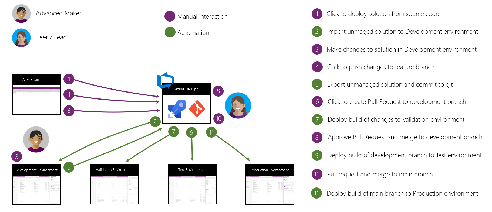
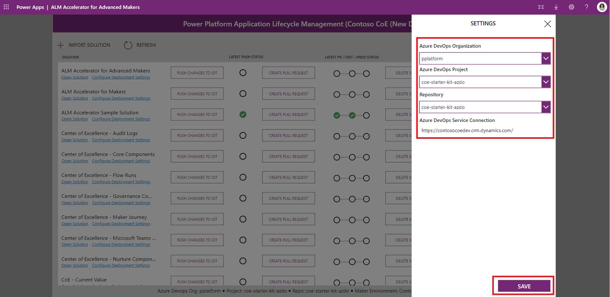
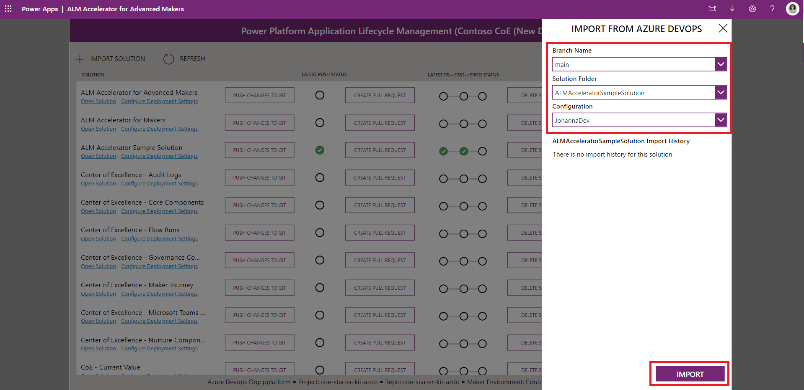
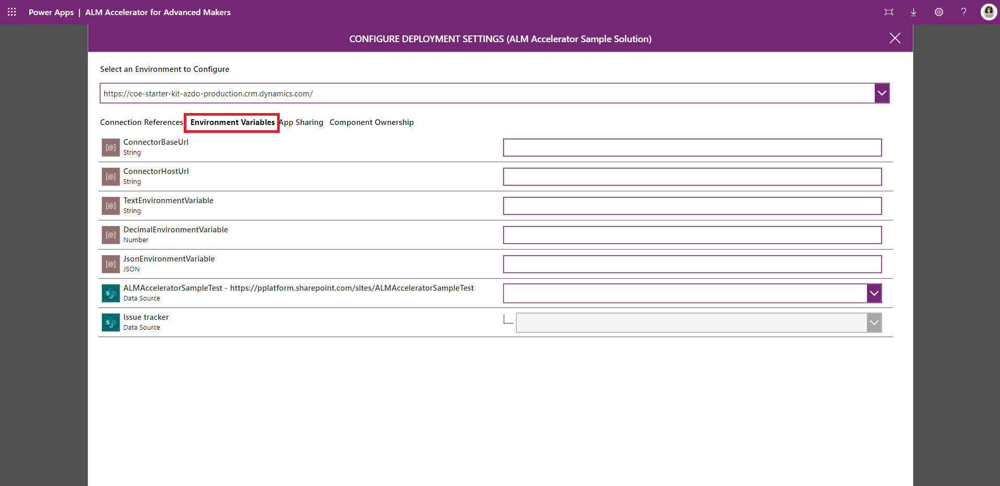
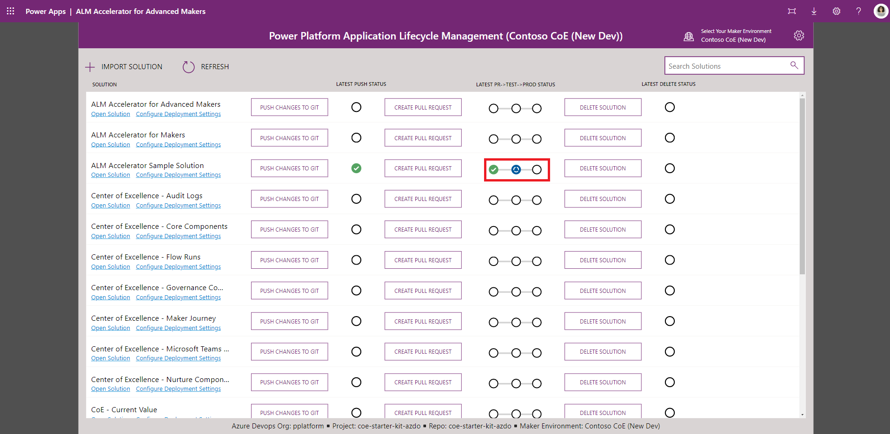

# Use the ALM Accelerator for Power Platform App (Preview)

> [!NOTE]
> ALM Accelerator for Power Platform is currently in public preview. Please see Issues currently tagged as [vnext](https://github.com/microsoft/coe-starter-kit/issues?q=is%3Aopen+is%3Aissue+label%3Aalm-accelerator+label%3Avnext) for the Roadmap to be completed prior to general availability. While in Public Preview it can be expected that there will be breaking changes and frequent updates to address feedback from preview members. Additionally, the Public Preview is reliant on the experimental [Power Apps Source File Pack and Unpack Utility](https://github.com/microsoft/PowerApps-Language-Tooling) that is being developed separately from AA4PP.

## Demo: ALM Accelerator for Power Platform

Watch how to use the ALM Accelerator for Power Platform solution.
> [!VIDEO https://www.youtube.com/watch?v=-P3uSUTdsSY]
>

## What's in the solution

The ALM Accelerator for Power Platform is a Canvas App and a set of Azure Pipelines and templates to provide a simplified interface for developers. With the ALM Accelerator for Power Platform, developers can commit and create pull requests for their development work in the Power Platform. The combination of the Azure Pipelines and the App is what make up the full ALM Accelerator for Power Platform (AA4PP) solution. The pipelines and the App are **reference implementations**. It was developed for use by the internal development team for the CoE Starter Kit. AA4PP is open-source and is available to the public to show how healthy ALM can be achieved in the Power Platform. AA4PP can be used as is or customized for specific business scenarios.

The solution is the Dataverse Solution System. All Application Lifecycle Management in the Power Platform is based on makers creating components within a Solution. To use the AA4PP your components (Apps, Flows, Customizations, and other components) must first be included in a solution. A solution in Dataverse is a deployable package of components that AA4PP will unpack and store in Azure DevOps Git source control.

The target end user for AA4PP is the Power Platform Maker who is comfortable with Solutions, Git, Azure DevOps, and ALM concepts. If you're not already familiar with these technologies and concepts, you should consider taking the following courses.

1. [Introduction to version control with Git](/learn/paths/intro-to-vc-git/)
2. [Use Git version-control tools in Visual Studio Code](/learn/modules/use-git-from-vs-code/)
3. [Build applications with Azure DevOps](/learn/paths/build-applications-with-azure-devops/)
4. [Manage solutions in Power Apps and Power Automate](/learn/modules/manage-solutions-power-automate/)

The target user for setting up AA4PP would generally be an Administrator with a deeper understanding of Power Platform Environments and Solutions, Azure Pipelines, and Administration as well as familiarity with Azure Active Directory and Dataverse Administration.

## Pipelines

The AA4PP Pipelines are a set of YAML pipelines intended to be used with Azure DevOps. Eventually, these pipelines will be ported to support GitHub workflows, but currently only support Azure Pipelines. These reference pipelines were written to demonstrate an end to end ALM process for Power Platform solutions. The pipelines use first-party tasks provided by Microsoft, some third-party tasks and low-level PowerShell scripts to automate all of the ALM scenarios. As such, the pipelines support scenarios related to unpacking / source controlling / building and deploying a solution from a development environment. The pipelines support the ability to deploy to many environments, but only currently demonstrate deployment from a Development environment to a Build Validation to Test and ultimately to Production based on the ALM process used by the CoE Starter Kit development team.

The Pipelines handle the following.

### Import Solution

1. Select an existing Solution from Source Control
1. Import a build of that Solution from Source Control
1. Future: Handle seeding environments with Data and configuring Connection References, Environment Variables, Sharing, and Ownership

### Delete Unmanaged Solution

1. Export an Unmanaged Solution from a Development Environment as Managed.
1. Import Managed Solution to Development Environment
1. Delete the Managed Solution from a Development Environment.

### Export to Git

1. Create a New Branch Based on an Existing Branch
1. Export an Unmanaged Solution from a Development Environment
1. Unpack Solutions to Human Readable Format
1. Store Unpacked Files in a Git Repository Branch

### Create Pull Request

1. Create a Pull Request in Azure DevOps for your New Branch
1. Run a Build on a Pull Request via Branch Policy to validate your changes including running Solution Checker
1. Include Branch Policies to require additional checks such as Reviewers, Work Items Linking

### Deploy to Environment

1. Create a trigger for when your Solution is deployed to an environment
1. Build Managed Solution and Deploy based on Trigger
1. Handle Upgrade vs Update of Solution based on changes in the Solution
1. Handle Setup of the Solution in the Target Environment
   - Deploy configuration data
   - Update Connection References
   - Update Environment Variable Values
   - Share Apps with Azure Active Directory Groups
   - Activate Flows
   - Create Teams in Dataverse for Azure Active Directory Groups
   - Update Solution Component Ownership

## ALM Accelerator App

The AA4PP Canvas App provides a convenience layer on top of the AA4PP Pipelines. The AA4PP Canvas App allows Power Platform Makers to easily invoke the Azure Pipelines to perform their complex tasks without context switching between the Power Apps environment and the Azure DevOps. The goal of the App is to provider Makers with a friction free way of performing common Development and ALM tasks as described in the following.

> [!NOTE]
>While all of these processes can be achieved directly from Azure DevOps the App provides a simple push-button interface for performing these tasks

1. Target multiple Organization / Projects and Repos in Azure DevOps
2. Get the latest version of a solution into the development environment by importing the solution
3. Remove existing work that needs to be rebased from source control by deleting an unmanaged solution
4. Push the latest changes from the development environment to source control by exporting to Git
5. Submit the changes tied to a Work Item for Review by creating a pull request
6. Monitor the progress of moving the changes between environments

## ALM Accelerator Flow and Maker Experience

1. Once the app is installed and configured launch it from your Environment under Apps.

> [!NOTE]
> When you first launch the app you may need to consent to the app using your connections.

2. Select the **Cog** in the top right to select your **Azure DevOps Environment**, **Project**, and **Repo** to which you'll push your changes and submit your pull requests and select **Save**
   

> [!NOTE]
> If you don't see your DevOps Organization / Project in the dropdown double check that the Custom connector is working correctly after updating it's Security settings.

3. From the Environment Drop Down **Select the Dataverse Environment** in which you'll be doing your development work.
   

> [!NOTE]
> In order for your Environment to show up in this drop down a service connection in the Azure DevOps project you just selected is required (see [Create a Service Connection for DevOps to access Power Platform](setup-almacceleratoradvanced.md#create-service-connections-for-devops-to-access-power-platform). Additionally, verify that you've followed the steps to reconnect the flow above if you do not see any environments in the list.

4. By default the **unmanaged solutions** in your Environment will be displayed in the main window with buttons to **Push Changes** and **Create Pull Requests**.

5. To import an unmanaged solution from an existing Azure DevOps project to begin making changes, select the **+ Import Solutions** button and select a **Branch Name, Solution Folder and Configuration (Optional)**.

   - **Branch Name** is based on the branches in Azure DevOps for the Project you selected in the configuration.

   - **Solution Folder** is a list of folders in the selected branch that contain a **SolutionPackage folder** from a previous export.

   - **Configuration** is a directory under the config directory in the Solution Folder that contains deployment settings and configuration data. For more information on this, see the [Deployment Configuration Guide](setup-almacceleratoradvanced-deployment-config.md)

> [!NOTE]
> The idea here is that you're either pulling the latest from the Solution branch or possibly want to pull another makers branch into your own environment. The configuration allows you to ensure that all of the necessary post solution import configuration and data exists in your environment.

   

6. Once your solution is imported into Dataverse, or you've created a new unmanaged solution and made your customizations, you can begin configuring your solution for deployment.

7. **Select the Configure Deployment Settings link** under the name of the Solution. On the configuration deployment page, you'll see the following items

   - Deployment Environments

     

     - The environments listed here are based on the pipeline(s) configured for the solution in Azure DevOps. In the example above we have three pipelines configured in Azure DevOps for this solution deploy-validation-ALMAcceleratorSampleSolution, deploy-test-ALMAcceleratorSampleSolution and deploy-prod-ALMAcceleratorSampleSolution. **The app will look for pipelines named deploy-*-UniqueSolutionName to populate this list. If you have named your pipelines different than the pattern above you won't be able to use the deployment configuration functionality.**

   - Connection References

      

      - This screen lists all of the connection references in your solution and allows users to create connections in their downstream environments to hook up the connection references in the target environment.
      - To create a new connection **select the + button**.
      - After creating a new connection, **select the refresh button** in the top right to get the latest list of connections.
      - To select an existing connection in the target environment **select a connection from the dropdown list**.
      - To Navigate to the connection in the target environment **select the name or the status of the connection**.

   - Environment Variables

      

      - This screen lists all of the environment variables in your solution and allows users to set the value of the environment variables in the downstream environment.
      - For standard environment variables (for example String, Number, JSON) **enter the value in the text box** to the right of the environment variable name
      - For data source environment variables **use the dropdowns to select the appropriate data source** to use in the downstream environment.

   - App Sharing

      

      - This screen lists all of the apps in your solution and allows users to share the apps in the downstream environment with an Azure AAD Group.
      - Use  the dropdown to **select the Azure AAD group** with which you'd like to share the app.
      - To view the Group details **select the details icon**. This will launch a new browser window with a link to the AAD Group in the Azure Portal.
      - To set the permissions **select the permissions dropdown** and set the permissions to either Can View, Can Edit or Can View and Share.

   - Component Ownership

      

      - This screen lists all of the Flows in your solution. Users can configure the owner of the Flow in the downstream environment by selecting a Dataverse user.
      - Use  the **dropdown to select a Dataverse user** to own the Flow in the downstream environment.
      - To view the Flow **select the name of the Flow** to open a new window with the Flow Definition.

8. Once you've configured your solution, you can push your changes to Git using the **Push Changes to Git** button for your solution.

> [!NOTE]
> Be sure to publish your changes before initiating the push. If a newly created solution doesn't show in your list immediately. Click the Refresh button to reload all solutions.

   - Select an **existing branch** or **create a new branch** based on an existing branch and enter a **comment**. Use the hashtag notation for example `#123` to link the changes to a specific work item in Azure DevOps and Select **Commit**.
     

   - When the push begins, a waiting indicator will appear. If the push is successful, a checkbox will appear otherwise a red x will appear. To see the progress of your push, click the progress indicator which will take you to the running pipeline in Azure DevOps.
   - Repeat the pushes as you iterate on your solution.

9. When you're ready to create a pull request for the changes to your branch, select the Create Pull Request button.

> [!NOTE]
> Be sure to publish your changes before initiating the push.

   - Specify the Source and Target branch and enter a Title and Comment for your Pull Request and Select Create.**
     

10. Once a Pull Request is created for your changes, the remaining steps to Merge and Release to Test occur in Azure DevOps. Depending on the Branch Policies and Triggers configured for your Target Branch, an Azure DevOps user can approve or reject your Pull Request based on their findings in the submitted changes. The status of the Pull Request will appear in the App.

11. In order to initiate a **solution upgrade** in the target environment, you can tag a Pull Request with the **solution-upgrade** tag.

   

12. Approving the PR will start the deployment of your solution to the Test environment. If the Pull Request is approved, you'll see the progress move to Test and a status based on the pipeline's success or failure in that stage.

   

13. For Production, a Pull Request will need to be created in Azure DevOps that merges the changes into your Production release branch. The same approval process will be required depending on your branch policies and once the PR is completed your solution will be pushed to Production. When the pipeline for deploying to Production is finished, you'll see the status of the deployment in the App.

[!INCLUDE[footer-include](../../includes/footer-banner.md)]
