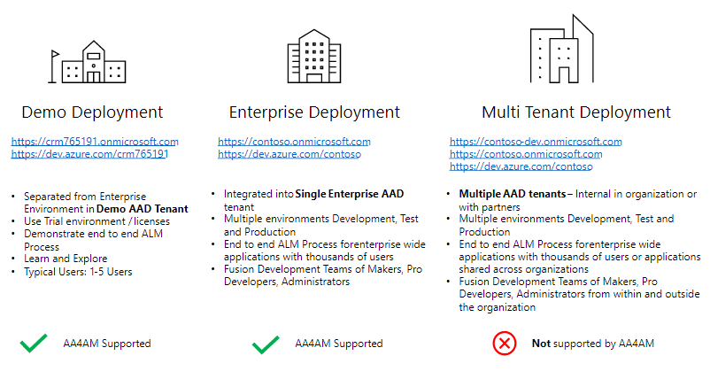

# Tenant Deployments

AA4AM can be deployed in the following scenarios single demo tenant, single enterprise tenant.

Currently AA4AM **does not** automatically support a multi tenant enterprise deployment model and additional manual configuration will be required to configure this scenario.



## Factors to Consider

- Does ALM for Low Code solutions introduce new concepts to parts of the business that has not been exposed to them before?

- Would a demo deployment provide an environment to allow the different [personas](../personas.md) to experiment and accelerate adoption of ALM processes?

- Who will manage and operate the ALM process?

- How will the maker community be expanded to adopt new ALM concepts?

- What steps can be put in place to adopt a self service model to provision environments and move between validation, test and production environments.

## Demonstration Deployment

In this scenario you are looking to quickly install AA4AM to demonstrate how it works and showcase the end to end process. For this scenario the following is expected:

1. Using Trial tenant and environments to demonstrate the solution

1. Single Administrator that has rights to the following:
   - Azure Active Directory tenant administrator
   - Power Platform Global Administrator
   - Power Platform Organization Administrator

1. Demo non administration maker users that will be used to show process of creating ALM process for Power Platform solutions

1. Non production applications

## Post Install

Once you have the [Admin Install](../admin-install.md) completed, Advanced makers can create [Development environments](../development-environments.md) and have Administrators add them to Azure DevOps and the required Azure Active Directory Security Group.

This will typically use the following commands as the **single administrator**

```bash
coe aa4am generate install -o quickstart.json
coe aa4am install -f quickstart.json
```

More information on the [coe aa4am generate install](../../help/aa4am/generate/install.md) command
More information on the [coe aa4am install](../../help/aa4am/install.md) command

Then add a demo user as a maker

```bash
coe aa4am maker add \
  -e https://alans-dev.crm.dynamics.com \
  -o https://dev.azure.com/contoso-dev \
  -p alm-sandbox \
  -u alan-s@crm716415.onmicrosoft.com
```

More information on the [coe aa4am maker add](../../help/aa4am/maker/add.md) command

Once these steps are completed makers can then [Setup Managed Solutions](../maker-setup.md)

## Enterprise Deployment

In this scenario the aim is to install AA4AM inside an enterprise tenant and the following is expected.

1. Likely to have different administration teams. For example
   - Azure Active Directory Administrators
   - Power Platform Administrators. May be Global Administrator or Environment Administrators
   - Azure DevOps Administrators
1. Configuration files for AA4AM install can be shared among different Administration teams
1. Advanced Makers have separate development environments to work on changes
1. AA4AM Azure DevOps pipeline used to validate and promote to Test and Production environments

### Azure Active Directory Administrators

The tenant administration team will need to create the following

1. Azure Active Directory Application that will be used as Service Principal in Azure DevOps and Power Platform Environments
1. Azure Active Directory Group that will be used to grant access to Advanced Makers to Azure DevOps resources, Maker Canvas Application and Dataverse Tables.
1. Grant Tenant Consent for Azure Active Directory Application. This required as the Azure DevOps pipeline uses APIs where an interactive user is not involved. As a result the tenant administrator consent is required.

To install the solution resources the following options can be used

#### Azure Active Directory

1. Use the CLI to install the AAD components. For example using the default install parameters

```bash
coe aa4am install -c aad
```

2. Using a shared configuration file and setting components array value to be [ "aad" ]

```json
{
  "log": [
    "info"
  ],
  "components": [
    "aad"
  ],
  "aad": "ALMAcceleratorServicePrincipal",
  "group": "ALMAcceleratorForAdvancedMakers",
  "devOpsOrganization": "https://dev.azure.com/contoso-dev",
  "project": "alm-sandbox",
  "repository": "pipelines",
  "settings": {
    "installEnvironments": [
      "validation",
      "test",
      "prod"
    ],
    "validation": "https://sample-validation.crm.dyamics.com",
    "test": "https://sample-test.crm.dyamics.com",
    "prod": "https://sample-prod.crm.dyamics.com",
    "createSecret": "true",
    "region": [
      "NAM"
    ]
  },
  "importMethod": "api",
  "endpoint": "prod"
}
```

#### Azure DevOps

```bash
coe aa4am install -c devops \
  -o https://dev.azure.com/contoso-dev \
  -p alm-sandbox
```

#### Power Platform Environment

```bash
coe aa4am install -f install.json

```

```json
{
  "log": [
    "info"
  ],
  "components": [
    "environment"
  ],
  "aad": "ALMAcceleratorServicePrincipal",
  "group": "ALMAcceleratorForAdvancedMakers",
  "devOpsOrganization": "https://dev.azure.com/contoso-dev",
  "project": "alm-sandbox",
  "repository": "pipelines",
  "settings": {
    "installEnvironments": [
      "validation",
      "test",
      "prod"
    ],
    "validation": "https://sample-validation.crm.dyamics.com",
    "test": "https://sample-test.crm.dyamics.com",
    "prod": "https://sample-prod.crm.dyamics.com",
    "createSecret": "true",
    "region": [
      "NAM"
    ]
  },
  "importMethod": "api",
  "endpoint": "prod"
}
```

1. Manual install using the [Create An App Registration in your AAD environment](https://github.com/microsoft/coe-starter-kit/blob/main/ALMAcceleratorForAdvancedMakers/SETUPGUIDE.md#create-an-app-registration-in-your-aad-environment)

## Multi Tenant Deployment

This deployment type involves different Azure Active Directory deployments that separate development, test and production systems. For example the following Azure Active Directory tenants

- contoso.onmicrosoft.com

- contoso-dev.onmicrosoft.com

Currently the AA4AM installation does not automatically support a multi-tenant deployment without further manual updated.

### Multi Tenant Deployment Assumptions

The multi tenant deployment is assumed to have one or more of the following

1. Multiple Azure Active Directory tenants

1. Power Platform Environments for Development, Validation, Test and Production may be in different tenants.

1. The Azure DevOps environment may be in the Development tenant

1. Users of the main tenant my use Azure Business to Business authentication to access the development tenant

1. External users from outside the organization maybe invited to the development tenant and not have access to the main tenant

### Azure Active Directory Implications

To support multi tenant deployments the Azure Active Directory application will need to be configured to support multi tenant authentication.

#### Further reading

1. [Tenancy in Azure Active Directory](https://docs.microsoft.com/azure/active-directory/develop/single-and-multi-tenant-apps)
