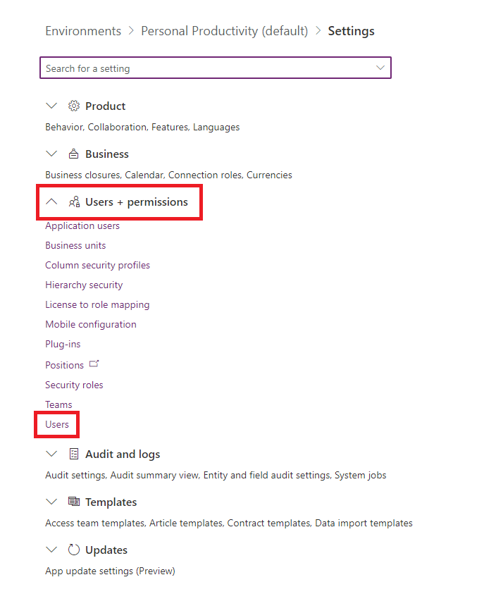
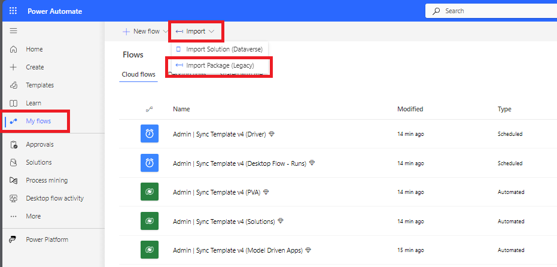
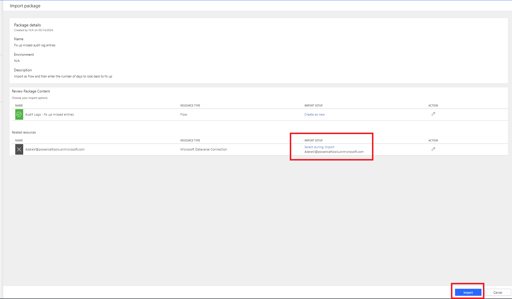
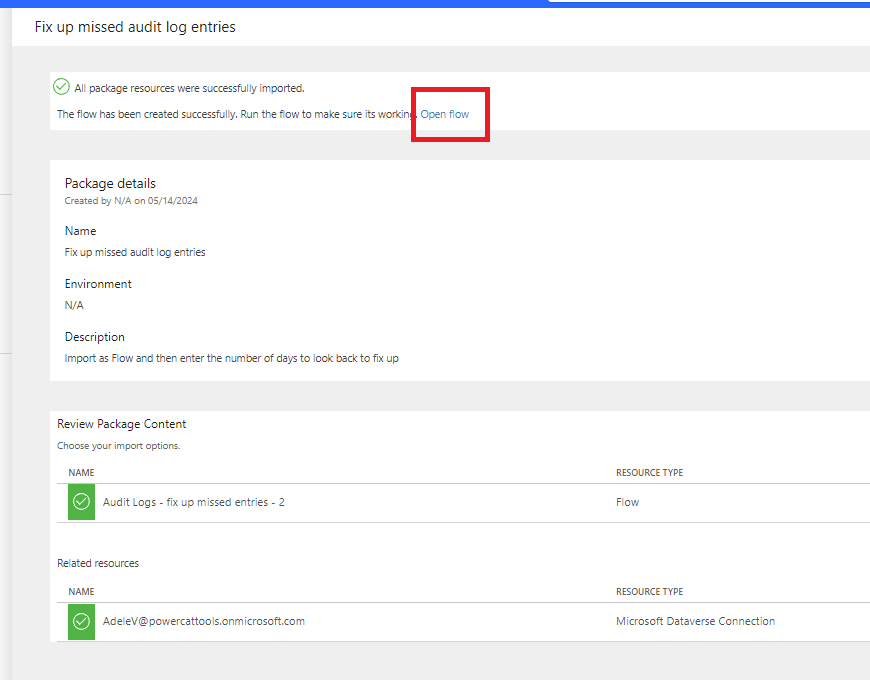
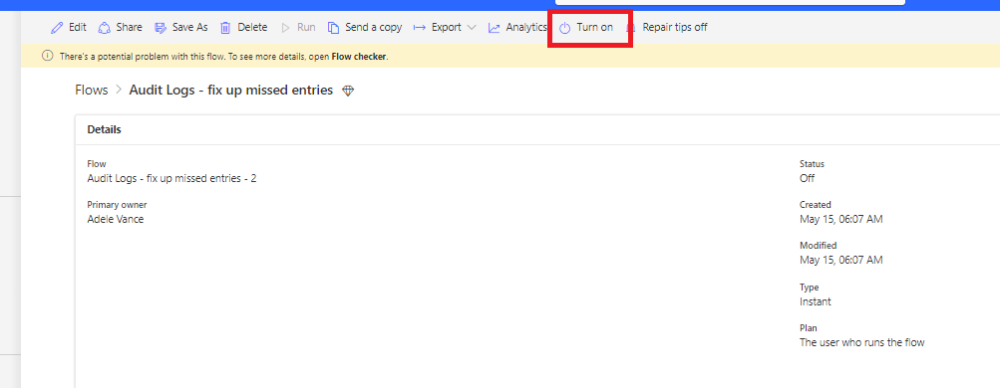
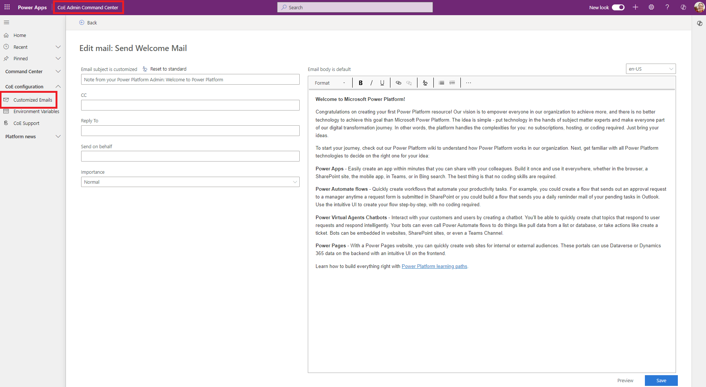
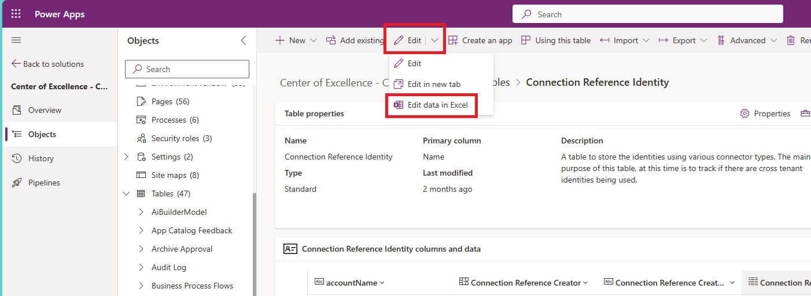
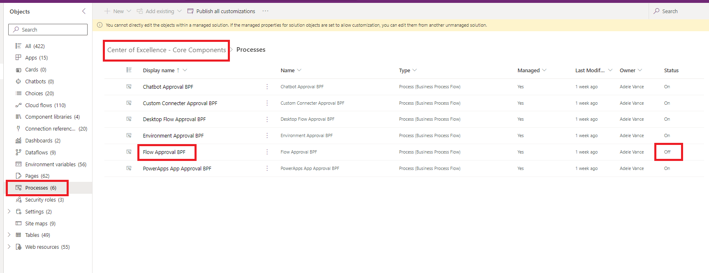

# Frequently asked questions, tips, and how-to's

This article provides you with answers to frequently asked questions and tips on setting up and using the CoE Starter Kit.

## Installing a solution in a production environment

1. Go to [make.powerapps.com](<https://make.powerapps.com>).
1. Go to your CoE environment. In the example in the following screenshot, we're importing to the environment named **Contoso CoE**.

    

1. On the left pane, select **Solutions**.
1. Select **Import**, and then select **Browse**.
1. Select the solution from the CoE Starter Kit download.
1. To activate your solution, establish connections. If you create a new connection, ensure to select **Refresh**. Your import progress remains intact.

     
1. Update environment variable values. These environment variables store application and flow configuration data specific to your organization or environment. By setting the value once per environment, it is utilized across all necessary flows and applications within that environment.
    
1. Select **Import**.

## Set flow run-only users properties

1. Remove [unmanaged layers](after-setup.md) for all flows.
1. Go to the details page, and then select the **Run only users** edit button.

    

1. You see all the connections in the child flow. For each one except Microsoft Dataverse, change the value to **Use this connection (userPrincipalName\@company.com)**. For Microsoft Dataverse, leave the value blank.
1. If there's no connection for any of the connectors, go to **Data** > **Connections**, and create one for the connector.

    

1. Once you have updated all run-only users, you can enable the child flow.

## Find a users Security Roles in an Environment

To find the Security Roles of a user in an environment, you can use the product UX as shown here

1. Go to [https://admin.powerplatform.microsoft.com/environments](https://admin.powerplatform.microsoft.com/environments)
2. Select the desired environment
3. Settings
    
4. From Users + Permissions, select Users
    
5. Locate the user and select their name to view their properties. There, you see their Security Roles.
    

## Import a Flow

Occasionally, we deploy a one-time flow to address specific issues. When these flows are made available, the first step is to import them. Below are the instructions for importing flows.

1. Go to [https://make.powerautomate.com/](https://make.powerautomate.com/)
1. Select your target environment. For us that will typically be our CoE Environment.
1. Select My flows > Import > Import Package (Legacy)
    
1. Select and upload your flow.
    
1. Create any needed connections and Import
    
1. When done click Open Flow to view and then back to see details and turn on.
    
    
    

## Setting up CoE for a subset of environments

You may want to monitor and govern only certain environments using the CoE Starter Kit. For example, this could be applicable if you are setting up the CoE Starter Kit for individual business units managing their own smaller Centers of Excellence or if you wish to include your Dynamics 365 environments in the CoE Starter Kit processes. The following option outlines how to selectively enable CoE Starter Kit processes for specific environments

> [!IMPORTANT]
> This is not a security feature and does not implement data privacy or row-level security. It is solely intended to facilitate the monitoring and management of environments for organizational units.

1. After import of the Core components and before you turn on flows, set the value of the **is All Environments Inventory** environment variable to **No**. Learn more: [Update environment variables](#update-environment-variables)).
1. Continue with the [inventory setup](setup-core-components.md) and turn on all inventory flows.
1. Wait for first inventory run of **Admin | Sync Template v3** to complete.
All environments in the tenant are added as excluded from inventory
      

1. Add environments you want to monitor and manage to the inventory by selecting **No** for the **Excuse from inventory** configuration.
      

1. Wait for the next inventory run to complete. It will automatically pick up and monitor inventory for the selected environments.

## Running a full inventory

To reduce API calls, the inventory flows do not update all objects with every sync flow. The flows only update objects modified since the last inventory.

The inventory flows also don't check each object every day to see if its modified date is more recent than what is in inventory. Instead these flows:

1. Get all the objects. For example, by calling [Get Apps as Admin](/connectors/powerappsforadmins/#get-apps-as-admin).
1. Filter the returned list of objects down to objects where the modified date is greater than 7 days old (configurable via **InventoryFilter_DaysToLookBack**).
1. Check each object in the filtered result to see if its current modified date is more recent than the inventoried one.
1. Update these objects with the more recent modified by date.

If your sync flows were turned off for longer than 7 days, you can only get the inventory updates you missed by modifying the **InventoryFilter_DaysToLookBack** environment variable. Learn more: [Update environment variables](#update-environment-variables)).

If you want to fully update your entire inventory again, you can do that by changing the **Full inventory** environment variable:

1. Set the value of the **Full inventory** environment variable to **Yes**. Learn more: [Update environment variables](#update-environment-variables)).
1. Run the **Admin | Sync Template v4 (Driver)** flow.
1. Wait till the flow finishes running.
1. Set the **Full inventory** environment variable to **No**.

## Update inventory for a selected app or flow

### Force inventory on Objects

To reduce API calls, the inventory flows do not update all objects with each synchronization run. Instead, they only update objects modified since the last inventory.

If you want to force the inventory for an individual object, you can use the **Inventory Me** flag. All objects have this flag.

Here is an example of how to set this using Cloud Flow objects.

1. Go to [Power Apps](https://make.powerapps.com), and then select your CoE environment.
1. Open the **Power Platform Admin View** app.
1. Select **Flows**.
1. Select the flow for which you want to force inventory from the view.
1. Select **Settings**.
1. Change the **Inventory Me** flag to **Yes**.

Once this flag has been set to **Yes**, the next inventory run updates the object, even if it hasn't recently been modified. The flag is then set back to **No**.

### Force inventory on cloud flow action details

We gather details about the flows actions in a long running flow called **Admin | Sync Template v3 (Flow Action Details)**.

To force this to run for your flow, you can use the **Inventory My FlowActionDetails** flag.

1. Go to [Power Apps](https://make.powerapps.com), and then select your CoE environment.
1. Open the **Power Platform Admin View** app.
1. Select **Flows**.
1. Select the flow for which you want to force flow action detail inventory from the view.
1. Select **Settings**.
1. Change the **Inventory My FlowActionDetails** flag to **Yes**.

## Update environment variables

### Limitations for environment variables

The following limitations apply when updating environment variables:

- You can't update the values for environment variables from within the imported solution.
- Always add or update the current value, not the default value, as the default value is overwritten when you install an upgrade.
- You can't update Azure Key Vault secret environment variables using the CoE Admin Command Center. Instead, update them via the **Default Solution**.

### Update CoE Starter kit specific environment variables

To update environment variables used in the kit, you can use the [CoE Admin Command Center](core-components.md#coe-admin-command-center)

1. Go to [Power Apps](https://make.powerapps.com), and then select your CoE environment.
1. Open the **CoE Admin Command Center** app.
1. Select **Environment Variables** screen
1. Select an environment variable to update, click edit and update.

    

### Ensure flows that use it are not cached

At times, Power Automate caches old values for environment variables. If you do not see the expected behavior after changing an environment variable, it is recommended to restart the impacted flows after setting the environment variable.

1. Go to [Power Automate](https://make.powerautomate.com).
1. On the left pane, select **Solutions**.
1. Select the **Default Solution**, and change the filter to show **Environment variables**.
1. Select a variable that you want to update, and show its dependencies

    

1. Look at the Used by find the Object type Process.
    

1. Go turn all these flows off and back on.

### Environment variables outside the kit

If you aren't using the [CoE Admin Command Center](core-components.md#coe-admin-command-center) app, or you need to update environment variables outside the kit. You can do so directly in the environment. This is also the only way to update Azure Key Vault secret environment variables.

1. Go to [Power Automate](https://make.powerautomate.com).
1. On the left pane, select **Solutions**.
1. Select the **Default Solution**, and change the filter to show **Environment variables**.
1. Select a variable that you want to update, and then configure its **Current Value**.
1. If you are updating an Azure Key Vault secret environment variable, enter the following information:
    - **Azure Subscription ID**: The Azure subscription ID associated with the key vault.
    - **Resource Group Name**: The Azure resource group where the key vault that contains the secret is located.
    - **Azure Key Vault Name**: The name of the key vault that contains the secret.
    - **Secret Name**: The name of the secret located in Azure Key Vault.

  > [!TIP]
  > The subscription ID, resource group name, and key vault name can be found on the Azure portal **Overview** page of the key vault. The secret name can be found on the key vault page in the Azure portal by selecting **Secrets** under **Settings**.

## Update connection references

1. Go to [Power Automate](https://make.powerautomate.com).
1. On the left pane, select **Solutions**.
1. Select the **Default Solution**, and change the filter to show **Connection References**.
1. Select a connection reference.
1. Set the value by selecting an existing connection from the drop down or creating a new one.
1. Select **Save** and confirm you want to save the changes.

## Monitor and Customize emails

All emails that are sent as part of the CoE Starter Kit are stored in the **Customized Emails** table. To customize the emails, you don't need to modify the flows or apps that send the emails. Instead, you can use the [CoE Admin Command Center](core-components.md#coe-admin-command-center) app.

1. Go to [Power Apps](https://make.powerapps.com), and then select your CoE environment.
1. Open the **CoE Admin Command Center** app.
1. Select **Customized Emails**.
1. Select the email you want to customize, and then select **Edit**.
1. By default, all emails are provided in English. You can also add localized versions of the email by selecting **Add language**.

      

## Share an app from a production environment

1. Go to [Power Apps](https://make.powerapps.com), and then select your CoE environment.
1. On the app that you want to share, select **...** > **Share**.

      

1. Select the Dataverse security role. The CoE Starter Kit makes three security roles available:
    - **Power Platform Admin SR** for sharing an app with admins
    - **Power Platform Maker SR** for sharing an app with your makers
    - **Power Platform User SR** for sharing an app with users

      

1. Select **Share**.

## Get a Power Apps URL from a production environment

1. Go to [Power Apps](https://make.powerapps.com), and then select your CoE environment.
1. Select **Apps**.
1. Select the app of which you need the URL from.
1. Select **...** > **Details**.
1. Select the **Web link**.

      

## Deal with backend throttling during inventory runs

Some users may encounter throttling by the product backends (such as updating records in Dataverse) during their inventory process, resulting in 429 errors. To address this issue, we have introduced an environment variable that users can utilize. This variable adds a delay at the beginning of each individual inventory action, preventing them from running concurrently. While this approach mitigates concurrency issues, it may prolong the inventory process.

To use this update value of the DelayObjectInventory environment variable to Yes

See [How to update environment variables](#update-environment-variables) for how to update environment variables.

<!-- See [All inventory environment variables](./setup-core-components#all-environment-variables)) for full list of environment variables associated with Inventory. -->

## Cross Tenant Connection Identities

In the Power Platform Admin View app, you can see where we highlight cross tenant connection identities. How do we configure what is considered cross tenant?
    

### How to configure what is a local connection identity

By default, only the host domain of the identity running the inventory flows will be considered a local identity. To configure this you can use  the **Host Domains** environment variable.
Enter any hosts you which to add to this environment variable as a comma separated string.
    

See [How to update environment variables](#update-environment-variables) for how to update environment variables.

<!-- See [All inventory environment variables](./setup-core-components#all-environment-variables)) for full list of environment variables associated with Inventory. -->

### How to update data to respect configured local tenants

Note that changing the Host Domains environment variable does not retroactively update the old data in the tables. As we anticipate this setting change to be infrequent, we do not regularly compare it to avoid additional API hits. Therefore, you need to update this manually.

There are multiple methods to accomplish this, including custom flows, the Excel add-in, or through plugins.
The underlying logic remains consistent, allowing you to choose the method that best suits your needs.
We have demonstrated how to achieve this using the Excel Add-In, which is ideal due to its speed and minimal API impact.

1. Browse to the **Connection Reference Identity** table and **Edit data in Excel**
    

1. Click Enable Editing, Accept and Continue if prompted and sign in as your CoE Admin identity
    
    

1. Filter the **accountName** field by the domain you have added to the **Host Domains** environment variable
    

1. Set the **NoneOrCrossTenantIdentity** to false (No)
    

1. Remove the filters and publish.
    

## How to activate Business Process Flows?

<!-- Occasionally people will see the BPFs used in the kit as disabled due to some issue with their install. If this happens and you want to use the features that employ them, for example the [Compliance processes](./governance-components#compliance-processes), you will need to activate them manually. -->
Occasionally, users encounter disabled Business Process Flows (BPFs) within the kit due to installation issues. In such cases, to utilize features relying on these BPFs, you need to activate them manually.

1. Browse to the solution with the BPFs and click to view Processes
1. Find BPFs that are turned off and click their name to open
    

1. Click Activate to turn on the BPF
    

## Which license should I assign to the user that's running the CoE Starter Kit flows?

The prerequisite for installing the CoE Starter Kit is that the user installing it must have a Power Automate Per User license, or the flows must be covered with a Per Flow license. Often, a combination of these licenses is required to run the CoE Starter Kit successfully. The specific combination depends on factors such as the number of resources (apps, flows, environments) in your tenant, the number of makers you have, and how frequently new resources are created and modified. Different Power Automate license types have different API limits and enforcements. If your license type is not sufficient, the flow may be throttled or run for an extended period. Please refer to the following guide to determine which license to select.

  1. Understand the [Power Automate request limits](/power-platform/admin/api-request-limits-allocations).
  1. Start by assigning a Power Automate Per user license and turn on all the required flows. Monitor the flows with **CLEANUP**, **Sync Template (Flows)** and **Sync Template (Apps)** in the name - these often consume a high number of API requests. You can use [**action analytics**](https://powerautomate.microsoft.com/blog/introduction-action-usage-analytics-in-power-automate/) to monitor the API requests of these flows.
  1. If the flow runs too many actions, [change the flow owner](/power-automate/change-cloud-flow-owner) to a different account with a Power Automate Per User license. This will load balance the API requests.
  1. If the flow continues to execute too many actions, consider assigning a [Per Flow](/power-platform/admin/power-automate-licensing/types#standalone-plans) plan to it. This action will allocate capacity and API requests specifically for the flow.

[!INCLUDE[footer-include](../../includes/footer-banner.md)]
