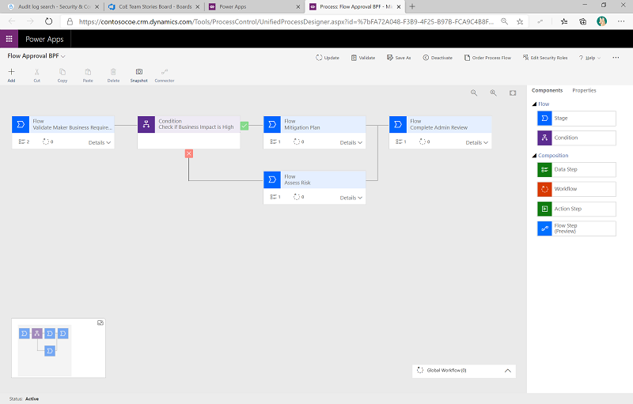
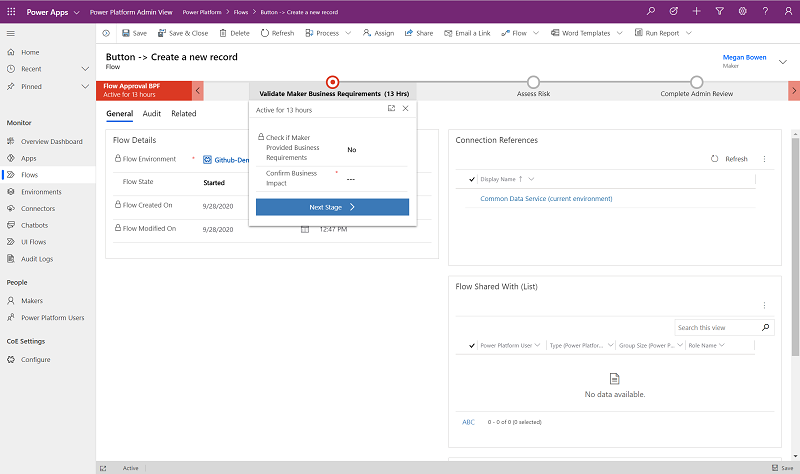
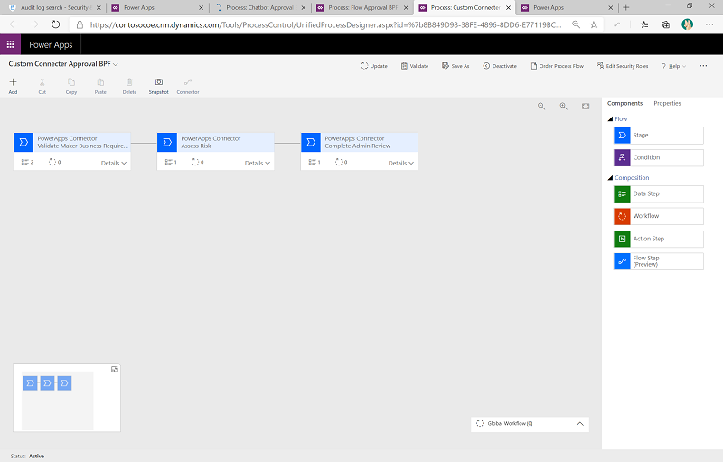

# Use governance components

After you've become familiar with your environments and resources, you might start thinking about governance processes for your apps. You might want to gather additional information about your apps from your makers, or audit specific connectors or app usage.

The Governance Components solution contains assets relevant to admins and makers. More information: [Set up governance components](setup-governance-components.md)

Here's a breakdown of the assets that form the governance components:

- Sample audit process
  - [Developer Compliance Center (canvas app)](#apps)
  - [Flow – Compliance detail request](#flows)
  - [Business Process Flow for Auditing resources](#business-process-flow)

- Archive unused apps
  - [App and Flow Archive and Clean Up – Start Approval and Check Approval (flows)](#flows)
  - [App Archive and Clean Up View (model-driven app)](#apps)

- Take action based on certain connector usage
  - [Find and add admins as owners for apps that use certain connectors (flow)](#flows)
  - [Find and disable flows that leverage certain connectors (flow)](#flows)

## Entities

### Archive Approval

Represents archival approval tasks started during the *App Archive and Clean Up* flow

## Flows

### Admin \| Compliance detail request

This flow works in conjunction with other apps and flows in the CoE toolkit to facilitate a process described in the following section: [PowerApps App Auditing
Process](example-processes.md).

Compliance detail request emails are sent for apps and chatbots.

It sends an email to users who have apps in the tenant that aren't compliant with the following thresholds:

- The app is shared with more than 20 users or at least one group, and no business justification details have been provided.

- The app has business justification details provided, but hasn't been published in 60 days (so is likely not on the latest version of Power Apps) or is missing a description.

- The app has business justification details provided and has indicated high business impact, but hasn't submitted a mitigation plan to the attachments field.

It sends an email to users who have chatbots in the tenant that aren't compliant with the following thresholds:

- The chatbot has more than 50 launches, and no business justification details have been provided.

- The chatbot has business justification details provided and has indicated high business impact, but hasn't submitted a mitigation plan to the attachments field.

You can customize the email sent out by the flow; by default, it will look like the following:  

### Admin \| App archive and clean up – Start Approval

Checks for apps that haven't been modified in the last six months (configurable) and asks the app owner (via flow approvals) if the app can be archived.

This flow starts the approval process and writes the approval task to the Archive Approval Common Data Service entity.

### Admin \| App archive and clean up – Check Approval

On a scheduled interval, checks for approval responses created by the App Archive and Clean Up – Start Approval flow and, if approved, archives the app file to SharePoint.

**Prerequisite**: Create a SharePoint document library to store the archived apps, and configure this in the environment variables.

**Customize**: By default, this flow will archive the application but not remove it or its permission from the environment, so that we don't inadvertently remove apps from your tenant. Update the [**Auto Delete On** Archive environmental variable](setup-governance-components.md#update-environment-variables) to also delete the app.

### Admin \| Flow archive and clean up – Start Approval

The same as the above flow but for flows instead of apps.

Checks for flows that haven't been modified in the last six months (configurable) and asks the flow owner (via flow approvals) if the flow can be archived.

This flow starts the approval process and writes the approval task to the Archive Approval Common Data Service entity.

### Admin \| Flow archive and clean up – Check Approval

The same as the above flow but for flows instead of apps.

On a scheduled interval, checks for approval responses created by the Flow Archive and Clean Up – Start Approval flow and, if approved, archives the flow files to SharePoint. It archives two files per flow, one with the flow content, the other with the flow connections.

**Prerequisite**: The same SharePoint document library as used to  store the archived apps can be use to store archived flows.

**Customize**: By default, this flow will archive the flow but not remove it or its permission from the environment, so that we don't inadvertently remove flows from your tenant. Update the [**Auto Delete On** Archive environmental variable](setup-governance-components.md#update-environment-variables) to also delete the flow.

### SETUP REQUIRED \| Admin \| Find and disable flows that leverage certain connectors

> [!NOTE]
> Are you aware of the [Data Loss Prevention Policy](https://docs.microsoft.com/power-platform/admin/wp-data-loss-prevention#the-effect-of-the-blocked-data-group) feature to block connectors. Connectors that are blocked can't be used by either flow or app makers. You might want to consider blocking the connector instead of having a reactive flow setup to discover its usage.

Checks whether any flows are using specific connectors, notifies the flow maker, and then disables the flow. The admin will receive a report.

**Customize**: On setup, the array provided is blank so that we don't inadvertently disable flows in your tenant. You must specify what connectors you want to audit by editing the flow and updating the *disableConnectorArray* as shown for the connectors of your choice.

### SETUP REQUIRED \| Admin \| Find and add admins as owners for apps that leverage certain connectors

> [!NOTE]
> Are you aware of the [Data Loss Prevention Policy](https://docs.microsoft.com/power-platform/admin/wp-data-loss-prevention#the-effect-of-the-blocked-data-group) feature to block connectors. Connectors that are blocked can't be used by either flow or app makers. You might want to consider blocking the connector instead of having a reactive flow setup to discover its usage.

Checks for apps that use certain connectors, notifies the app maker, and shares the app with the admin security group.

**Customize**: On setup, the array provided is blank so that we don't inadvertently add owners to apps with connectors in your tenant. You must specify what connectors you want to audit by editing the flow and updating the *disableConnectorArray* as shown for the connectors of your choice.  

## Apps

### Developer Compliance Center

This app is used in the [auditing process](example-processes.md) as a tool for users to check whether their app, flow, chatbot or custom connector is compliant, and to submit information to the CoE admins as business justification to stay in compliance.

**Permission**: As soon as you're using the app auditing process, this app needs to be shared with your app makers. If you intend to use this process, modify the [Welcome email](setup-nurture-components.md) flow to add users to a security group, and then share this app with the security group.

**Prerequisite**: This app uses Common Data Service; a Premium license is therefore required for each app user.

#### Compliance Status

A traffic light indicates how compliant the resource is towards a pre-defined rule set.

- **Apps** are compliant if the app description is populated, the business justification is submitted and the app has been published in the past 60 days.
- **Flows** are compliant if the flow description is populated, the business justification is submitted and the flow is not suspended.
- **Chatbots** are compliant if the chatbot description and the business justification is populated, and the chatbot is not suspended.
- **Custom Connectors** are compliant if the custom connector description, business justification and conditions of use are populated.

**Customize**: Verify that the Compliance criteria matches your requirements, and update if necessary.

Makers can achieve compliance by providing additional information through the Support Details form:

- **Business Justification**: Describe the business need and problem you are solving with this solution.
- **Business Impact**: Define the operational impact this solution has on the people using it.
- **Access Management**: Describe who has access to this resource, how access is managed (individual user access, access through group membership) and how joiners/movers/leavers processes are managed.
- **Dependencies**: Describe any dependencies this solution uses, e.g. external or internal APIs or Azure resources.
- **Conditions of use**: (connectors only) Describe in which situations the connector can and should be used.
- **Mitigation Plan provided**: For critical solutions, upload a mitigation plan that details what business users will do in the event of an outage.

**Customize**: Verify that the Support Details form matches your requirements, and update if necessary.

:::row:::
   :::column span="":::
      
   :::column-end:::
   :::column span="":::
      
   :::column-end:::
:::row-end:::

## Model-driven app

### App Archive and Clean Up View

A model-driven app that provides an interface to canvas apps that have been highlighted for archiving, and their approval status. This model-driven app works in conjunction with other apps and flows in the CoE toolkit to facilitate the process described for the [app auditing process](example-processes.md).

**Customize**: Instead of using this model-driven app, you can modify the Power Platform Admin View app to show the Archive Approval entity.

## Business process flows

### Power Apps App Approval BPF

This process helps the admin audit the app approval process by providing a visualization of the stage in the process they're currently on.

The audit stages are:

- Validate maker requirements.
- Assess risk.
- Highlight the app in the App Catalog.

:::row:::
   :::column span="":::
      
   :::column-end:::
   :::column span="":::
      
   :::column-end:::
:::row-end:::

### Flow Approval BPF

This process helps the admin audit the flow approval process by providing a visualization of the stage in the process they're currently on.

The audit stages are:

- Validate maker requirements.
- Assess risk.
- Complete admin review.

:::row:::
   :::column span="":::
      
   :::column-end:::
   :::column span="":::
      
   :::column-end:::
:::row-end:::

### Custom Connector Approval BPF

This process helps the admin audit the custom connector approval process by providing a visualization of the stage in the process they're currently on.

The audit stages are:

- Validate maker requirements.
- Assess risk.
- Complete admin review.

:::row:::
   :::column span="":::
      
   :::column-end:::
   :::column span="":::
      
   :::column-end:::
:::row-end:::

### Chatbot Approval BPF

This process helps the admin audit the chatbot approval process by providing a visualization of the stage in the process they're currently on.

The audit stages are:

- Validate maker requirements.
- Assess risk.
- Complete admin review.

:::row:::
   :::column span="":::
      
   :::column-end:::
   :::column span="":::
      
   :::column-end:::
:::row-end:::

#### Activate the business process flows

All business process flows are disabled by default. To enable it, do the following:

1. Go to [make.powerapps.com](<https://make.powerapps.com>) and set the current environment to the same environment where the CoE solution is installed.

1. Select **Solutions** > **Center of Excellence**.

1. Select **Process** from the Filter option at the top.

1. In **Power Apps App Approval BPF**, select the ellipsis (…) button, and then select **Turn On**.

1. Repeat the last step for **Flow Approval BPF, Chatbot Approval BPF and Custom Connector Approval BPF**.
