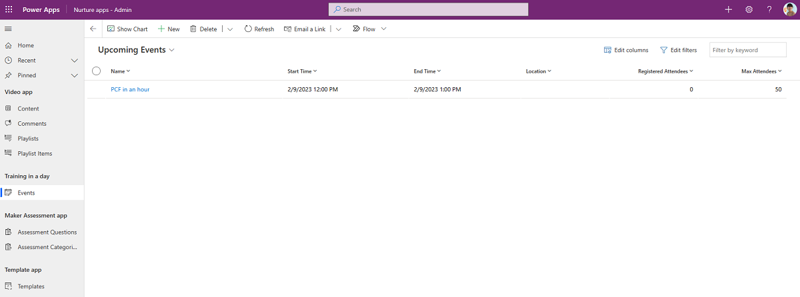
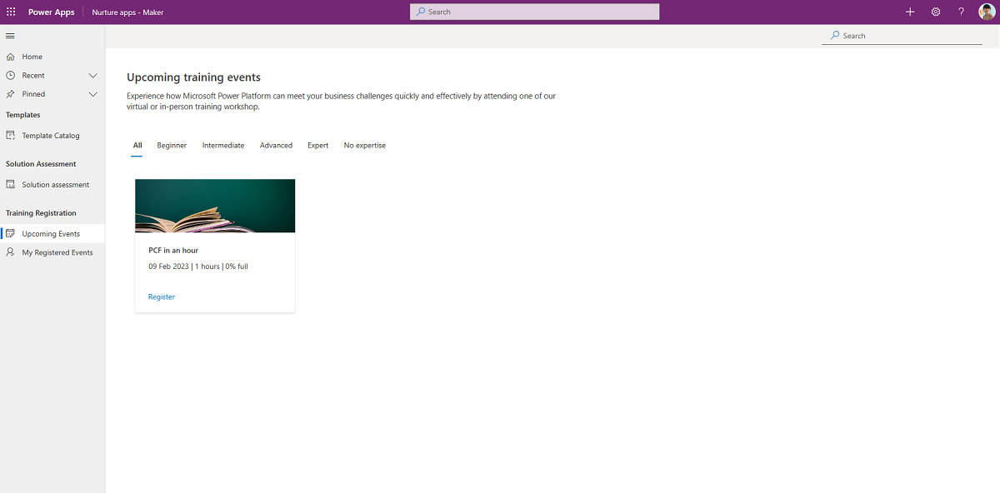
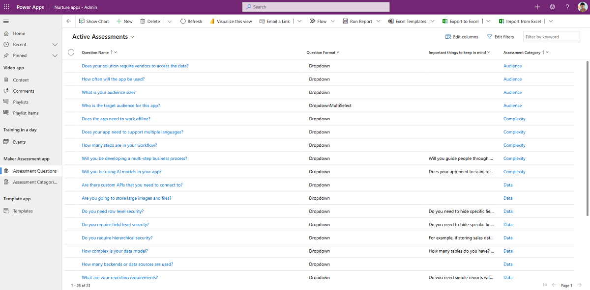

# Use nurture components

An essential part of establishing a Center of Excellence (CoE) is nurturing your makers and an internal community. You'll want to share best practices and templates, and onboard new makers. The assets in this solution can help you develop a strategy for this motion.   More information: [Set up nurture components](setup-nurture-components.md) and [Watch](https://www.youtube.com/embed/StqxBgbt_ZM) how to use the core components solution.

The CoE nurture components solution contains assets relevant to everyone in the organization: admins, makers, in addition to users of apps and flows. More information: [Set up nurture components](setup-nurture-components.md)

## Training in a day components

### Tables

| Name | Description |
|------|---------------|
| InADayAttendees | Represents attendees that have registered for a Training in a Day course by using the Training in a Day Registration canvas app. The following information is available for each attendee: attendee email, name and registered event |
| InADayEvent | Represents available training events created through the Training in a Day Management canvas app. The following information is available for each event: name, description, start time, end time, max attendees and location |

### Flows

| Flow | Type | Schedule | Description |
| --- | --- | --- | --- |
| Training in a Day \| Feedback Reminder | Schedule | Daily | Sends an email to attendees of a training event on the day, and requests feedback. |
| Training in a Day \| Registration Confirmation Automated | Automated | when a user registers for an event using the [Training in a day](#training-in-a-day--registration) app | Sends an email to attendees of a training event on the day, and requests feedback. |
| Training in a Day \| Reminder 3 days prior to event | Schedule | Daily | Sends a reminder email to an attendee of a Training in a Day event three days before the event. |

### Apps

#### Training in a Day – Management

If you're planning to run an internal Training in a Day event (such as App in a Day), you can use this canvas app to create and manage it.

**Permission**: Share with CoE admins or the owners of your internal training events.

**Prerequisite**: This app uses Microsoft Dataverse. If you have installed this solution in a Production environment, end users need to have a Per User license, or the app needs to be assigned a Per App license, or the environment needs to be covered by pay-as-you-go. If you have installed this solution in a Dataverse for Teams environment, a Microsoft 365 license is required for every user.

#### Training in a Day – Registration

If you're planning to run a Training in a Day event, use this canvas app to enable your users to register for upcoming events.

**Permission**: As soon as you're running internal training events, share with everyone in the organization.

**Prerequisite**: This app uses Microsoft Dataverse. If you have installed this solution in a Production environment, end users need to have a Per User license, or the app needs to be assigned a Per App license, or the environment needs to be covered by pay-as-you-go.  If you have installed this solution in a Dataverse for Teams environment, a Microsoft 365 license is required for every user.

## Maker assessment components

### Security roles

**Maker Journey Admin SR** Gives a user full access (create, read, write, etc) to the Maker Assessment tables. When you share the Maker Assessment Admin app with your admin team, make sure to assign them the **Maker Journey Admin SR** security role.

**Maker Journey Maker SR** Gives a user read access to the Maker Assessment tables. When you share the Maker Assessment app with your organization, make sure to assign them the **Maker Journey Maker SR** security role.

### Tables

| Name | Description |
|------|---------------|
| Assessment Category | Categories - such as Data, Audience, Support - used in the Maker Assessment app.|
| Assessment Questions | Questions used in the Maker Assessment app. |
| Answer Options | Potential answers to questions in the Maker Assessment app. |

### Apps

#### Maker Assessment Admin App

A canvas app that the Maker Assessment admin uses to enter or update the questions, answers, and categories, that are listed in the apps.

**Permission**: Share this app with the Maker Assessment admins - this can be your CoE or Power Platform adoption lead.

**Prerequisite**: This app uses Microsoft Dataverse. If you have installed this solution in a Production environment, end users need to have a Per User license, or the app needs to be assigned a Per App license, or the environment needs to be covered by pay-as-you-go. If you have installed this solution in a Dataverse for Teams environment, a Microsoft 365 license is required for every user.

#### Maker Assessment

The Maker Assessment app can be used to ask users a series of questions regarding the target audience, data and support of the solution they are planning and informing them about governance, support and license considerations a maker needs to keep in mind before starting the development of their solution.

**Permission**: The Maker Assessment app can be shared with the entire organization.

**Prerequisite**: This app uses Microsoft Dataverse. If you have installed this solution in a Production environment, end users need to have a Per User license, or the app needs to be assigned a Per App license, or the environment needs to be covered by pay-as-you-go.  If you have installed this solution in a Dataverse for Teams environment, a Microsoft 365 license is required for every user.

## Pulse survey components

### Tables

| Name | Description |
|------|---------------|
| Pulse Feedback | Stores feedback received via Pulse feedback surveys. |

### Flows

| Flow | Type | Schedule | Description |
| --- | --- | --- | --- |
| Pulse - Survey Makers for CoE feedback | Schedule | Weekly on Thursdays | Posts an adaptive card to randomly identified makers to ask them for feedback on how they feel about the Power Platform support and adoption strategy.. |
| Pulse [Child] - post adaptive cards to maker | Manual | child flow | Uses AI Builder to translate and analyse the feedback response and stores the response in the Pulse Feedback table.|

### Power BI

Pulse feedback Power BI Dashboard to display feedback and sentiment over time.

## Other nurture components

### Flows

| Flow | Type | Schedule | Description |
| --- | --- | --- | --- |
| Admin \| Newsletter with Product Updates | Schedule | Weekly | Sends a weekly email with a summary of product updates, consisting of posts from the product blogs for Power Apps, Power Automate, and Power BI, and the Power Apps Community blog. |

### Apps

#### Template Catalog

A canvas app that CoE admins can use to share app and component templates, in addition to best practice documents, with their makers.

**Permission**: After you've made the content ready, the template catalog can be shared with the entire organization.

**Prerequisite**: This app uses Microsoft Dataverse. If you have installed this solution in a Production environment, end users need to have a Per User license, or the app needs to be assigned a Per App license, or the environment needs to be covered by pay-as-you-go. If you have installed this solution in a Dataverse for Teams environment, a Microsoft 365 license is required for every user.

> [!NOTE]
> This app can't be used in the managed solution; it can only be tested and used after you've [imported it into your extended unmanaged solution](modify-components.md). This is due to some limitations in the environment variables and data sources in the canvas apps. For more information, go to [Set up the Template Catalog and upload components](modify-components.md#set-up-the-template-catalog-and-upload-components).

[!INCLUDE[footer-include](../../includes/footer-banner.md)]
