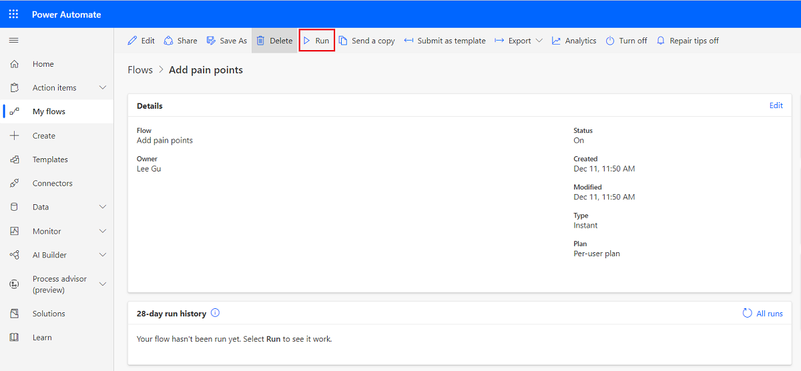
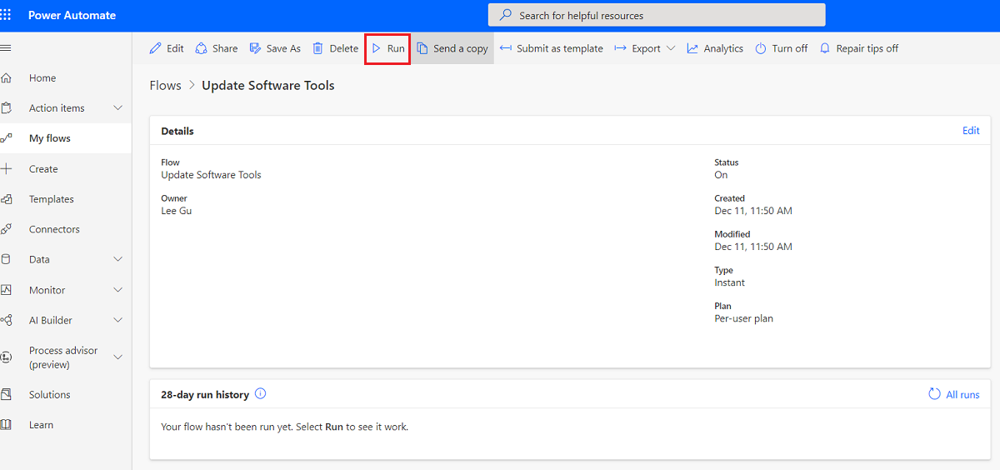
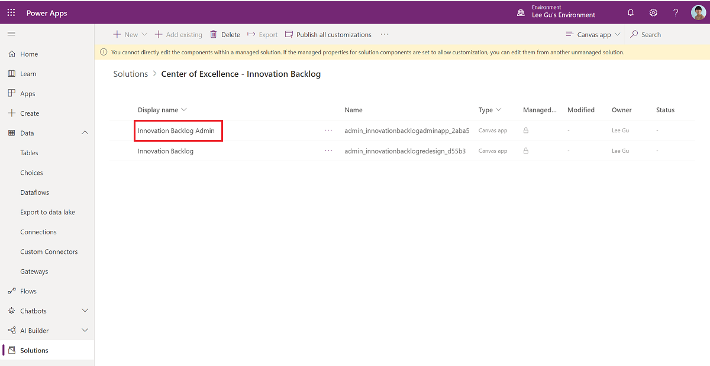
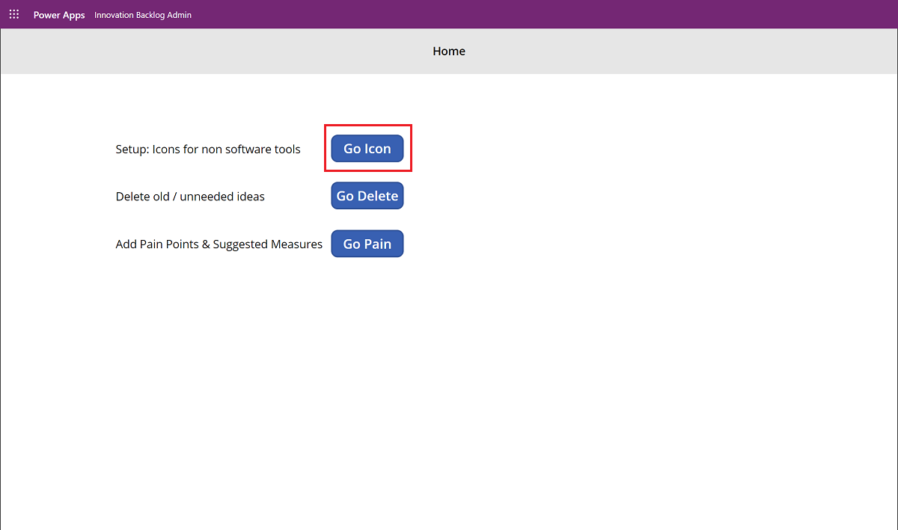
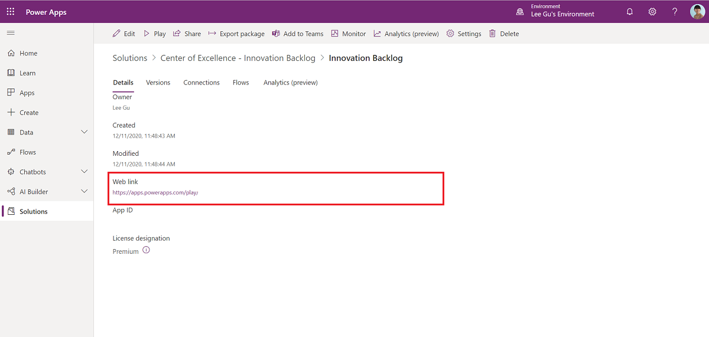
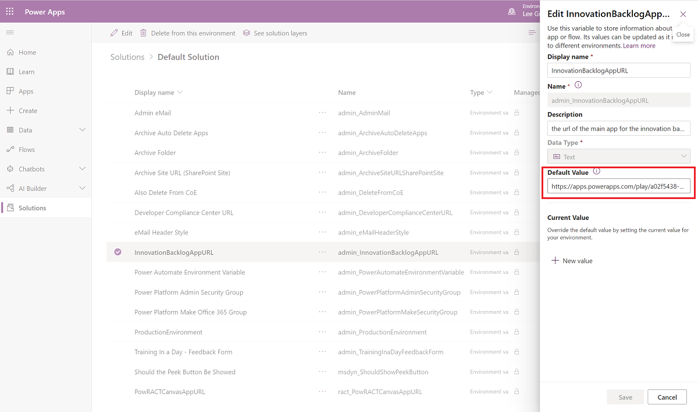

# Set up Innovation Backlog components

Use the Innovation Backlog app to ask users to submit ideas for apps and flows that need building, and describe pain points with the current process. As users describe the process, they will provide information about personas involved, tools used, and measures for improvement. This information is then used to calculate an ROI and complexity score.

Pick the most impactful ideas to for your development team to build, or select them for an upcoming hackathon. Other users can vote on ideas, or add their own scenarios to an existing idea. Developers can additionally request feedback and testimonials to build their portfolio.

The Innovation Backlog solution contains assets that are relevant to all users in your organization.

> [!IMPORTANT]
> The Innovation Backlog components solution doesn't have a dependency on other components of the CoE Starter Kit. It can be used independently.

Before you begin, review the [prerequisites](setup.md#prerequisites) for using the starter kit solution.

- If you aren't already using the CoE Starter Kit, we recommend [creating a new environment](https://docs.microsoft.com/power-platform/admin/create-environment) for CoE solutions.
- If you are already using other CoE Starter Kit components, use the environment that you created as part of setting up the [core components](setup-core-components.md) for this solution.

## Import the solution

1. Download the CoE Starter Kit compressed file from [aka.ms/CoeStarterKitDownload](https://aka.ms/CoeStarterKitDownload).

1. Extract the zip file.

1. Sign in to [Power Apps](<https://make.powerapps.com>).

1. Select your CoE environment. In the example, we're importing to the environment named **Contoso CoE**.

     

1. On the left pane, select **Solutions**.

1. Select **Import**. A pop-up window appears. (If the window doesn't appear, ensure that your browser's pop-up blocker is disabled and try again.)

1. In the pop-up window, select **Choose File**.

1. Select the Center Of Excellence Innovation Backlog solution: CenterOfExcellenceInnovationBacklog_*x_x_x_xx*_managed.zip.

1. When the compressed (.zip) file has been loaded, select **Next**.

1. Establish connections to the Common Data Service (Current Environment), Common Data Service, Power Apps for Makers and Power Platform for Admins connector. If you create a new connection, you must select **Refresh**. You won't lose your import progress.

     

1. Select **Import**. (This might take some time.)

1. When the import succeeds, refresh the page and open the Center of Excellence - Innovation Backlog solution.

1. Now, we will populate some of the tables with default values by running instant cloud flows.
    1. Open the **Add pain points** cloud flow and select **Run** > **Run Flow**.
        
    1. Open the **Update Software Tools** cloud flow and select **Run** > **Run Flow**.
        
    1. Wait for both of them to finish (This might take 10 mins.)

1. Extract the **ToolIcons.zip**. You can find this file in the initial download.

1. Open the **Innovation Backlog Admin** app.
    
1. Select **Go Icon**.
        
1. Select each non-software tool, add an icon from the **ToolIcons** folder, and select **Add** to save the icon.
    
1. Go back to the Center of Excellence - Innovation Backlog solution and select the **Innovation Backlog** canvas app.
    
1. Copy the **Web Link**
        
1. Go to [make.powerapps.com](<https://make.powerapps.com>) > **Solutions** > **Default Solution** and filter by **Environment Variables**
    
1. Select the **InnovationBacklogAppURL** variable and paste in the URL for the Innovation Backlog app.
    

You can now [use the Innovation Backlog app](innovationbacklog-components.md).
