# Use theming components

An frequent question we get when it comes to creating canvas apps is theming and specifically the ability to create apps that match the organization brand.  The assets in this solution will help you create, manage and share themes. More information: [Set up theming components](setup-theming.md)

The theming components allows you to create and manage themes for canvas apps. A theme contains a collection of styles that defines multiple design properties for controls and components such as colors, fonts, borders etc. These styles are then applied automatically when makers use the provided themed template app to create a new app, and controls and components are automatically themed.

The theming components ensure makers can focus on what matters - the business logic and problem they're trying to solve, and end users will have a consistent experience when using apps.

Here's a breakdown of the assets that form the Theming Components solution:

- [Theme Editor](#apps)
- [Theme Gallery](#apps)
- [Shared Component Library](#components)

## Entities

### Theme

Represents a custom theme created with the [Theme Editor](#apps).

### Style

Represents the style properties corresponding to a theme created with the [Theme Editor](#apps). Colors, borders, fonts are stored in this entity.

## Apps

### Theme Editor

The Theme editor app allows designers to create and manage themes. A theme contains a collection of styles that defines design properties for controls and components such as colors, fonts, borders etc.

**Permission**: Share the Theme Editor with your designers creating themes.

**Prerequisite**: This app uses Common Data Service; a Premium license is therefore required for every app user.

The theme editor provides an overview of existing themes, users can create or edit a theme.

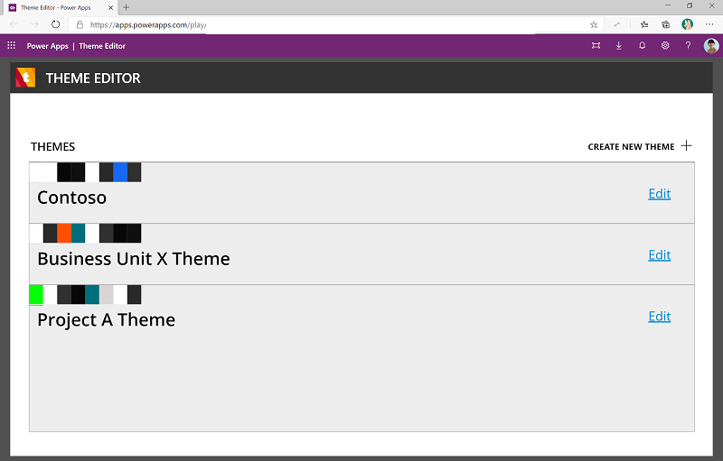

Select *Edit* to edit a theme or *Create new theme* to create a new theme.

Use the styles (color picker, font picker) to create the style and see a real time preview of the theme as you are editing various colors, fonts and sizes.

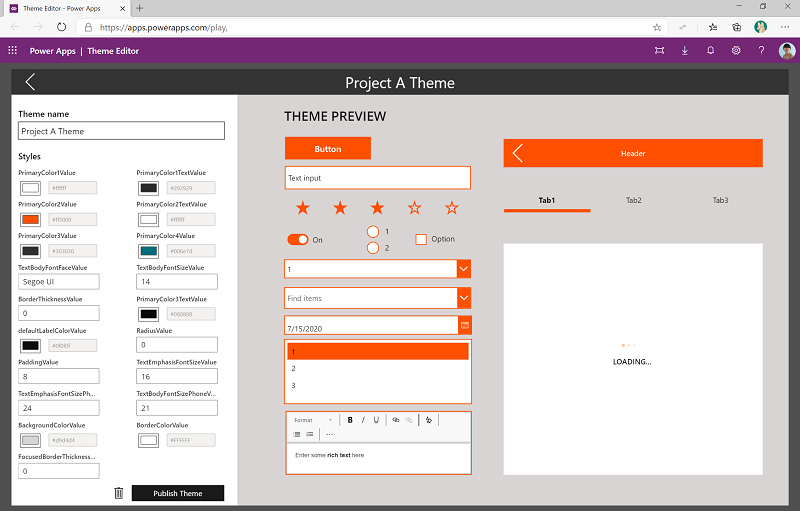

Once done authoring the theme, theme designers will need to update the *AppTemplatePhone.msapp* & *AppTemplateTablet.msapp* files and upload them. This step ensures that when app makers download the apps, it’s ready to be used with the correct theme applied.  

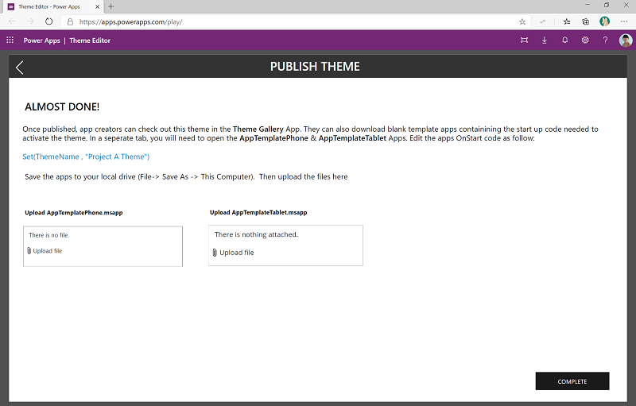

#### Update .msapp files

1. Copy the formula *Set(ThemeName, "Your Theme Name")* to your clipboard or notepad.
1. Go to [make.powerapps.com](<https://make.powerapps.com>) and go to your CoE environment where the Theming solution is installed.
1. Select **Solutions** on the left navigation bar.
1. Select the **Center of Excellence - Theming** solution.
1. Edit the **AppTemplatePhone** canvas app.
1. Select **App** > **OnStart** and replace the first line in the formula with the new formula you've copied in the first step. Make sure you don't replace any other formulas in the *OnStart* function.
    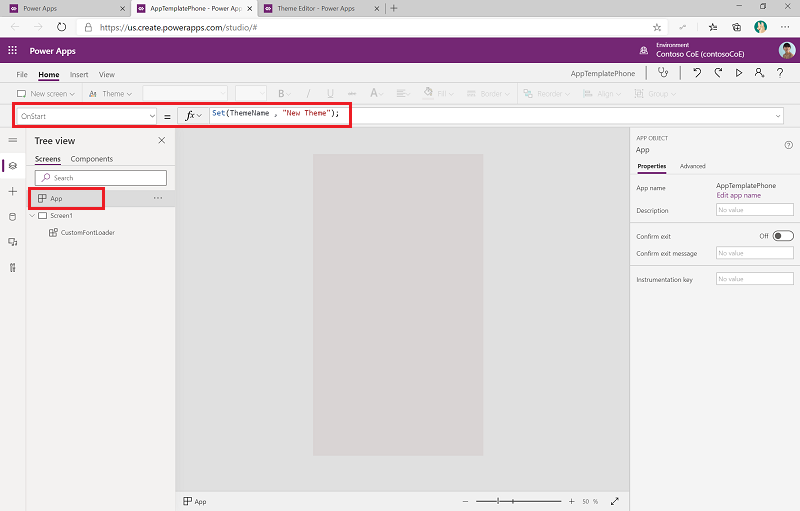
1. Select **File > Save as > This Computer** to save the file locally.
    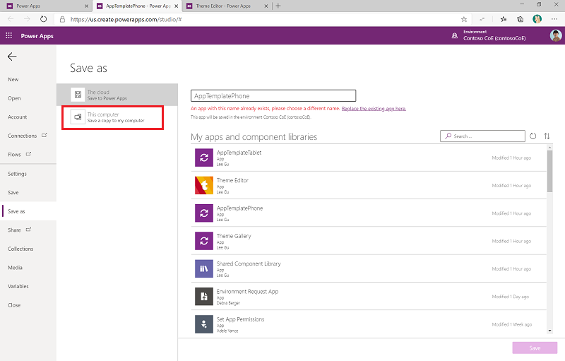
1. Download the file.
  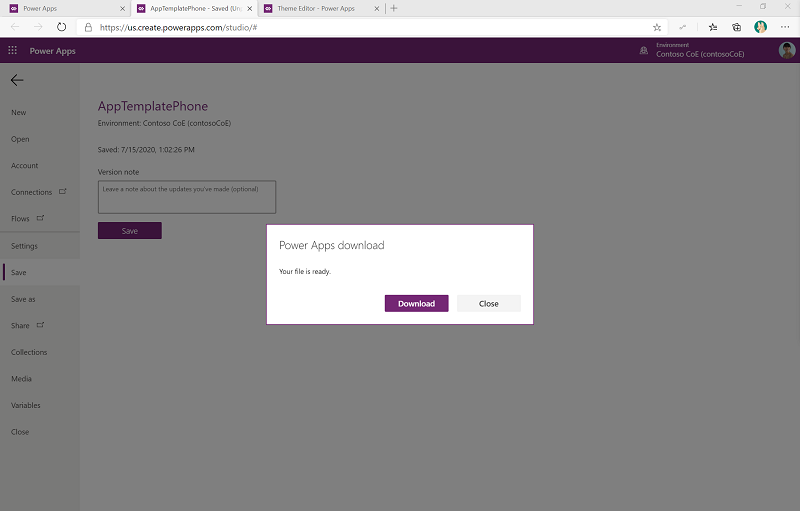

Complete the same steps for the *AppTemplateTablet* canvas app.

Navigate back to the **Theme Gallery** app and upload the template files you have just downloaded.

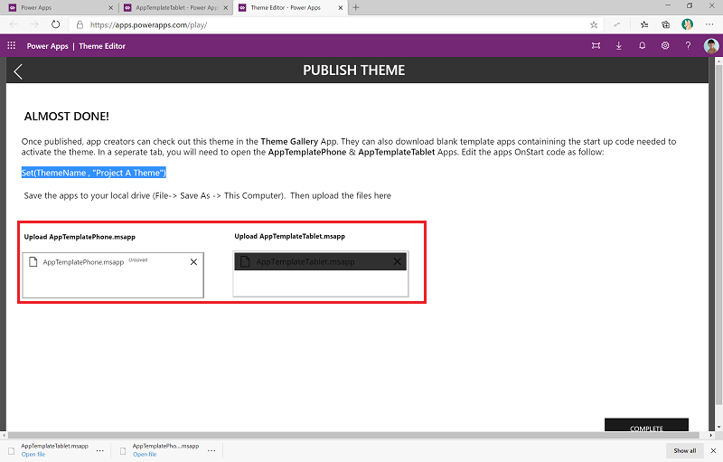

Select *Complete* to publish the theme to the theme gallery app.

### Theme Gallery

The Theme gallery app can be used by app makers to browse existing themes and download a corresponding template app either in Phone (*AppTemplatePhone.msapp*) or Tablet (*AppTemplateTablet.msapp*) layout.

**Permission**: Share the Theme Gallery with makers in your organization.

**Prerequisite**: This app uses Common Data Service; a Premium license is therefore required for every app user.

Makers can get an overview and browse available themes

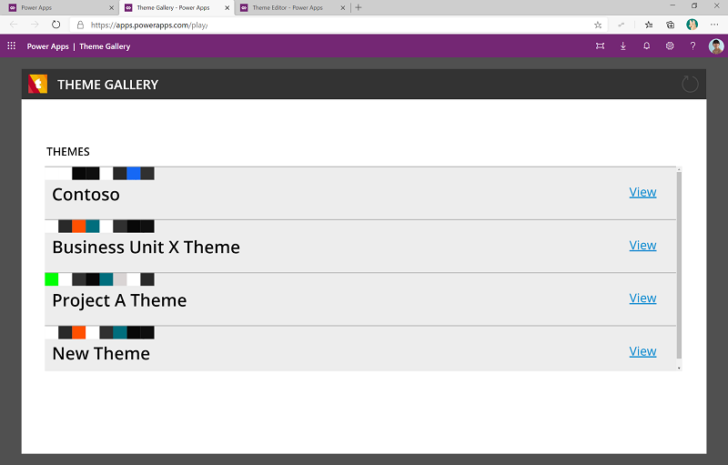

The detail view of the theme provides a preview with all styles applied to native controls and components.

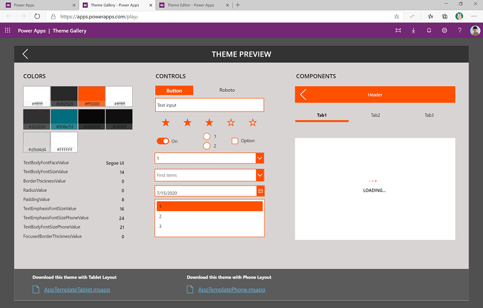

App makers can download the template corresponding to the chosen layout.

#### Use the template

Create a new app based on the template.

1. Navigate to [make.powerapps.com](<https://make.powerapps.com>).
1. Select **New > Canvas App**.
1. Select **Open > Browse Files** and choose the template file downloaded from the Theme Gallery.
    
1. Once opened, the theme will automatically applied to controls or components added to the screen.
    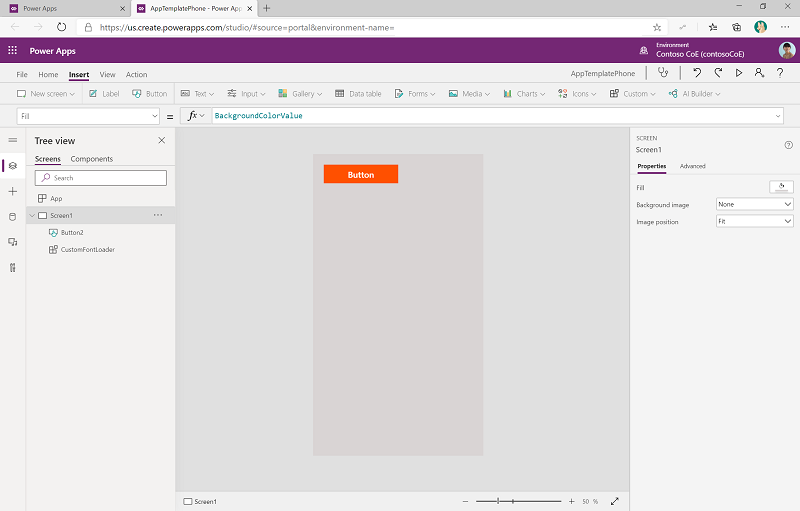

## Components

### Shared Component Library

[Component libraries](https://docs.microsoft.com/powerapps/maker/canvas-apps/component-library) provides a centralized and managed repository of components for reusability. Component libraries are the recommended way of sharing components across apps.

The Shared Component Library part of the Theming components contains a Header, TabControl and PreLoader component. You can extend this component library with further components you want your makers to use.

**Permission**: Share the Shared Component Library with makers in your organization. Makers are using the same components to create their apps will ensure consistent look and feel across various apps.

For a component to also use the theme, makers will need to update the *Style* property and set it to *ComponentStyles*. *ComponentStyles*is a collection of styles specially formatted for components and is initialized as part of the app start code.

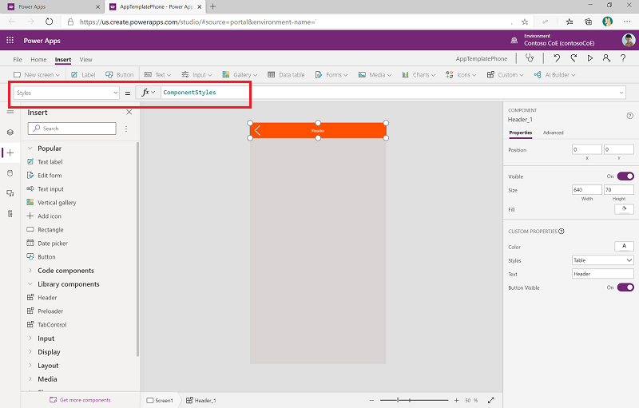
