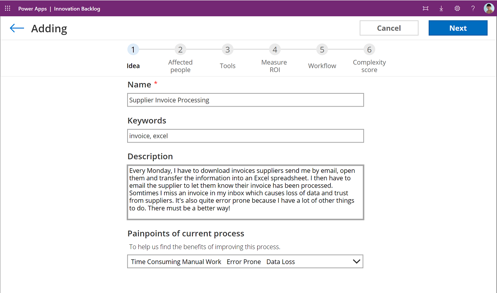
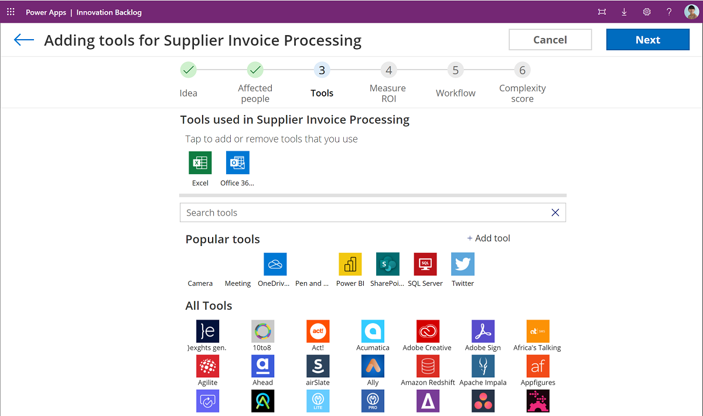
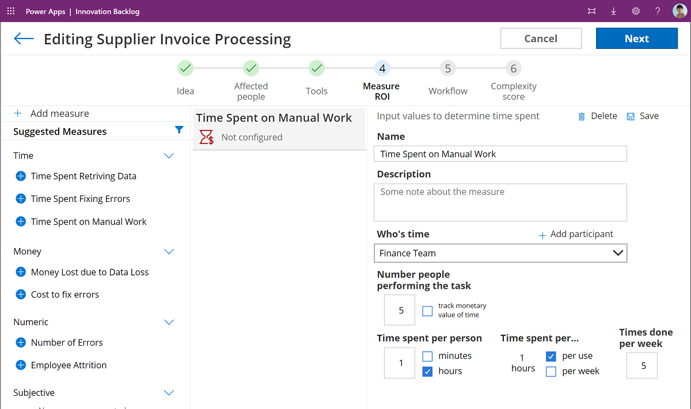
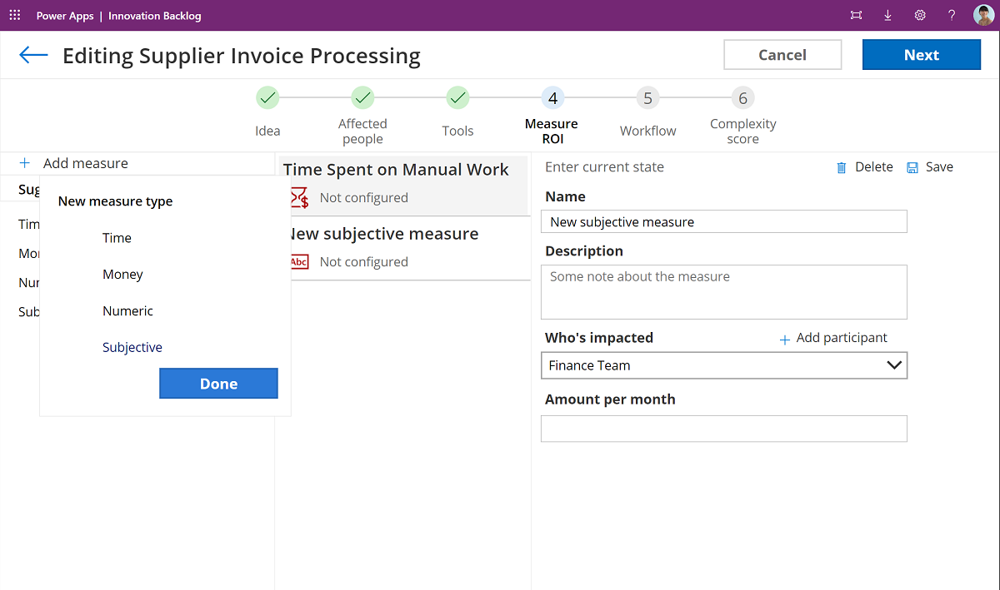
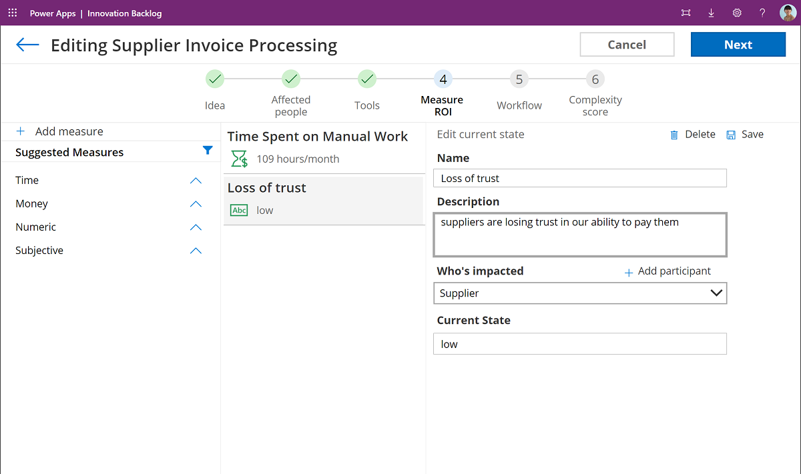
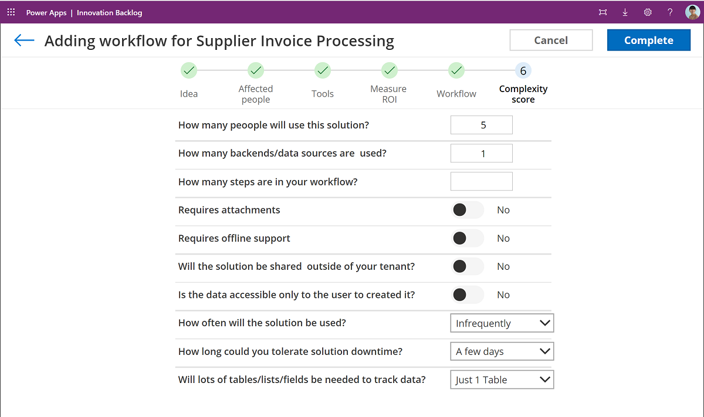
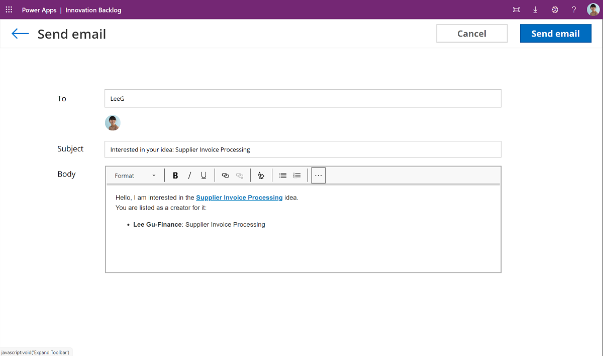
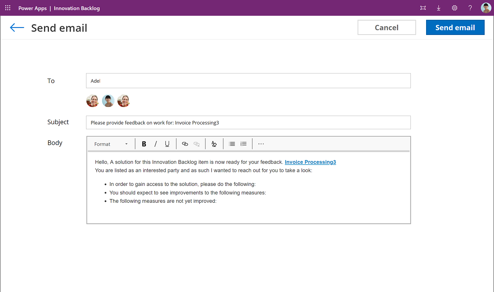
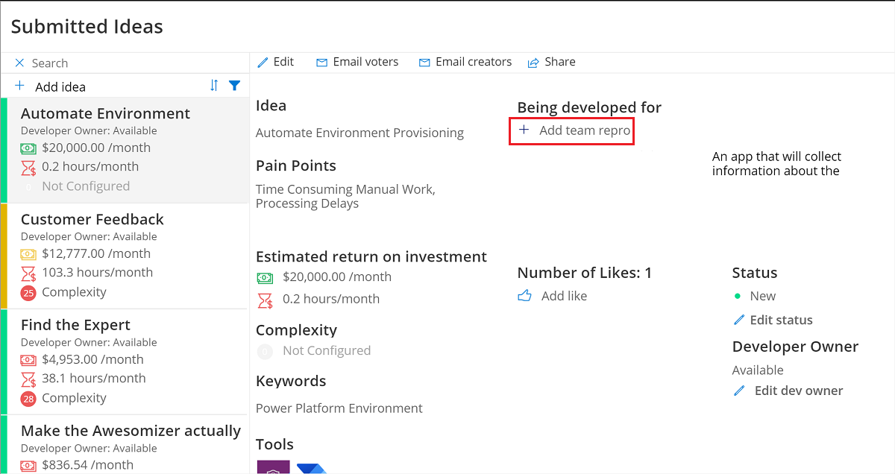

# Use the Innovation Backlog app to manage app and flow ideas

Use the Innovation Backlog app to ask users to submit ideas for apps and flows that need to be built, and describe pain points with the current process. As users describe the process, they will provide information about personas involved, tools used, and measures for improvement. This information is then used to calculate an ROI and complexity score.

Pick the most impactful ideas to for your development team to build, or select them for an upcoming hackathon. Other users can vote on ideas, or add their own scenarios to an existing idea. Developers can additionally request feedback and testimonials to build their portfolio.

## Process description

**Problem statement:** The Center of Excellence wants to ensure the most impactful and valuable scenarios are selected for development. They want to ensure ideas are submitted via a standard process that gathers information on personas, tools, and pain points.

**Solution:** A canvas app can be used by everyone in the organization to describe their ideas and pain points, or vote on existing ideas.

[Set up the Innovation Backlog](setup-innovationbacklog.md) and share the Innovation Backlog canvas app with your organization.

## Add a new idea

1. Open the Innovation Backlog app and select **Add idea**.
    
1. Describe your idea and pain points with the current process.
    
1. Describe people participating in this process - remember to include approvers and external parties, such as customers or vendors, as well.
    
1. Select the tools that are used for the current process - it can be software tools, such as Excel and Outlook, or non-software tools, such as doing calculations in your head or having to organize a meeting. You can add your own tools, if you can't find them in the list.
    
1. Measure the value of your idea. Based on the pain points you entered in the first screen, the tool will suggest some measures for you. Pick a measure from the list, and enter the relevant data - such as time involved completing the task.

    

    Add your own measure by selecting **Add Measure** and filling out the details.

    

    Make sure all measures are saved (the icon will turn green), and add as many measures as needed to describe your current pain points.

    

1. Share how the existing process works - this optional step will help developers understand your process better. You can upload a Visio diagram, use [Process Advisor](https://docs.microsoft.com/power-automate/process-advisor-overview), or describe your process inline in the tool. 
    
1. Lastly, help a developer understand how complex your process is. We are making some estimations here that you can update.
        
1. That's it, your idea can now be voted on or picked up by a developer.
    

## Pick an idea for development

As a Power Platform developer, you can now browse ideas, and pick them for development. Pick ideas that have the highest impact, or ones where you are familiar with the team and process. This is a great opportunity for new makers to learn more and help others in the organization!

1. Search for ideas by keyword, tool, team, name, or creator.
     

1. Email the voters or creator to let them know you're interested in developing their ideal
    

    

1. Assign yourself as the development owner by selecting **Edit Dev Owner**
    

1. Change the status to **Complete** once you're done developing the solution.

    

1. Provide further details for the solution you have developed, such as technology used and cost it took to develop.
     

1. Ask the idea creator and voters to provide feedback.
     

## Vote on ideas and add your own scenario

Other users can browse ideas, add their votes or own scenarios if they have similar processes.

1. Browse ideas and select **Add Like** if you think this is a valuable idea.
     
1. If your team has a similar process, select **Add team repo** to describe your version of this process.
         

[!INCLUDE[footer-include](../../includes/footer-banner.md)]