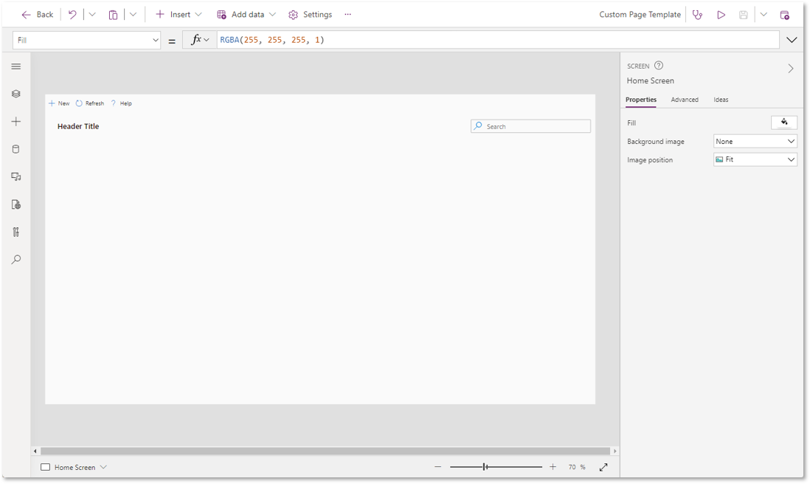
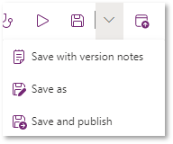
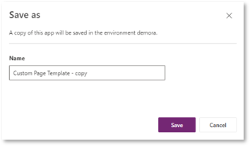

# Use the Creator Kit

## Get started
We recommend following these steps before using the components to make getting started easier:
1. Use the Reference App to learn component behavior and implementation patterns
1. Learn how to add components to an app

The Creator Kit is shipped with the following assets:
- **PCF** and **Canvas** [components](creator-kit/components.md)
- A **Reference App** to interactively learn
- **Templates** to quickly start building apps
- A **Theme Editor** generates Theme JSON, used to easily style consistent components

## How to add components to an app
Once the kit has been [installed](setup.md), learn how to add the components into your app.
- How to [add PCF code components to a Canvas apps](https://docs.microsoft.com/power-apps/developer/component-framework/component-framework-for-canvas-apps#add-components-to-a-canvas-app)
- How to [add Canvas components to a Canvas app](https://docs.microsoft.com/power-apps/maker/canvas-apps/component-library#import-from-a-component-library)

## Building blocks

### Reference App
This app allows you to learn about each component, best practices recommended for optimal user experience, interact with each component, and see the implementation code behind the properties that enables the behavior. We recommend exploring the components of interest in the Reference App before trying to use the components in an actual app.

- Observe how the component behaves and renders data.
- Select the {Code} tab to see the Power Fx formulas used.
- Learn best practices from the inline guidance related to the control.


 

### Templates
The templates are designed to help quickly start creating a responsive Fluent UI based apps. They come with the custom components preloaded and attached to a Theme JSON variable to reduce the time it takes to start developing.

   

#### Canvas Template app
Make a copy of this app when creating a new [canvas app](https://docs.microsoft.com/power-apps/maker/canvas-apps/getting-started) for a project or proof-of-concept that require the components in the kit.


How to make a copy of the Canvas Template:
1. Create a new unmanaged solution
1. Select **Add existing** > **Apps** > **Canvas** action in the ribbon
1. Select the **Canvas Template** app and then press **Add**. The 
1. Edit the **Canvas Template**
1. In the studio top ribbon, select **File** > **Save As** and provide a new name for the copy
1. The copy will appear in the same solution
1. Remove the original Canvas Template app from the solution

Only edit the copy going forward so others can utilize the template app from the same starting point.

#### Custom Page Template
Make a copy of this page when creating a new custom page for a [converged app](https://docs.microsoft.com/power-apps/maker/model-driven-apps/model-app-page-overview).

   

Follow the same steps of how to make a copy of the Canvas Template app, except the Save As action is in the top right corner of the studio for pages:

1. In the top right corner, expand the menu next to the save icon, and select **Save as**

   

1. Provide a new name, then click **Save**

   

1. Close the studio by selecting the back button in the top left corner. Notice the copy was created in the same solution.
 
   

1. Remove the original Custom Page Template from the solution.

### Theme Editor App
Use this app to generate a Theme JSON object for styling components consistently.

> [!IMPORTANT]
> A Theme JSON object is a set of colors that are mapped to properties in the components. The code block  generated by the Theme Generator app and should be stored in a global variable to be referenced by the components that accept it. Any component, including those outside of the Creator Kit, can reference these values to maintain consistency across all app components.

1. Play the Theme Editor App
1. Modify the Primary color, Text color, and Background color values
   
1. Select the **Export theme** button in the top right corner of the app to generate the Power Fx expression version of the Theme JSON, then copy the value from the panel.
    
1. Save the Theme JSON as a global variable in the OnStart property of your app, with the palette code block as a property of the `AppTheme` object variable.
    ```powerapps-dot
    Set( AppTheme, {
      palette: {
        themePrimary: "#0078d4",
        themeLighterAlt: "#eff6fc",
        themeLighter: "#deecf9",
        themeLight: "#c7e0f4",
        themeTertiary: "#71afe5",
        themeSecondary: "#2b88d8",
        themeDarkAlt: "#106ebe",
        themeDark: "#005a9e",
        themeDarker: "#004578",
        neutralLighterAlt: "#faf9f8",
        neutralLighter: "#f3f2f1",
        neutralLight: "#edebe9",
        neutralQuaternaryAlt: "#e1dfdd",
        neutralQuaternary: "#d0d0d0",
        neutralTertiaryAlt: "#c8c6c4",
        neutralTertiary: "#a19f9d",
        neutralSecondary: "#605e5c",
        neutralPrimaryAlt: "#3b3a39",
        neutralPrimary: "#323130",
        neutralDark: "#201f1e",
        black: "#000000",
        white: "#ffffff"
      }
    });
    ```
1. Reference the `AppTheme` variable for any Creator Kit controls that has a `Theme` property.

> [!NOTE] 
> Any control, including those outside of the Creator Kit, can reference the Theme JSON colors, but the specific property of palette needs to be indicated.

Example formula referencing the `AppTheme` color values in a standard button's `TextColor`:
```powerapps-dot
ColorValue( AppTheme.palette.white )
```

### Canvas Components
These components are defined in the component library called "Power CAT Component Library", and are implemented with [Canvas app custom components](https://docs.microsoft.com/power-apps/maker/canvas-apps/create-component).

   

### Code Components
Implemented with [Power Apps component framework (PCF)](https://docs.microsoft.com/power-apps/developer/component-framework/custom-controls-overview), which are defined as individual custom controls in the solution.

View the code components in the [components refernce page](components.md).

   

## Deploying apps with Creator Kit components
Avoid solution dependency issues when deploying an app by:
- Building apps that use Creator Kit components in a seperate, unmanaged solution.
- Ensuring target Environment already contain the Creator Kit managed solution, or include the specific components used in the app, in the solution

See [solution import troubleshooting tips](https://docs.microsoft.com/troubleshoot/dynamics-365/sales/troubleshoot-solution-import-errors-in-dynamics-365) for more general guidance.

> [!div class="nextstepaction"]
> [Next step: View the components reference](components.md)

[!INCLUDE[footer-include](../../includes/footer-banner.md)]
