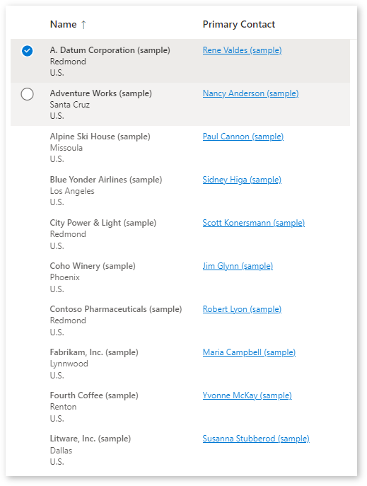

# Details List control

A control used to display a set of data.



## Description
A details list is a robust way to display an information-rich collection of items, and allow people to sort, group, and filter the content. Use a details list when information density is critical.

The DetailsList code component allows using of the [Fluent UI DetailsList component](https://developer.microsoft.com/en-us/fluentui#/controls/web/detailslist) from inside canvas apps and custom pages.

## Limitations
This PCF component can only be used in Canvas apps and Custom Pages.


## Key properties

| Property | Description |
| -------- | ----------- |
| Items | Required. The data source items table to render. This can be any data source because values are mapped in the Columns property (which acts as a schema definition). |
| Fields | Required. The fields needed are indicated. |
| Columns | Required. Table mapping definition between the component column and the data source. Use this to map field names and define specific column behavior. |

## Additional properties

| Property | Description |
| -------- | ----------- |
| Views | View if supported by the data source (e.g., Dataverse). |
| Selection type |  |
| Select rows on focus |  |
| Page size |  |
| Sort column |  |
| Sort direction |  |
| Compact | |
| Header visible | |
| Alternate row color | |
| Selection radio button | |
| Raise OnRowSelection |  |

## Mapping data to columns
To determine which columns are displayed in the Details List, configure the following properties of the Detail List:

1. **Fields**. Add the desired fields by selecting the Edit option in the controls flyout on the right (uses the same interface for modifying [predefined data cards](https://docs.microsoft.com/en-us/power-apps/maker/canvas-apps/working-with-cards)).

1. **Columns**. Provide specific mapping between columns and fields in the `Columns` property.  

The below table schema must be used in the `Columns` (`column_Items`) property to display the desired data.

### Columns table schema
| Name | Description |
| ------ | ----------- |
| ColName | A unique key for identifying the column. |
| ColDisplayName | Name to render on the column header. |
| ColWidth | Minimum width for the column. |
| ColSortable | Whether the column has sorting behavior. |
| ColIsBold | Whether the text is bold. |
| ColResizable | Determines if the column can be resized. |
| ColShowAsSubTextOf | The ColName value of the parent column this text. Leave blank to display in a seperate column. |
| ColCellType | Provide 'link' as the value to make the column clickable. Leave blank for regular text without style. |

Example (mapping to the Dataverse [Accounts](https://docs.microsoft.com/en-us/power-apps/developer/data-platform/reference/entities/account) system table):

  ```powerapps-dot
Table(
	{
		ColName: "name",
		ColDisplayName: "Name",
		ColWidth: 200,
		ColSortable: true,
		ColIsBold: true,
		ColResizable: true
	},{
		ColName: "address1_city",
		ColDisplayName: "City:",
      ColShowAsSubTextOf: "name"
	},{
		ColName: "address1_country",
		ColDisplayName: "Country:",
	  ColShowAsSubTextOf: "name"
	},{
		ColName: "telephone1",
		ColDisplayName: "Telephone",
		ColWidth: 100,
		ColSortable: true,
		ColResizable: true
	},{
		ColName: "primarycontactid",
		ColDisplayName: "Primary Contact",
		ColWidth: 200,
		ColSortable: true,
		ColSortBy: "_primarycontactid_value",
		ColResizable: true,
		ColCellType: "link"
	}
)
  ```


## Configure 'On Change' behavior
Add and modify the below formula in the component's `OnChange` property to configure specific actions based on the `EventName` provided by the component:

- Trigger events when a user changes the selected row: Enable the property **Raise OnRowSelectionChange event** in the component.
- Configure link behavior: Add columns with the **ColCellType** value set to "link".

```powerapps-dot
/* Runs when selected row changes and control property 'Raise OnRowSelection event' is true */
If( Self.EventName = "OnRowSelectionChange",
    Notify( "Row Select " & Self.EventRowKey )
);

/* Runs when a user clicks on a column with ColCellType set to 'link' */
If( Self.EventName = "CellAction",
    Notify( "Open Link " &  Self.EventColumn & " " & Self.EventRowKey )
)
```

## Best Practices
Refer to [Fluent UI Details List control best practices](https://developer.microsoft.com/en-us/fluentui#/controls/web/detailslist)

[!INCLUDE[footer-include](../../includes/footer-banner.md)]