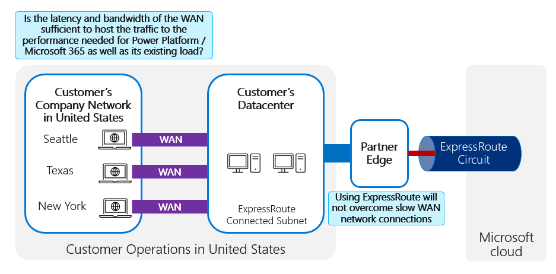
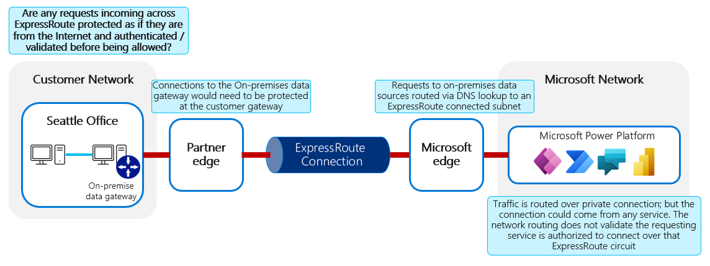

# ExpressRoute readiness checklist

As part of determining whether you're ready to implement ExpressRoute for Microsoft Power
Platform, you need to validate the following scenarios.

## Client routing

Using ExpressRoute for Microsoft Power Platform and Microsoft 365 requires routing traffic
from the client via the ExpressRoute circuit rather than via the internet. This is
typically done through proxy setup. Verify the following:

-   Have you confirmed how client connectivity will be configured to make
    sure that appropriate traffic will be routed via the ExpressRoute circuit?

-   Are clients able to connect via the internet for non-private resources,
    for example Azure Content Delivery Network?

-   Has the client been configured to use a proxy to route traffic to the
    ExpressRoute subnet rather than across the internet?

-   Are the clients connecting from a public IP address or are they hidden behind network address translation (NAT)?
<!--note from editor: I deleted "and points to consider" because the points all seem to have been described in the preceding text (which is good!). -->

## WAN performance

When using ExpressRoute, the performance from a client will only be as good as
the slowest link on the connection. Because most clients will be connected to
the ExpressRoute circuit via a wide-area network (WAN), the capacity and speed of the WAN connection
is critical.

-   Will the capacity and speed of the WAN connection be sufficient for the traffic you'll require?
<!--note from editor: Please make sure the preceding text or the image alt text covers the "points to consider" that you refer to. (I think it does.)-->

## Peering

Microsoft Power Platform uses Microsoft peering.

-   Has the appropriate Microsoft peering been configured for your needs?
<!--note from editor: Please make sure the preceding text of the image alt text covers the "points to consider" that you refer to. (I think it does.)-->

## Asymmetric routing

-   Have you configured the network and ExpressRoute to ensure that you avoid
    asymmetric routing?
<!--note from editor: The alt text for this image exceeds the 150-character limit, and actually it should be even longer to fully describe the image. Please verify my edits to alt text and flesh out the long description. Also, please change "ER" in the image to "ExpressRoute."

-->
:::image type="complex" source="media/checklist-asymmetric-routing.png" alt-text="Diagram a showing a network request sent via the internet to Microsoft services and a response routed back via ExpressRoute - asymmetric routing.":::
   <!--NOTE FROM EDITOR: PLEASE FLESH OUT THIS LONG DESCRIPTION SO USERS WHO CAN'T SEE THE IMAGE CAN KNOW WHAT IT'S CONVEYING.-->
:::image-end:::

## Geographical distribution

-   If a geographically distributed user base is to be served, has this been
    considered in the ExpressRoute circuit connectivity?

-   Should multiple circuits be distributed geographically for different areas
    or regions?<!--note from editor: Suggested. -->
<!--note from editor: Please verify alt text.-->

## On-premises integration

-   Are connections back into the on-premises network from the Microsoft cloud
    across ExpressRoute protected (that is, are they validated as if they came from the public internet)?

