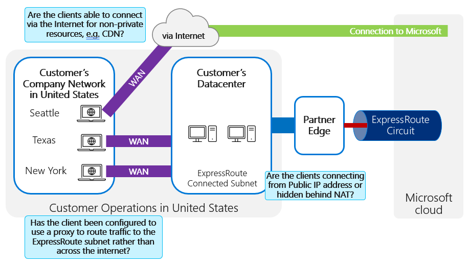
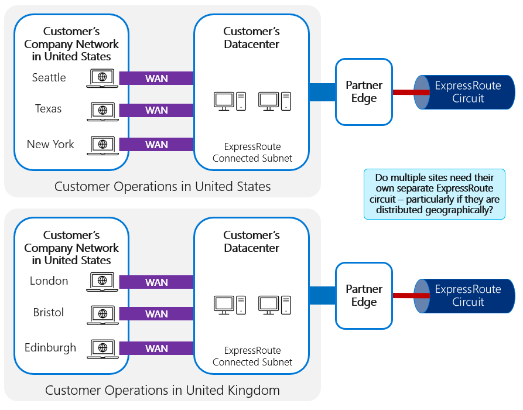

# ExpressRoute Readiness Checklist

As part of determining if you are ready to implement ExpressRoute for Power
Platform, the following scenarios should be validated.

## Client routing

Using ExpressRoute for Power Platform and Microsoft 365 requires traffic routing
from the client via ExpressRoute circuit, rather than via the Internet. This is
typically done through proxy setup.

-   Has it been confirmed how the client connectivity will be configured to make
    sure that appropriate traffic will be routed via the ExpressRoute circuit?

-   Are the clients able to connect via the Internet for non-private resources,
    e.g. CDN?

-   Has the client been configured to use a proxy to route traffic to the
    ExpressRoute subnet rather than across the internet?

-   Are the clients connecting from public IP address or hidden behind NAT?

## WAN performance

When using ExpressRoute, the performance from a client will only be as good as
the slowest link on the connection. Because most clients will be connected to
the ExpressRoute circuit via a WAN, the capacity and speed of the WAN connection
is critical.

-   Will the capacity and speed of the WAN connection be sufficient for the
    required traffic?

## Peering

Power Platform uses a Microsoft Peering.

-   Has the appropriate Microsoft Peering been configured for your needs?

    

## Asymmetric routing

-   Have you configured the network and ExpressRoute to ensure you avoid
    asymmetric routing?

## Geographical distribution

-   If a geographically distributed user base is to be served, has this been
    considered in the ExpressRoute circuit connectivity?

-   Are multiple circuits needed distributed geographically for different areas
    or regions?

## On-Premises integration

-   Are connections back into the on-premises network from Microsoft cloud
    across ExpressRoute protected (validated as if coming from the public
    Internet)?

